# 今日回顾

## ☀️ 👨‍🏫 教师端 PC 2025/02/08

## 样式调整

| 调整项                                                           | 旧版                                                                                      | 目前                                                                                      |
| ---------------------------------------------------------------- | ----------------------------------------------------------------------------------------- | ----------------------------------------------------------------------------------------- |
| **`弹窗`、`抽屉`中`单选框组`的样式问题**                         | 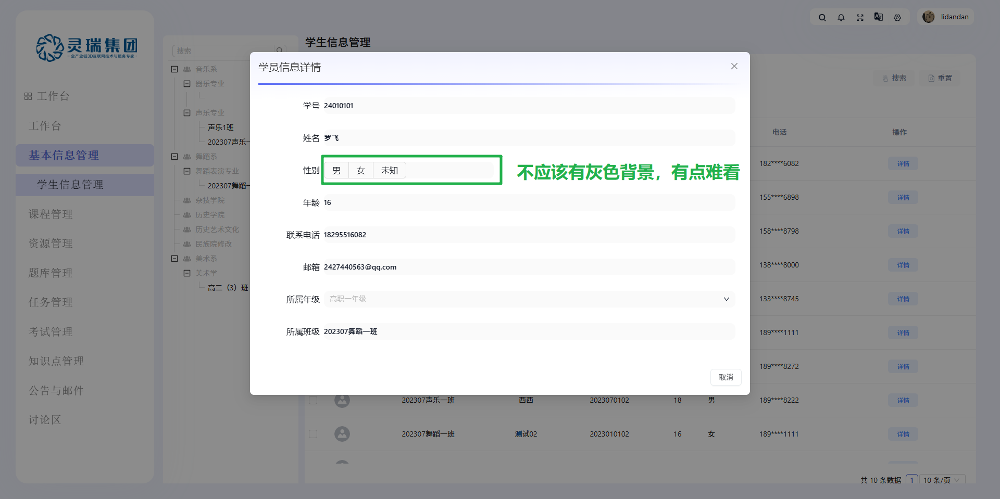                                     | 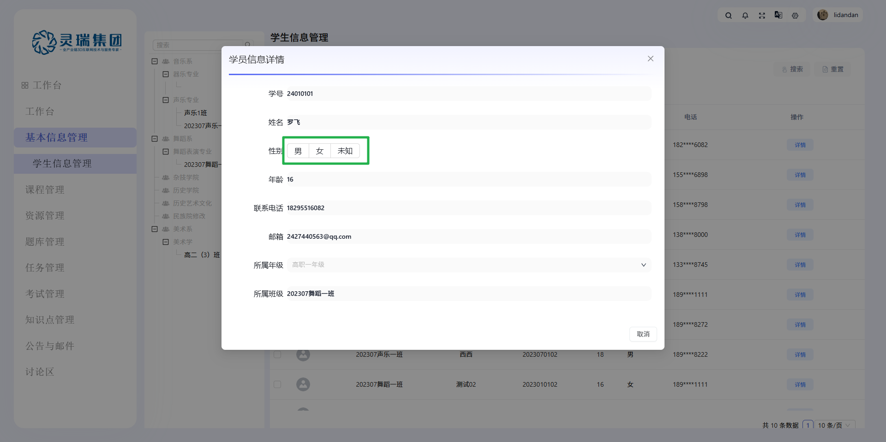                                      |
| **租户展示问题(`教师端不选择租户`)**                             | 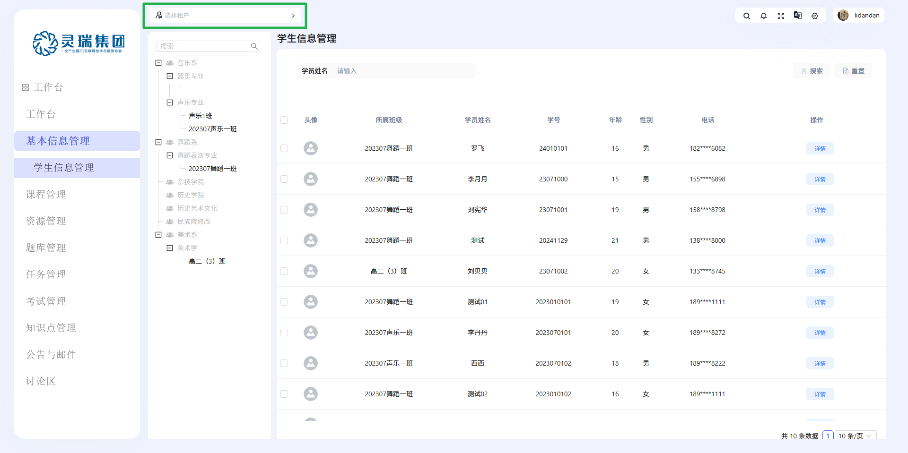                                                     | 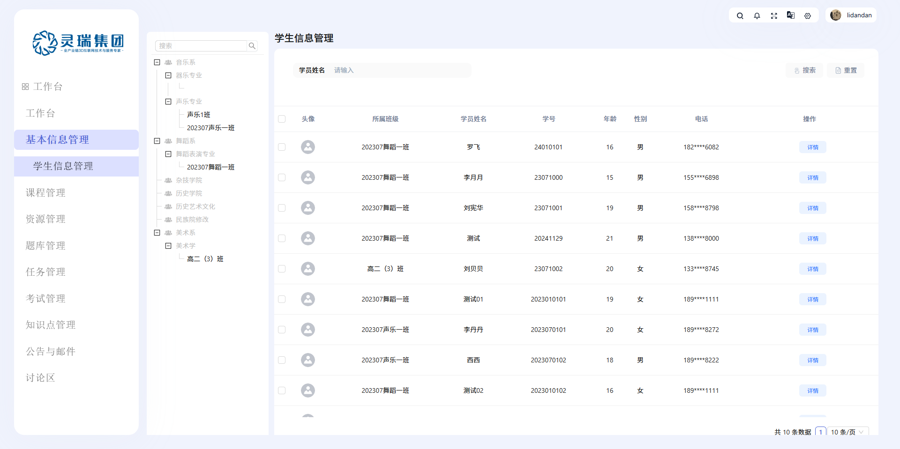                                                      |
| **任务管理：查看详情 - `附件样式`问题**                          | 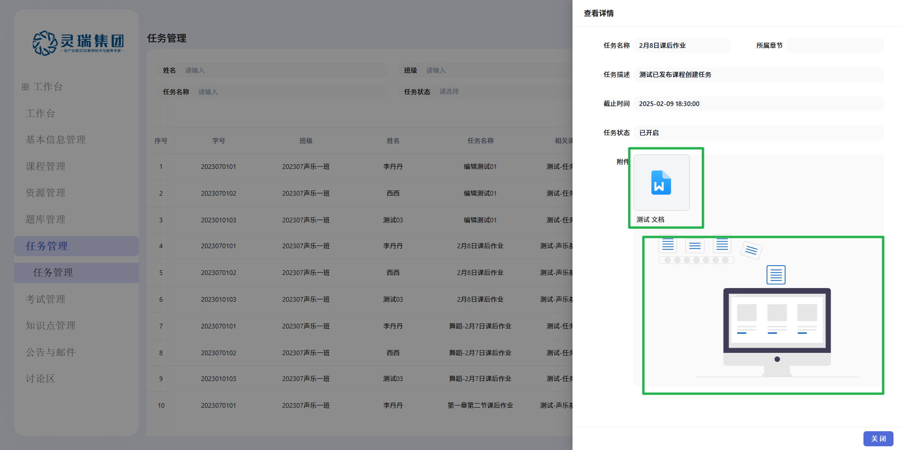                                                  | 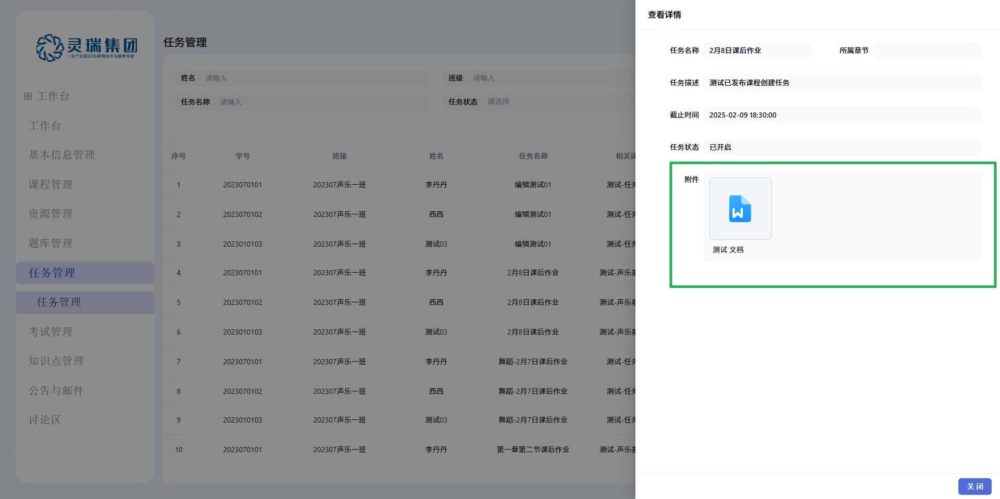 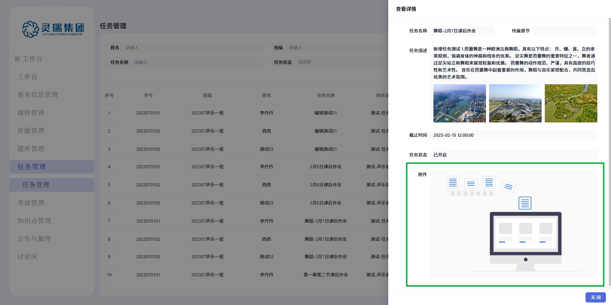    |
| **表单`label宽度导致的对齐与连接`问题**                          | 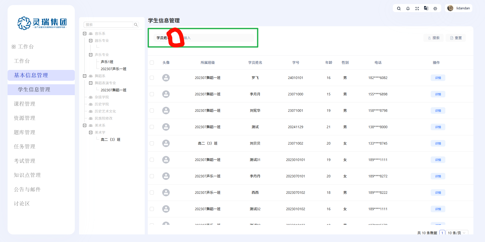 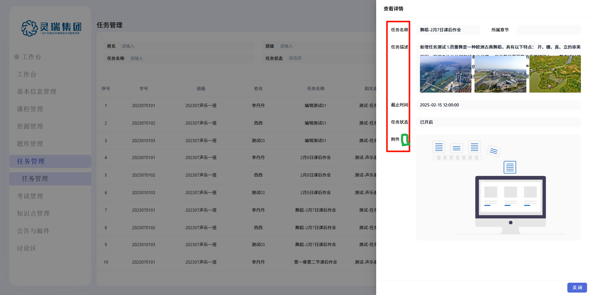 | 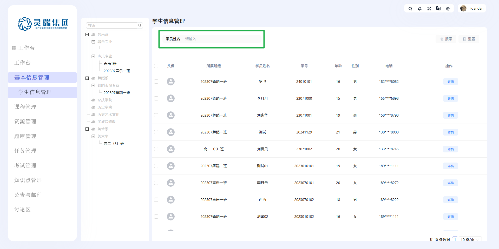 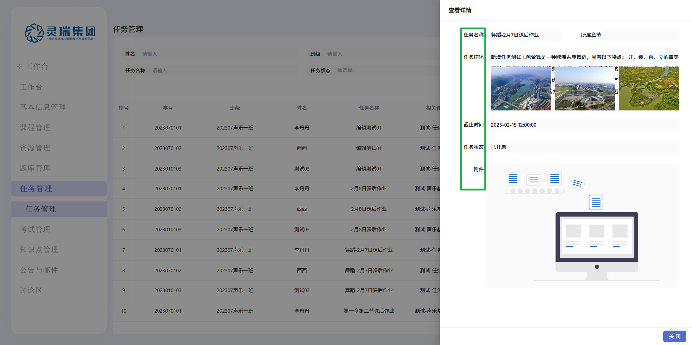 |
| **学生信息管理的`左侧树高度`和`表格宽度及横向滚动条`导致的问题** | 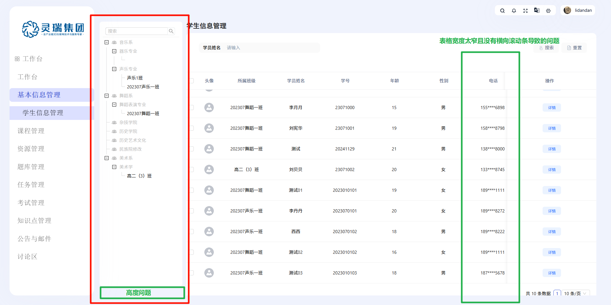                           | 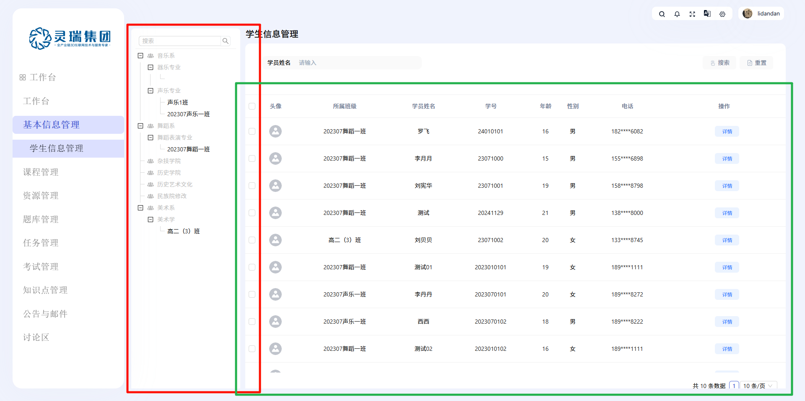                            |

## bug

- 目前存在 bug：<b style="color: red">1</b>
- 今日解决 bug：<b style="color: green">1</b>

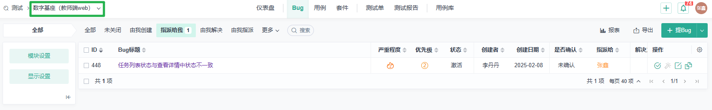

