# 今日回顾

## ☀️ 👨‍🏫 教师端 PC 2025/02/10

## 样式调整及 bug 修复

| 调整项                                               | 旧版                                                           | 目前                                                          |
| ---------------------------------------------------- | -------------------------------------------------------------- | ------------------------------------------------------------- |
| **课程列表：`创建课程`样式调整**                     | 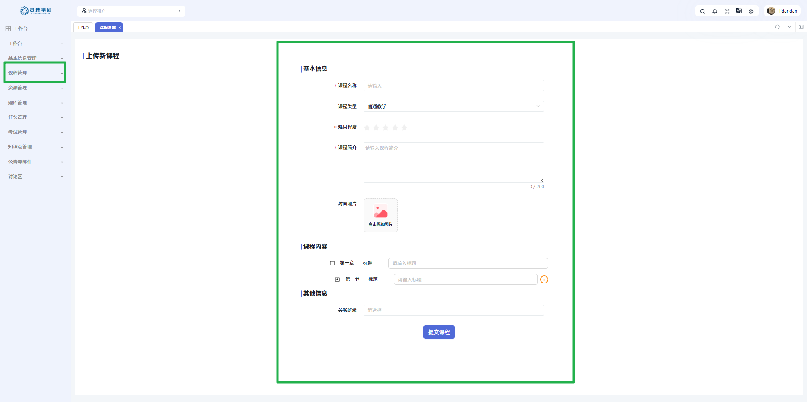           | 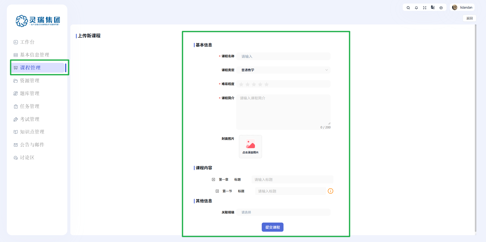           |
| **`任务管理`：`查看详情`改为与`批阅`表单项一致**     | 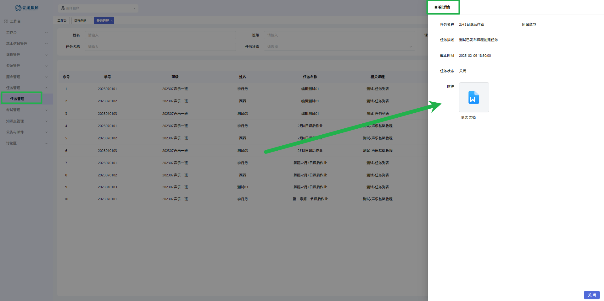   | 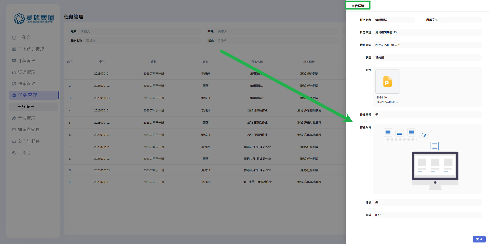   |
| **`试卷管理`页面样式调整**                           |                  | 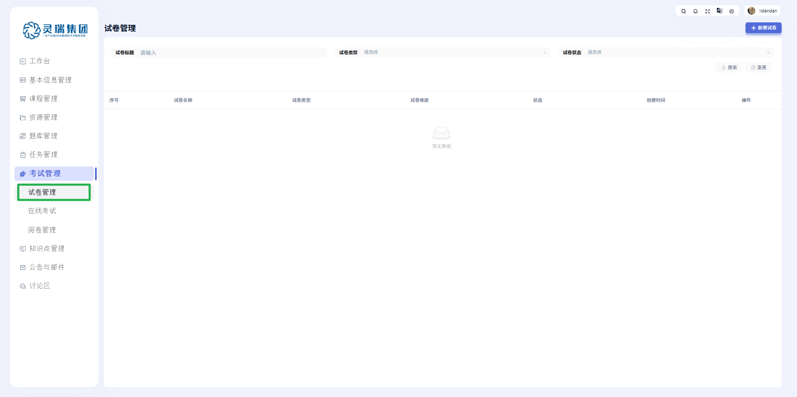                 |
| **`在线考试`页面样式调整**                           | 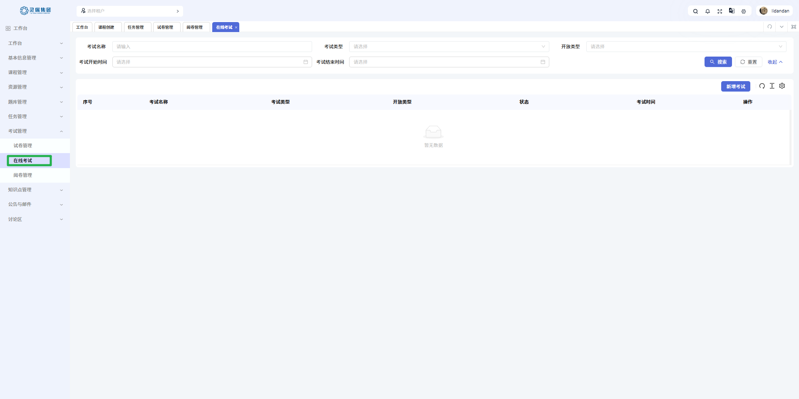                 | 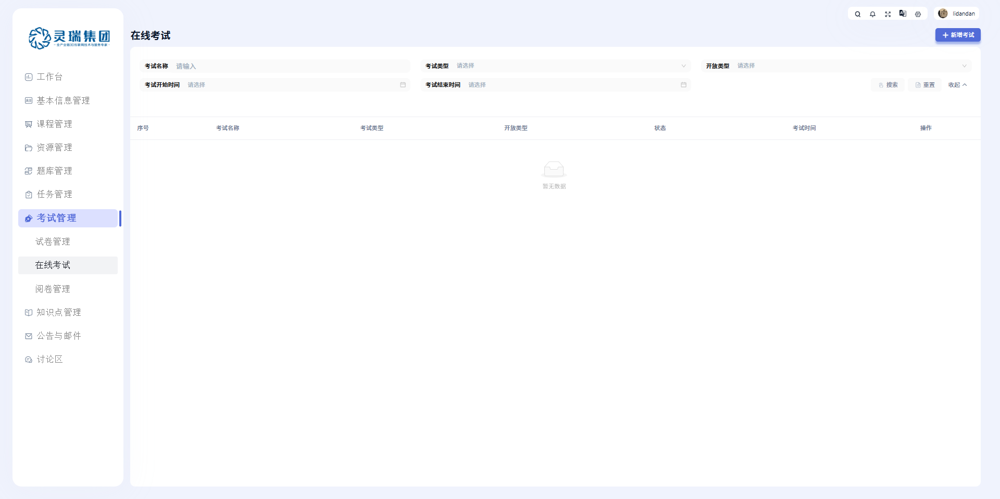                 |
| **`阅卷管理`页面样式调整**                           | 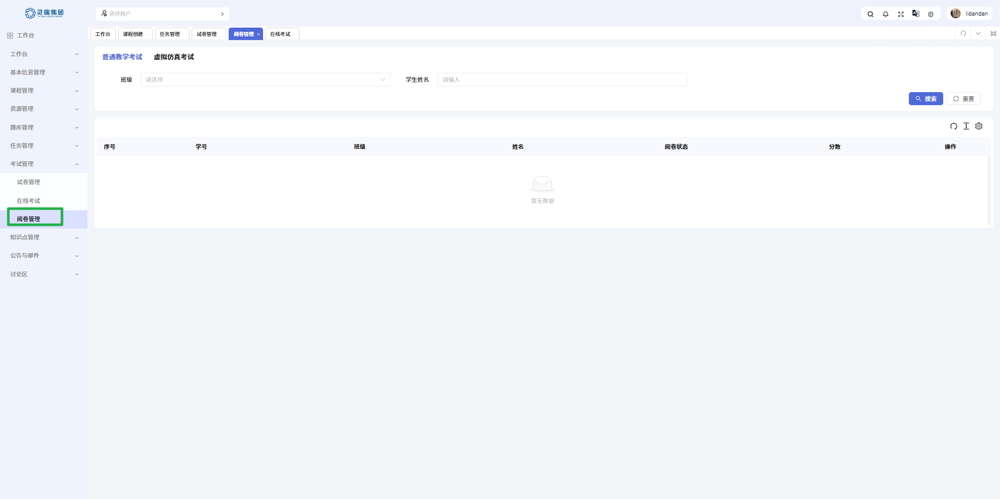               | 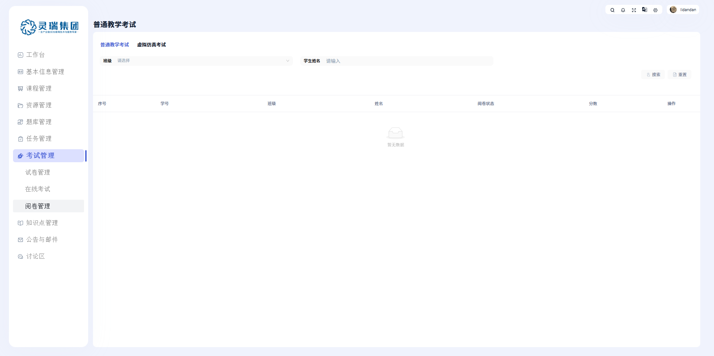               |
| **`知识点管理`页面样式调整**                         | 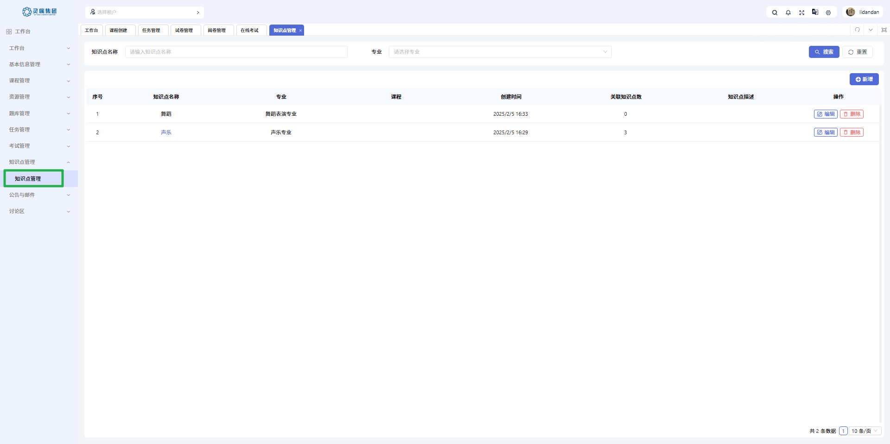 | 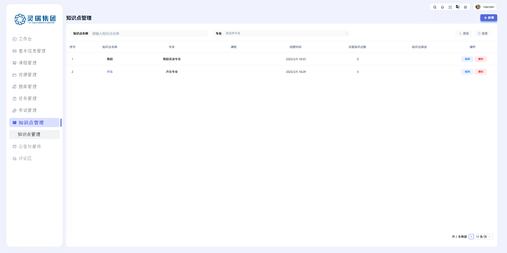 |
| **`公告与邮件`页面样式调整**                         | 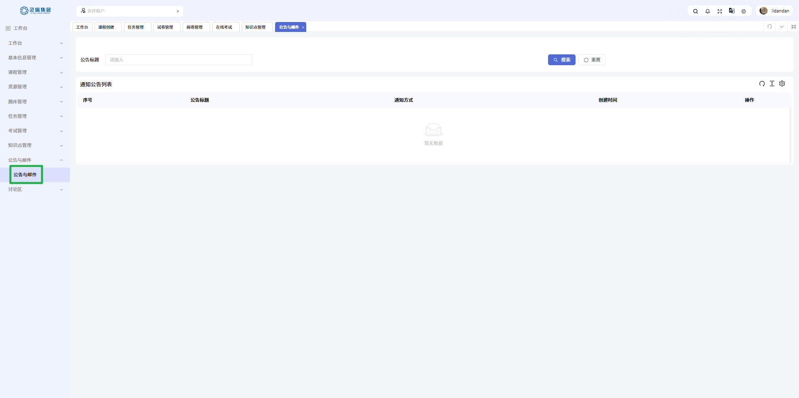         | 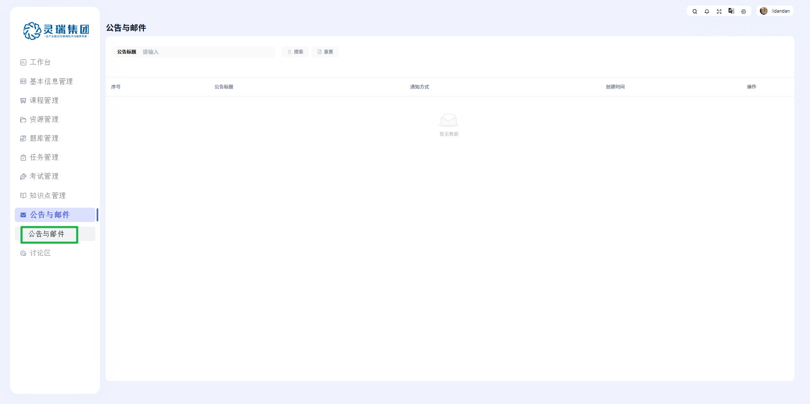         |
| **`讨论区`样式更改**                                 | 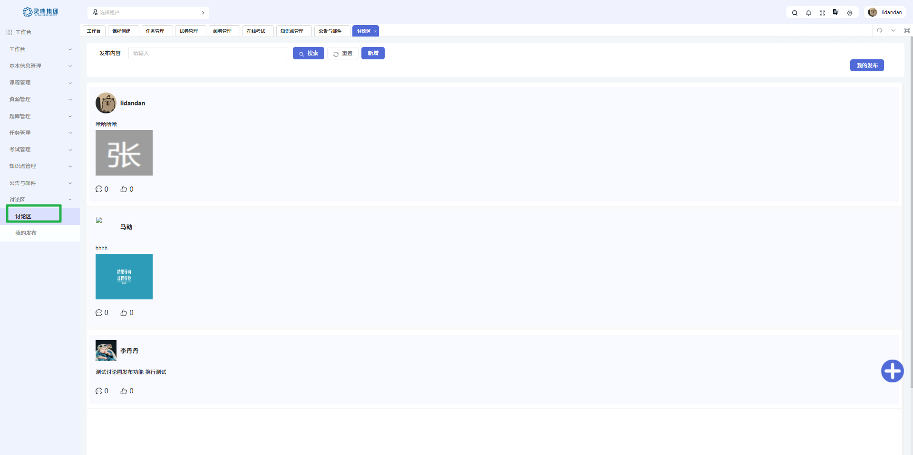           | 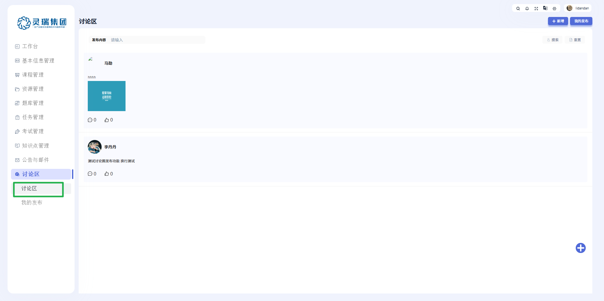           |
| **`我的发布`页面样式调整**                           | 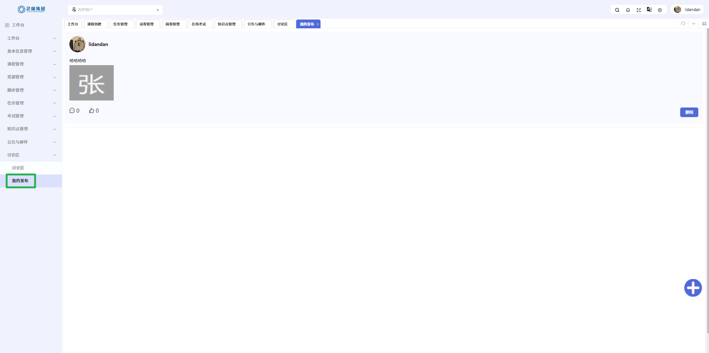            | 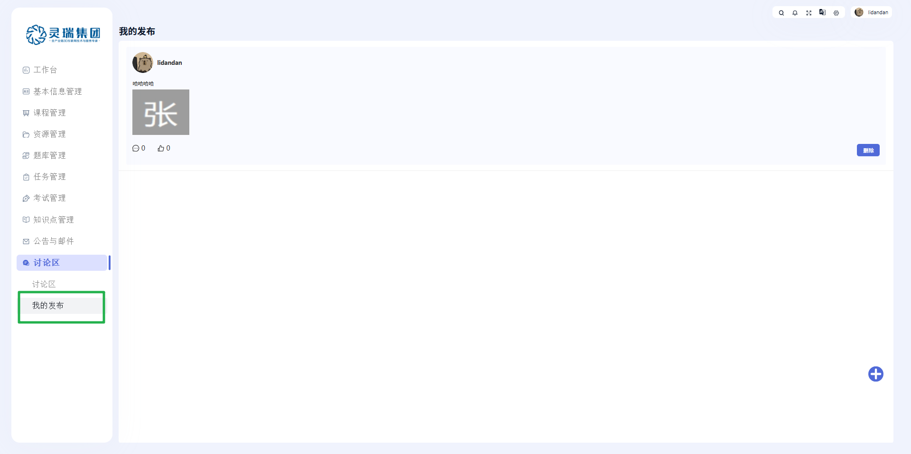            |
| **`单选框`的边框样式问题：和背景色一致导致`看不见`** |                 | 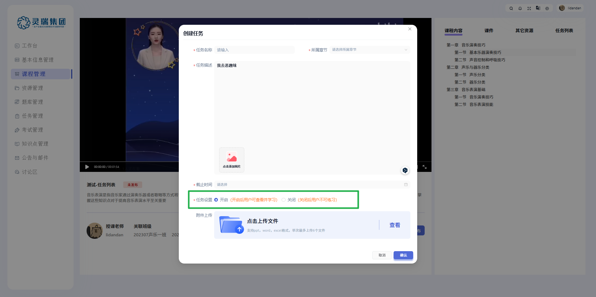                |

## bug

- 目前存在 bug：<b style="color: red">1</b>
- 今日解决 bug：<b style="color: green">1</b>

