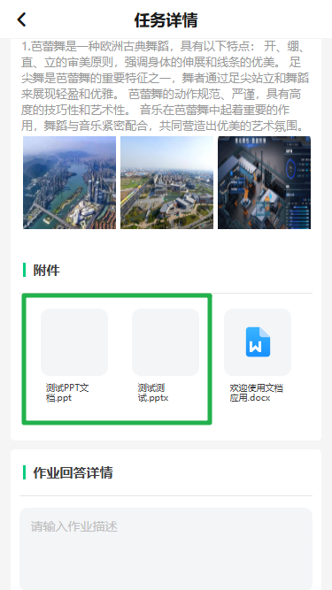
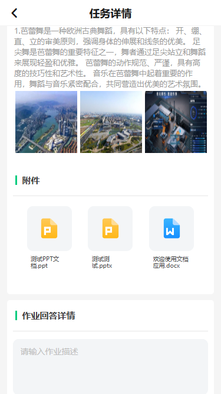
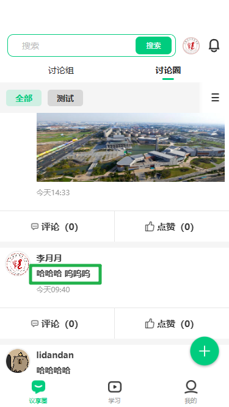
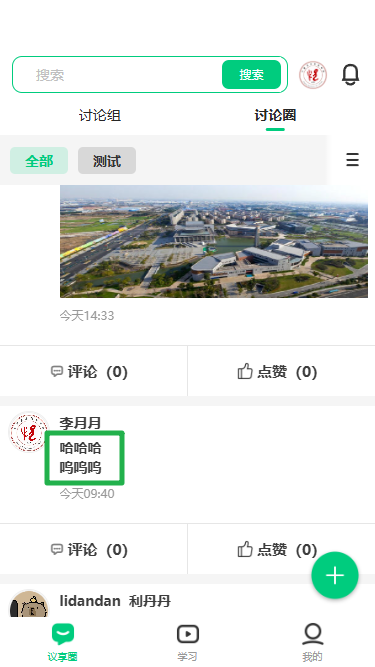
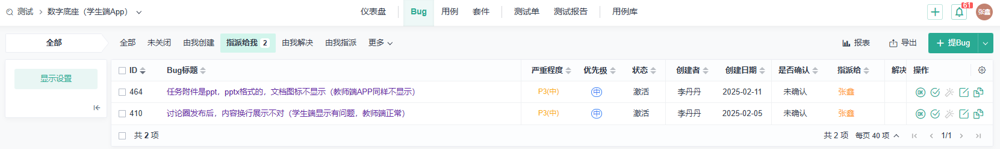

# 今日回顾

## bug 具体

👨‍🏫 学生端 APP 2025/02/12

| 调整项               | 旧版                                                              | 目前                                                             |
| -------------------- | ----------------------------------------------------------------- | ---------------------------------------------------------------- |
| **`任务详情-附件`**  |  |  |
| **`讨论圈发布内容`** |   |   |

## bug 总项

- 目前存在 bug：<b style="color: red">2</b>
- 今日解决 bug：<b style="color: green">2</b>

