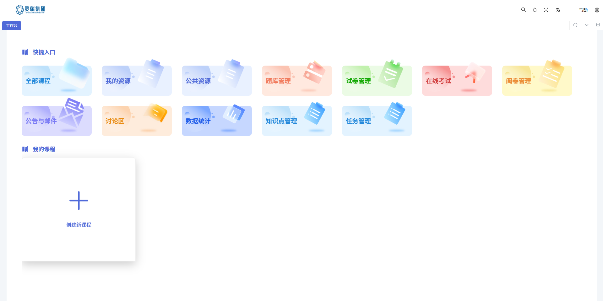
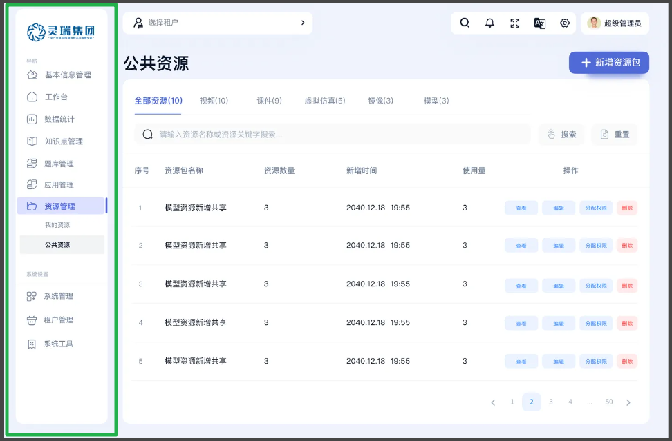
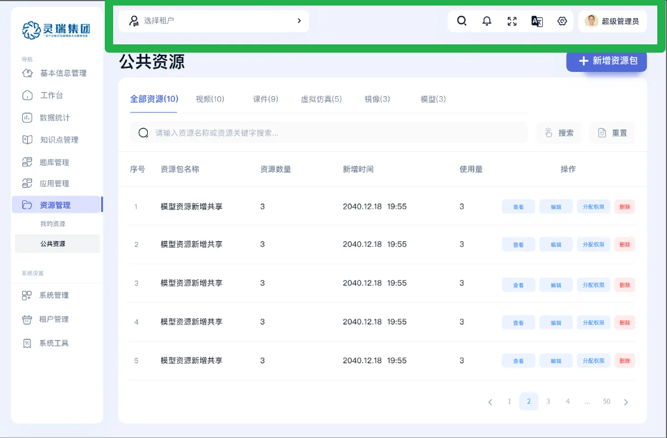
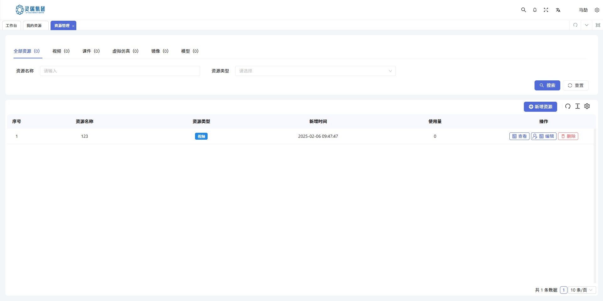
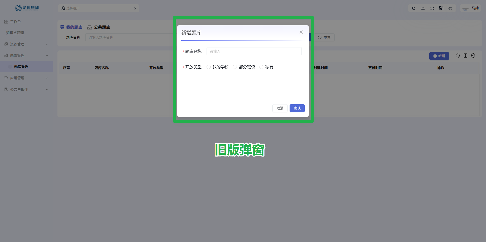

# 本月回顾

## 🌙 👨‍🏫 教师端 PC 2025/02/28

- 样式调整，主要包括
  1. 左侧菜单
  2. 头部导航条
  3. 查询表单
  4. 表格
  5. 弹窗
  6. 抽屉
  7. 其他细小部分的样式改动

| 对比项                     | 旧版                                              | 新版                                             | 差异说明                                                                                       | 预计完成时间            | 负责人       |
| -------------------------- | ------------------------------------------------- | ------------------------------------------------ | ---------------------------------------------------------------------------------------------- | ----------------------- | ------------ |
| **左侧菜单**               |                 |                | 新版将布局从卡片式改为左右布局，提升了操作效率和视觉层次感                                     | 2025/02/06              | 虎生发       |
| **头部导航条**             |                 |                 | 新版将平铺式导航变为分离式悬浮导航，凸显了功能和视觉层次感                                     | 2025/02/06              | 张鑫         |
| **查询表单及表格**         |  |  | 新版将查询表单和表格连接在了一起，并改变了操作按钮的样式以及查询表单元素的背景填充             | 2025/02/07 ~ 2025/02/08 | 张鑫         |
| **弹窗**                   |               |               | 新版弹窗在内容区域划分及视觉体验上做出了优化，并在右上角添加了全屏及自定义插槽                 | 2025/02/07              | 虎生发       |
| **抽屉**                   | 🈚️                                               |              | 新版抽屉适用于查看详情，不用跳转新的页面，减少了用户操作，并和新增、编辑的弹窗交互方式做了区分 | 2025/02/08              | 虎生发       |
| **其他细小部分的样式改动** | 🈚️                                               | 🈚️                                              | 在向新版的样式迭代中与框架产生的冲突调整，以及部分页面的因样式问题导致的逻辑修改               | 2025/02/10 ~ 2025/02/12 | 张鑫、虎生发 |

