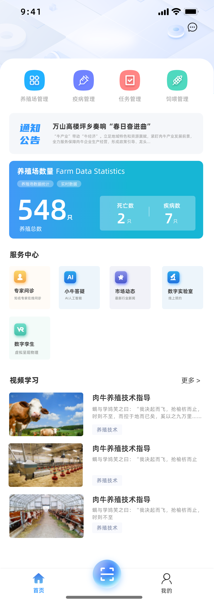
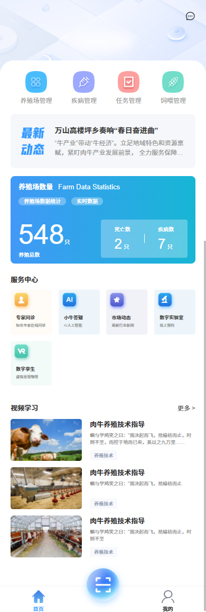
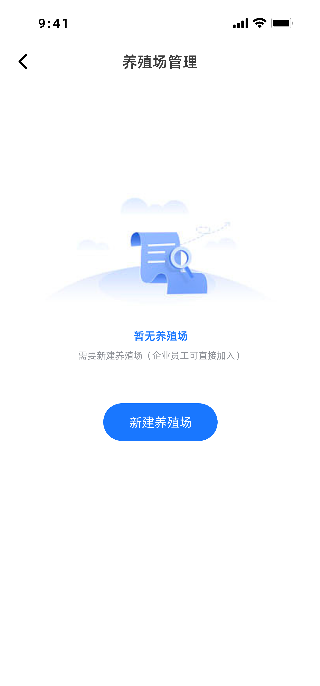
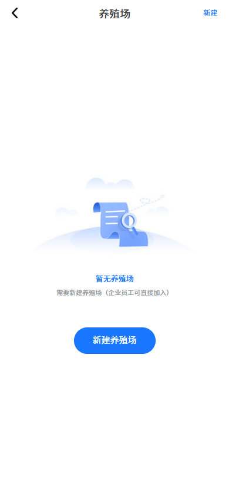
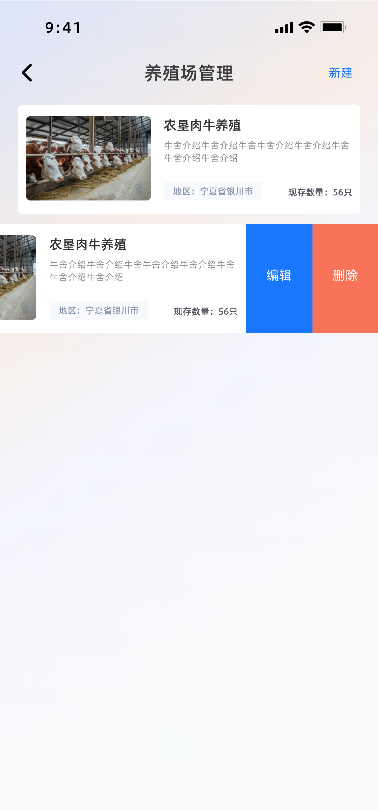
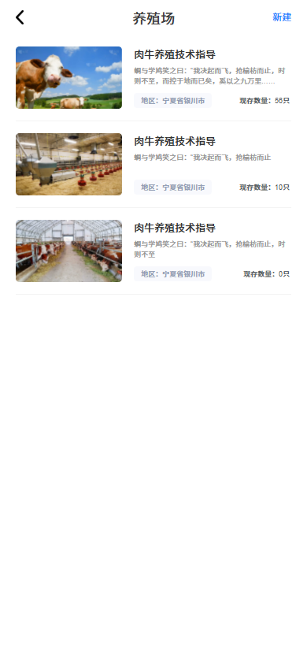
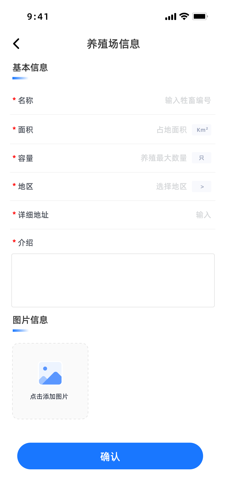
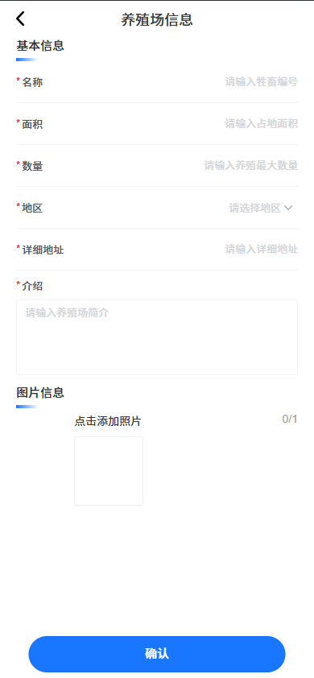

# 🌙 智慧养殖 APP - 2025/03/21

<pre>

  领导，您好：
    以下是我今天工作内容的简述：
      今日工作回顾：
        1> 《 首页 》绘制完成
        2> 《 养殖场管理首页 》绘制完成
        3> 《 养殖场新建 》绘制中

    以下是明天的工作事项简述：
      明日（周一）工作计划：
        1> 继续开发 《 养殖场管理 》模块

    详细的工作报告及相关文件已整理，请您查收。
    如有任何疑问或需要进一步的信息，请随时与我联系。
        此致
        敬礼！
        [姓名] 张鑫
        [职位] Web前端开发工程师
        [日期] 2025.03.21
        联系方式：13488603307
        感谢您的关注与支持，期待与您共同推动项目的进展。
</pre>

| 页面名称           | UI 页面                                      | 目前页面                                              |
| ------------------ | -------------------------------------------- | ----------------------------------------------------- |
| **首页**           |                |                |
| **养殖场无数据时** |  |  |
| **养殖场**         |            |            |
| **养殖场新建**     |    |    |

