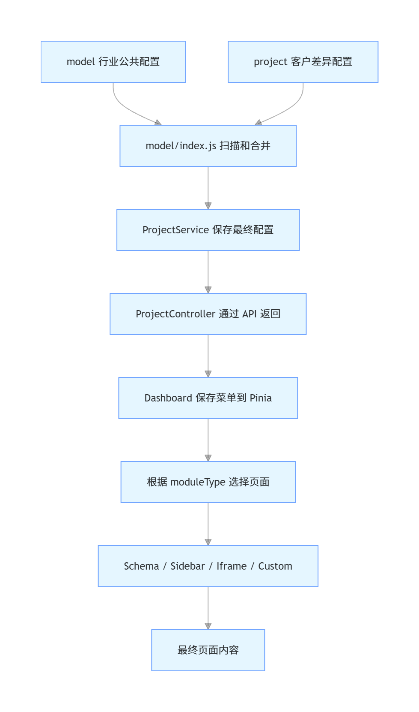
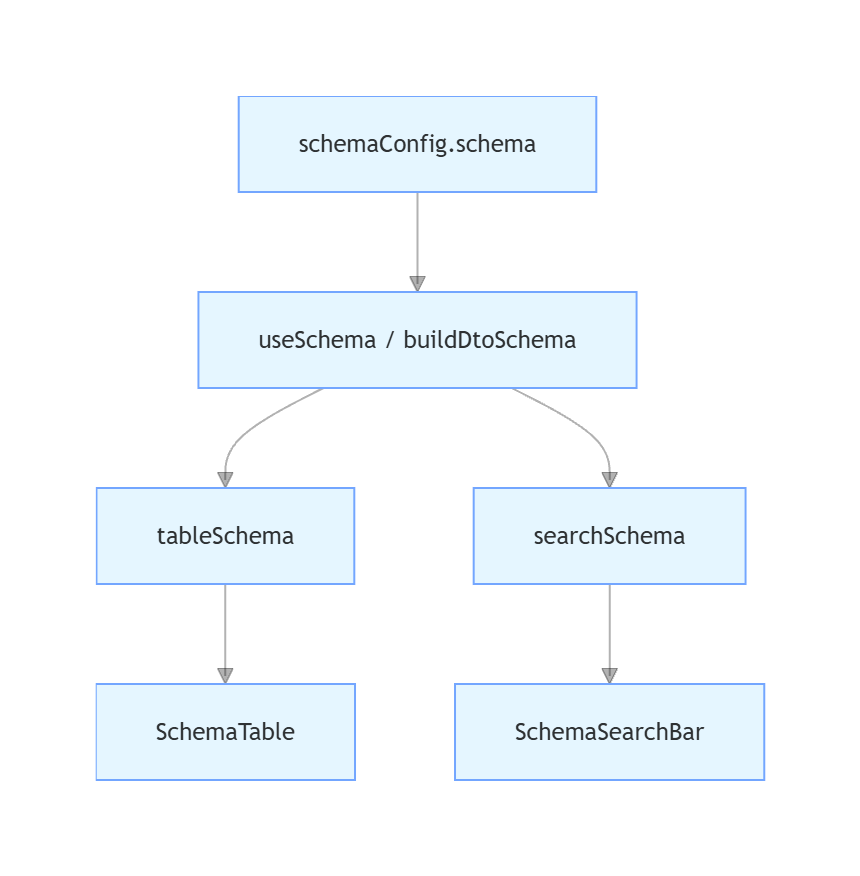
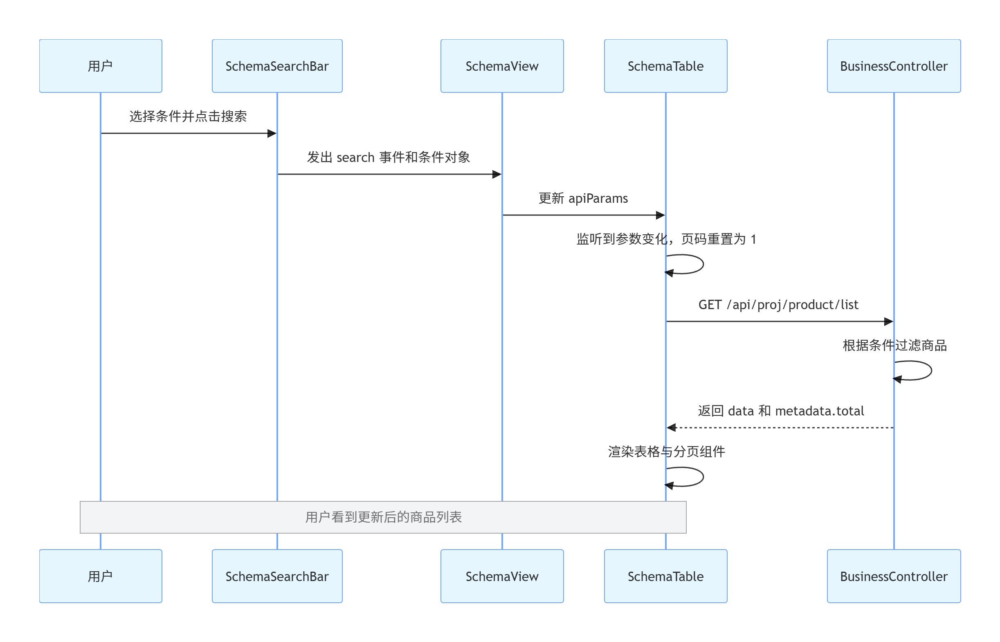

# Elpis：从重复开发到配置驱动后台的设计与实现

> 涉及分支：`feature/dsl`、`feature/dashboard`、`feature/dashboard-subview`
> 核心目标：理解 Elpis 为什么要使用 DSL，以及 `model` 中的一份配置最终如何变成真正的后台页面。

---

## 1. 项目背景：从“复制粘贴大师”到“后台框架设计者”

最开始，你接到一个电商后台项目。

商品管理、订单管理、客户管理、数据分析……你吭哧吭哧干了三个月，总算把系统交付了。客户很满意，还觉得你技术不错，于是给你介绍了第二位客户。

第二位客户也是做电商的。你打开需求文档一看，心里一喜：

> 这不和上一个项目差不多吗？复制一份改改不就完了？

于是你复制了第一个项目：

- 商品管理页面继续使用；
- 订单页面换几个字段；
- 菜单名称改一改；
- 首页换一下；
- 再增加几个客户专属页面。

虽然比第一次快，但改着改着又出现了问题：两个项目的代码已经分家。第一个项目修过的表格问题，第二个项目也要重新修一次。

没过多久，第三位电商客户又来了。你正准备右键复制项目时，突然意识到：

> 今天复制三个项目，以后来了十个客户，难道我要维护十份差不多的代码？

于是你请教了一位大师。大师没有直接给你代码，只问了一个问题：

> 这些项目真正相同的，到底是“页面内容”，还是“页面的构造方式”？

这句话让你开始重新思考整个后台系统的设计。

---

## 2. 设计思想：不是复用 A、B、C，而是研究它们怎么造出来

一开始，你可能会把三个项目中相同的 A、B、C 页面抽出来，放进一个公共项目。

但问题很快就来了：以后新增 D、E、F 页面怎么办？

如果每出现一种业务页面，就再开发一个公共页面，本质上还是追着需求跑，只不过把复制粘贴换了一个位置。

因此需要继续往上抽象一层，不再关注页面叫“商品管理”还是“课程管理”，而是观察这些页面的构造方式。

仔细观察后会发现，大多数后台页面无非是下面几种结构。

| 构造类型  | 大白话解释                   | 常见例子             |
| --------- | ---------------------------- | -------------------- |
| `custom`  | 完全自己编写的 Vue 页面      | 数据大屏、特殊编辑器 |
| `iframe`  | 把另一个网页嵌入当前系统     | 外部报表、第三方平台 |
| `sidebar` | 页面左边还有一组二级菜单     | 数据分析、系统设置   |
| `schema`  | 搜索栏、表格、分页和操作按钮 | 商品、订单、客户列表 |

于是，设计目标发生了变化：

> 以后不再为每个业务重新制作页面，而是先实现这四种页面制造机器，再用配置告诉机器应该制造什么。

### 2.1 还不能只停留在电商系统

假设目前只做过电商系统，我们很容易把所有公共代码都围绕“商品、订单、客户”设计。

但以后可能接到：

- 教育课程系统；
- 旅游管理系统；
- 医疗管理系统；
- 内容管理系统。

这些系统的业务名称完全不同，但后台页面的构造方式仍然可能是搜索、表格、侧栏、自定义页面和 iframe。

所以项目又把配置分成了两个层次：

```text
行业模型 model
    负责描述某一类系统的公共能力

具体项目 project
    只负责描述某个客户和公共模型不一样的地方
```

例如：

```text
business/model.js
    电商系统公共菜单和商品 Schema

business/project/pdd.js
    PDD 的名称、首页和菜单差异

business/project/taobao.js
    淘宝的名称、首页和菜单差异
```

### 2.2 什么是 DSL

DSL 全称是 Domain-Specific Language，中文叫“领域专用语言”。

听起来很高深，但这里并没有创造一门新的编程语言。它实际上就是规定了一套 JavaScript 对象格式，专门用来描述后台页面。

例如：

```js
{
  key: "product",
  name: "商品管理",
  moduleType: "schema",
  schemaConfig: {
    api: "/api/proj/product",
  },
}
```

这段配置不负责亲自渲染页面。它只是用统一格式说明：

- 菜单的身份是什么；
- 菜单显示什么名字；
- 应该使用哪种页面模板；
- 页面数据去哪里获取。

可以把 DSL 理解成一份“后台页面施工单”。

`app/docs/dashboard-model.js` 是这套配置格式的参考说明；运行时真正被读取的是根目录 `model/` 下的配置。

---

## 3. 整体架构：配置怎样一步步变成页面

整个过程可以先记成下面这条流水线：



下面按照真实执行顺序展开。

---

## 4. 第一步：用配置描述页面

例如 `model/business/model.js` 中的商品管理，大意如下：

```js
{
  key: "product",
  name: "商品管理",
  menuType: "module",
  moduleType: "schema",
  schemaConfig: {
    api: "/api/proj/product",
    schema: {
      type: "object",
      properties: {
        product_name: {
          type: "string",
          label: "商品名称",
          tableOption: {
            "show-overflow-tooltip": true,
          },
          searchOption: {
            comType: "dynamicSelect",
            colSpan: 2,
            api: "/api/proj/product_enum/list",
          },
        },
      },
    },
  },
}
```

这份配置相当于在告诉系统：

| 配置字段            | 负责什么                               |
| ------------------- | -------------------------------------- |
| `key`               | 菜单身份证，配置合并和菜单查找都依赖它 |
| `name`              | 页面上显示的菜单名称                   |
| `menuType`          | 当前项是普通模块还是菜单分组           |
| `moduleType`        | 应该使用哪种页面构造方式               |
| `schemaConfig.api`  | 表格数据请求地址的前缀                 |
| `schema.properties` | 页面中有哪些业务字段                   |
| `tableOption`       | 字段在表格中的特殊表现                 |
| `searchOption`      | 字段是否进入搜索栏，以及使用什么控件   |

这里最重要的一点是：

> 配置只负责描述页面，真正执行渲染的是后面的 Vue 组件。

---

## 5. 第二步：公共模型和客户配置合并

PDD 不需要复制完整商品配置，只需要描述自己不同的部分：

```js
{
  key: "product",
  name: "商品管理(拼多多)",
}
```

`model/index.js` 会按照 `key` 合并公共模型和项目配置：

```text
公共 product 配置
        +
PDD 的 product 差异
        =
PDD 最终 product 配置
```

最终结果类似：

```js
{
  key: "product",
  name: "商品管理(拼多多)",
  moduleType: "schema",
  schemaConfig: {
    // 继续继承公共模型中的完整 Schema 配置
  },
}
```

这就像总部提供完整装修方案，分店只提交“招牌换个名字”，不用重新画整栋楼。

### 5.1 为什么必须使用 `key`

菜单不能简单按照数组下标合并。

如果按照位置合并：

```text
模型第 1 项 覆盖 项目第 1 项
```

那么只要有人调整菜单顺序，商品配置就可能错误地覆盖到订单菜单。

使用 `key` 后：

```text
key = product 只会寻找另一个 key = product
```

位置可以改变，但身份不会改变。

---

## 6. 第三步：后端把配置交给前端

服务启动时，`ProjectService` 会调用 `model/index.js`，获得已经合并好的 `modelList`。

之后主要通过三个接口把配置交给前端：

| 接口                          | 作用                         | 使用位置   |
| ----------------------------- | ---------------------------- | ---------- |
| `GET /api/project/model_list` | 获取所有模型和项目的分组信息 | 项目入口页 |
| `GET /api/project`            | 获取当前项目的完整配置       | Dashboard  |
| `GET /api/project/list`       | 获取当前模型下的其他项目     | 项目切换器 |

可以这样理解：

```text
/api/project/model_list
    回答“现在一共有多少家店”

/api/project
    回答“当前这家店具体应该怎么装修”

/api/project/list
    回答“当前行业里还有哪些店可以切换”
```

需要注意：后端主要负责返回配置和业务数据，不会直接把 Schema 绘制成完整表格。

真正把配置变成页面内容的是浏览器里的 Vue 组件。

---

## 7. 第四步：Dashboard 保存菜单并分发页面

进入 Dashboard 后，前端会根据 URL 中的 `projectKey` 请求当前项目配置：

```text
GET /api/project?projectKey=pdd
```

拿到结果后，`dashboard.vue` 把菜单保存到 Pinia：

```js
menuStore.setMenuList(menu)
```

Pinia 可以理解成 Dashboard 大厅里的一块公共白板：

- Header 可以读取菜单；
- Sidebar 可以读取菜单；
- Iframe 页面可以查找当前菜单；
- Schema 页面也可以查找当前菜单。

不需要 Dashboard 把菜单一层一层传递给所有子组件。

### 7.1 点击菜单后怎样选择页面

Dashboard 根据 `moduleType` 决定跳转地址：

```js
const pathMap = {
  sidebar: '/sidebar',
  iframe: '/iframe',
  schema: '/schema',
  custom: customConfig?.path,
}
```

整体过程是：

```text
用户点击菜单
    ↓
从 menuStore 找到菜单配置
    ↓
读取 moduleType
    ↓
Vue Router 跳转到对应页面组件
```

---

## 8. 四种页面构造方式分别怎样工作

### 8.1 `custom`：完全自定义页面

适合无法被通用结构描述的页面，例如数据大屏、流程编辑器。

```js
{
  moduleType: "custom",
  customConfig: {
    path: "/todo",
  },
}
```

配置提供 Vue 路由地址，真正的页面内容仍由开发者自己编写。

### 8.2 `iframe`：嵌入外部页面

```js
{
  moduleType: "iframe",
  iframeConfig: {
    path: "https://example.com",
  },
}
```

IframeView 从当前菜单中读取 `iframeConfig.path`，再把该地址放进 iframe。

### 8.3 `sidebar`：带二级菜单的页面

```js
{
  moduleType: "sidebar",
  sidebarConfig: {
    menu: [
      // 二级菜单
    ],
  },
}
```

这里不是 Sidebar 自己重新请求一次菜单接口。

真实流程是：

```text
Dashboard 请求完整项目配置
    ↓
菜单保存进 menuStore
    ↓
SidebarView 找到当前 sidebar 菜单
    ↓
读取 sidebarConfig.menu
    ↓
生成左侧二级菜单
```

二级菜单中的每一项仍然可以继续是 `custom`、`iframe` 或 `schema`。

### 8.4 `schema`：配置化列表页面

这是后台系统中最常见、也是最值得抽象的一类页面。

它通常包含：

- 搜索表单；
- 数据表格；
- 分页器；
- 表头按钮；
- 行操作按钮。

因此项目不再为商品、订单、客户分别复制一套页面，而是通过一份 Schema 描述字段和页面行为。

---

## 9. Schema 配置怎样生成搜索栏和表格

`useSchema` 会根据 URL 中的菜单 `key`，从 `menuStore` 找到当前菜单，然后读取它的 `schemaConfig`。

接下来，同一份字段配置会被翻译成两份数据：



### 9.1 表格字段规则

表格默认收录所有 Schema 字段。

`tableOption` 不是“字段是否进入表格”的开关，而是某一列的覆盖配置，例如：

```js
tableOption: {
  width: 160,
  visible: false,
  "show-overflow-tooltip": true,
}
```

不写 `tableOption`，字段仍然可以正常显示。

### 9.2 搜索字段规则

搜索栏只收录配置了 `searchOption` 的字段。

例如：

```js
searchOption: {
  comType: "dynamicSelect",
  colSpan: 2,
  api: "/api/proj/product_enum/list",
}
```

它表示：

- 使用动态下拉框；
- 在大屏搜索栅格中占两列；
- 下拉选项从指定 API 获取。

目前支持的控件构造包括：

```text
input         -> 输入框
select        -> 固定选项下拉框
dynamicSelect -> 动态请求选项的下拉框
dateRange     -> 日期范围
```

---

## 10. 一次商品搜索的完整流程

假设用户在商品页面选择价格 `999` 并点击搜索：



这里有两个重要细节：

1. 搜索后需要回到第一页，否则用户原来在第 5 页时，可能错误地看到空结果。
2. 后端必须返回筛选后的真实 `total`，这样没有数据时，表格显示“暂无数据”，分页总数也会变成 `0`。

---

## 11. 三条分支分别完成了什么

```text
feature/dsl
    先定义“如何描述系统”
    实现模型配置、项目差异和配置合并

feature/dashboard
    让配置真正进入页面
    实现项目详情、菜单状态和路由分发

feature/dashboard-subview
    实现具体的页面制造机器
    补齐 sidebar、iframe、schema、搜索栏和表格
```

所以，这三个分支不是三个独立功能，而是一条逐步深入的路线：

> 先让系统可以被配置描述，再让配置能够驱动导航，最后让配置能够真正生成页面内容。

---

## 12. 以后再接一个新项目，需要做什么

如果以后再接到一个新的电商客户，理想情况下不需要复制整个项目，而是：

1. 在 `model/business/project` 下增加一份项目配置；
2. 填写项目名称、描述和默认首页；
3. 只覆盖与公共电商模型不同的菜单；
4. 如果是 Schema 页面，配置字段、搜索方式和表格按钮；
5. 接入这个客户真正的业务 API 和数据库；
6. 继续复用 Dashboard、Sidebar、SchemaTable 和 SchemaSearchBar。

如果接到旅游系统，可以新增：

```text
model/travel/model.js
model/travel/project/项目名.js
```

旅游系统拥有自己的公共业务配置，但底层的四种页面构造方式仍然可以继续使用。

---

## 13. 最终总结

Elpis 追求的不是“以后完全不用写代码”，而是把重复工作压缩到最低：

```text
重复的页面结构
    -> 沉淀成通用 Vue 组件

不同的业务字段和菜单
    -> 写进 DSL 配置

同一行业下不同客户的差异
    -> 写进 project 配置

真正特殊的页面
    -> 使用 custom 单独开发
```

最终形成的稳定规则是：

```text
业务差异写进配置
        ↓
后端统一扫描、合并并返回配置
        ↓
Dashboard 保存菜单并控制导航
        ↓
通用页面根据配置生成搜索栏、表格和侧栏
        ↓
业务接口提供真实数据
```

最核心的一句话是：

> 相同的页面构造只写一次；新项目主要描述业务差异，只有真正特殊的需求才新增代码。
