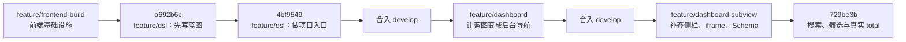
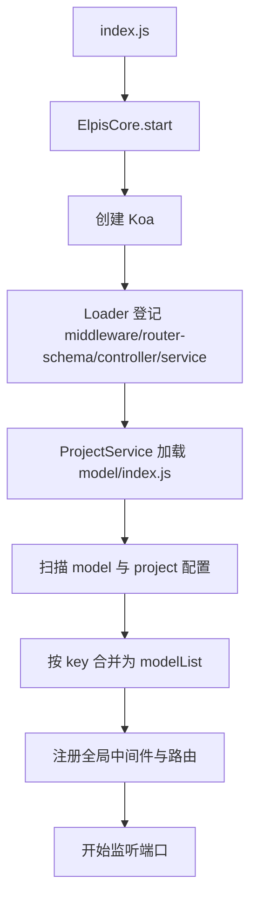
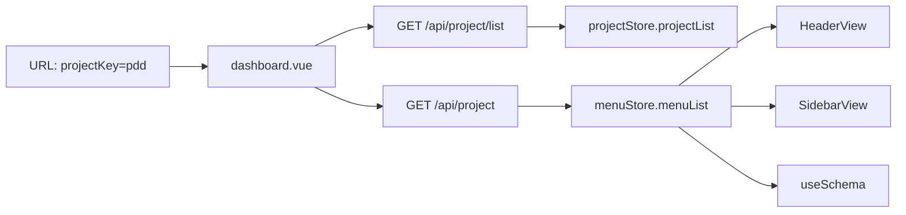
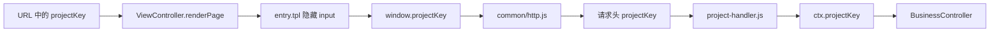
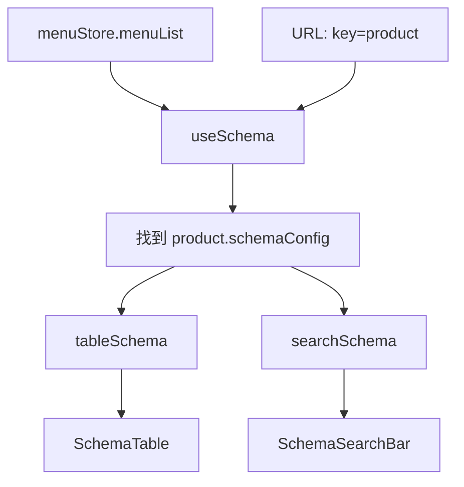
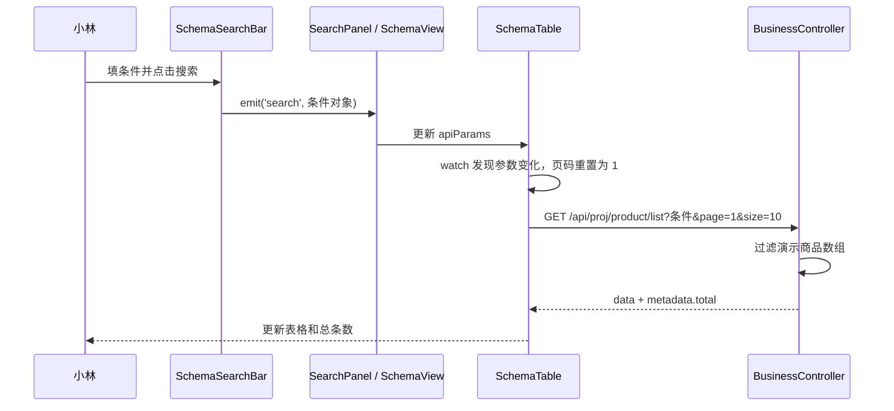

# Elpis 小白导游手册：一座会按配置自己布置的后台小镇

> 涵盖分支：`feature/dsl`、`feature/dashboard`、`feature/dashboard-subview` 三条分支的主线代码。
>
> 本文目标：不逐个念文件名，而是带你看清这些角色怎样接力，把一份配置变成一个能搜索商品的后台页面。

## 1. 这项目到底在做什么：一座会自己装修的后台小镇

想象你在经营一家“后台小镇建造公司”。客户可能是拼多多、淘宝、京东，也可能是一个课程平台。

以前的做法像这样：每来一个客户，就手工盖一整套后台，菜单复制一遍，商品表格复制一遍，搜索栏再复制一遍。刚开始很快，三个客户后就开始痛苦：一个表格列改了，三套代码都要回头找。

Elpis 的主意更聪明一点：

```text
先写一份“通用蓝图”
        ↓
每个客户只写“我和通用蓝图不一样的地方”
        ↓
后端把两份东西拼成最终装修图
        ↓
前端看着装修图，自动摆出菜单、页面、搜索栏和表格
```

在这座小镇里：

- `model` 是总设计院，保存公共蓝图。
- `project` 配置是客户本人写的改装单，例如“商品管理要改成拼多多的名字”。
- 后端是资料管理员，负责找图纸、拼图纸、通过 API 把图纸交出去。
- Dashboard 是大厅前台，拿到图纸后摆出顶部菜单和内容区。
- Schema 页面是万能展柜，它不关心你卖的是商品、订单还是客户，只认“字段说明书”。

### 1.1 用一句大白话记住项目核心

**业务差异写在配置里，通用页面读取配置来干活。**

“配置”不是玄学。这里它就是一段对象数据，例如：

```js
{
  key: "product",
  name: "商品管理",
  moduleType: "schema",
  schemaConfig: {
    api: "/api/proj/product",
  },
}
```

它好像一张工单，在交代四件事：

1. 这项菜单的身份证是 `product`。
2. 它显示给人看的名字是“商品管理”。
3. 它应该打开 Schema 类型的通用页面。
4. 这个页面的数据去哪个接口拿。

配置本身不会画表格，也不会发请求。它只负责把规则说清楚；真正执行的是后面的前端、后端组件。

> 小提示：看到 `Schema` 别紧张。它在这里可以理解为“字段说明书”，比如商品名叫什么、表格里怎么显示、搜索栏用输入框还是下拉框。

### 1.2 三条分支，其实是同一部连续剧

这不是三套互不相干的项目。按 Git 的祖先关系和提交顺序，它们像三集连续剧：



| 剧集                        | 当时遇到的问题                         | 做出的选择                                                 | 留下来的能力                           |
| --------------------------- | -------------------------------------- | ---------------------------------------------------------- | -------------------------------------- |
| `feature/dsl`               | “不同项目的菜单和首页怎么不复制粘贴？” | 模型配置和项目配置分开，用稳定 `key` 合并。                | 先有可描述系统的蓝图。                 |
| `feature/dsl`               | “用户从哪里挑一个项目进入？”           | 提供项目列表接口和项目卡片页。                             | 可以从入口页进入某个项目。             |
| `feature/dashboard`         | “进入项目后，菜单从哪里来？”           | 后端返回完整项目配置，前端存进 Pinia。                     | 菜单不再写死在 Vue 模板里。            |
| `feature/dashboard`         | “点击不同菜单怎么换内容？”             | 用 `moduleType` 决定路由去向。                             | 支持 custom、iframe、sidebar、schema。 |
| `feature/dashboard-subview` | “一张业务表难道每次都手写？”           | 做 Schema View、SchemaTable、SchemaSearchBar。             | 字段配置可以生成表格和搜索栏。         |
| `729be3b`                   | “搜不到数据时为何总条数还像有数据？”   | 搜索参数进接口，后端返回筛选后的 `total`，前端失败时清零。 | 空结果与分页总数一致。                 |

### 1.3 你现在看到的“商品管理”来自哪里

`model/business/model.js` 中的 `product` 菜单，好比商品区的总设计图：

```text
product 菜单
    ├─ moduleType: schema        告诉大厅：请打开通用 Schema 页面
    ├─ api: /api/proj/product    告诉表格：数据去这里拿
    └─ schema.properties         告诉搜索栏和表格：有哪些字段、各自怎么表现
          ├─ product_name
          ├─ price
          ├─ inventory
          └─ create_time
```

例如 `product_name.searchOption.colSpan: 2` 的意思不是“这个商品名有两个”。它是在告诉搜索栏：这个控件在大屏时占两格，别把它挤成和普通输入框一样窄。

---

## 2. 文件和文件夹角色表：谁在这座小镇里做什么

把项目目录想成一间公司。每个文件夹是一支小团队，关键文件是团队里的具体成员。

```text
Elpis/
├─ index.js                       开门的值班经理
├─ elpis-core/                    后端总调度中心
├─ model/                         总设计院：配置蓝图
├─ app/                           业务办事大厅
│  ├─ controller/                 接待员
│  ├─ service/                    资料管理员
│  ├─ router/                     导诊台
│  ├─ router-schema/              表单审核员
│  ├─ middleware/                 门禁与安检
│  ├─ pages/                      浏览器里的前台
│  ├─ view/                       HTML 外壳制作间
│  └─ webpack/                    打包运输队
├─ test/                          质量检查员
├─ config/                        环境说明书
└─ scripts/                       小工具抽屉
```

### 2.1 后端开门组

| 角色           | 位置                                                                      | 负责什么                                                              | 生活化比喻                                               |
| -------------- | ------------------------------------------------------------------------- | --------------------------------------------------------------------- | -------------------------------------------------------- |
| 值班经理       | [index.js](../index.js)                                                   | 调用 `ElpisCore.start`，给应用名和默认首页。                          | 早上打开公司大门，并在门口放一张“先去项目列表”的指示牌。 |
| 总调度中心     | [elpis-core/index.js](../elpis-core/index.js)                             | 创建 Koa，按顺序加载中间件、参数规则、控制器、服务和路由。            | 新员工报到时，按部门把人安排到工位上。                   |
| 自动登记员     | [elpis-core/loader](../elpis-core/loader)                                 | 扫描目录，把 Controller、Service 等挂到 `app` 上。                    | 不用手写员工花名册，看到符合命名规范的同事就自动登记。   |
| 公共门禁       | [app/middleware.js](../app/middleware.js)                                 | 注册静态资源、模板、Body 解析、异常、签名、参数和项目上下文中间件。   | 所有人进大厅都要按顺序过门禁。                           |
| 项目胸牌检查员 | [app/middleware/project-handler.js](../app/middleware/project-handler.js) | 对 `/api/proj/` 请求读取 `projectKey` 请求头，写入 `ctx.projectKey`。 | 商品部门要先看访客属于哪个项目，再决定给谁的数据。       |

`Koa` 是一个 Node.js 的 Web 框架。别把它想得很神秘，它就是一个“请求流水线”：浏览器的请求进来，依次经过几个函数，最后到对应接口。

### 2.2 蓝图设计组

| 角色       | 位置                                                              | 负责什么                                                      | 为什么重要                               |
| ---------- | ----------------------------------------------------------------- | ------------------------------------------------------------- | ---------------------------------------- |
| 总蓝图     | [model/business/model.js](../model/business/model.js)             | 描述电商系统的公共菜单、商品字段、搜索方式、表格按钮。        | 商品页的大部分规则只写一次。             |
| 客户改装单 | [model/business/project/pdd.js](../model/business/project/pdd.js) | 只写拼多多与公共蓝图不同的名称、首页、侧栏或 iframe。         | 不用复制整份电商系统配置。               |
| 另一套样板 | [model/course](../model/course)                                   | 描述课程系统和它的项目。                                      | 证明这套机制不只服务电商。               |
| 拼图师     | [model/index.js](../model/index.js)                               | 扫描 model 与 project 文件，按 `key` 合并，产出 `modelList`。 | 让“公共部分继承，差异部分覆盖”真正发生。 |

`key` 是这里最重要的身份证。不要把它当普通文案。

```text
公共菜单：{ key: "product", name: "商品管理", ...完整配置 }
PDD 改装：{ key: "product", name: "商品管理(拼多多)" }
最终结果：{ key: "product", name: "商品管理(拼多多)", ...完整配置 }
```

如果没有 `key`，只能说“数组第 0 项覆盖数组第 0 项”。有人一调菜单顺序，商品配置就可能盖到订单身上，现场会非常尴尬。`key` 让位置可以变，身份不变。

### 2.3 API 办事组

| 角色            | 位置                                                                                             | 负责什么                                                    | 你新增功能时何时找它               |
| --------------- | ------------------------------------------------------------------------------------------------ | ----------------------------------------------------------- | ---------------------------------- |
| 路由规则审核员  | [app/router-schema](../app/router-schema)                                                        | 规定接口接收什么参数、哪些必填。                            | 新增接口，或给列表新增筛选参数时。 |
| URL 导诊台      | [app/router](../app/router)                                                                      | 把 URL 指向 Controller 方法。                               | 新增 `/api/xxx` 地址时。           |
| 接待员          | [app/controller](../app/controller)                                                              | 从请求中拿数据，调用 Service 或业务逻辑，再按统一格式返回。 | 接口需要协调输入和输出时。         |
| 项目资料柜      | [app/service/project.js](../app/service/project.js)                                              | 保存已合并的 `modelList`，查询项目或同模型项目列表。        | 改项目聚合或项目查询规则时。       |
| 商品演示柜      | [app/controller/business.js](../app/controller/business.js)                                      | 用内存数组演示商品筛选、枚举接口和返回总数。                | 接数据库前，用它把链路跑通。       |
| HTML 外壳制作间 | [app/controller/view.js](../app/controller/view.js)、[app/view/entry.tpl](../app/view/entry.tpl) | 返回 Vue 挂载所需的 HTML 壳，并把 `projectKey` 放到浏览器。 | 改页面入口或首屏传递信息时。       |

这里有四个容易混的词，可以这样记：

```text
router-schema：这张申请表允许填什么
router：        填好表后该去哪个窗口
controller：    窗口接待员，接单并组织答复
service：       后面保管资料和查询资料的人
```

### 2.4 浏览器里的前台组

| 角色           | 位置                                                                                                                                                                                                                        | 负责什么                                                             | 拟人化理解                                 |
| -------------- | --------------------------------------------------------------------------------------------------------------------------------------------------------------------------------------------------------------------------- | -------------------------------------------------------------------- | ------------------------------------------ |
| Vue 启动器     | [app/pages/boot.js](../app/pages/boot.js)                                                                                                                                                                                   | 创建 Vue、Pinia、路由等公共前端能力。                                | 商场开门前先通电、开广播。                 |
| 项目广场       | [project-list.vue](../app/pages/project-list/project-list.vue)                                                                                                                                                              | 请求模型分组和项目卡片，用户点击“进入”。                             | 小镇入口的导览牌。                         |
| Dashboard 大厅 | [dashboard.vue](../app/pages/dashboard/dashboard.vue)                                                                                                                                                                       | 请求当前项目配置和同模型项目，把菜单和项目列表分别交给 Pinia。       | 进楼后的总前台。                           |
| 大厅路线图     | [entry.dashboard.js](../app/pages/dashboard/entry.dashboard.js)                                                                                                                                                             | 注册 iframe、schema、sidebar 和示例 custom（`/todo`）路由。          | 告诉访客每扇门通向哪里。                   |
| 菜单公共白板   | [store/menu.js](../app/pages/store/menu.js)                                                                                                                                                                                 | 保存菜单并递归寻找顶级、分组、侧栏菜单项。                           | 不同楼层都能看到的一块白板。               |
| 项目切换白板   | [store/project.js](../app/pages/store/project.js)                                                                                                                                                                           | 保存同模型项目列表。                                                 | 顶部项目切换器的数据来源。                 |
| Schema 翻译员  | [schema.js](../app/pages/dashboard/complex-view/schema-view/hook/schema.js)                                                                                                                                                 | 从当前菜单找 `schemaConfig`，再翻译为表格和搜索栏各自能读的 Schema。 | 把总设计图翻成两个施工队都看得懂的施工单。 |
| 搜索接待台     | [schema-search-bar.vue](../app/pages/widgets/schema-search-bar/schema-search-bar.vue)                                                                                                                                       | 根据 `comType` 放输入框、下拉框、日期范围，并处理 `colSpan` 栅格。   | 同一排柜台，按菜单摆不同控件。             |
| 通用表格       | [schema-table.vue](../app/pages/widgets/schema-table/schema-table.vue)                                                                                                                                                      | 请求列表、显示列、分页、错误清空和 `total`。                         | 一个可以卖不同商品的标准展柜。             |
| 两位现场主管   | [search-panel.vue](../app/pages/dashboard/complex-view/schema-view/complex-view/search-panel/search-panel.vue)、[table-panel.vue](../app/pages/dashboard/complex-view/schema-view/complex-view/table-panel/table-panel.vue) | 接住搜索事件、传给表格；处理表头或行操作。                           | 一个管筛选，一个管表格和按钮。             |

`Pinia` 是 Vue 的状态管理工具。大白话说，它是“公共白板”：菜单不必从 Dashboard 一层层 `props` 传到 Header、Sidebar、Schema 页面，大家都可以从同一处读取。

### 2.5 两种“路由”，别把它们搅在一起

项目用了两层导航：

```text
第一层：Koa 路由
/view/dashboard/...  -> 后端返回 dashboard 的 HTML 外壳

第二层：Vue Router
/view/dashboard/schema -> 浏览器里的 Vue 显示 SchemaView
```

所以 `ctx.render` 并不表示“Vue 所有内容都在服务器拼完了”。当前项目主要是 Nunjucks 先给浏览器一个 HTML 外壳和脚本位置，Vue 再在浏览器里挂到 `#root` 上绘制真正的界面。

> 小吐槽：同样都叫“路由”，一个负责把你送进商场，一个负责告诉你商场内部该去几楼。名字一样，工种不同。

---

## 3. 完整数据流故事：从一张蓝图到“搜索后总数为 0”

下面让一位用户“小林”从项目入口走到商品搜索页。读完这段，你应该能把前后端的接力顺序说出来。

### 3.1 清晨：服务启动，资料先归档

当运行 `index.js` 时，事情不是立刻从商品接口开始，而是先做开门准备：



`ProjectService` 顶部调用 `model/index.js`，所以配置在服务准备阶段已经整理进内存。之后每次请求项目详情，不需要重新扫描一遍所有配置文件。

生活化一点说：餐厅开门前先把菜单和食材摆好，顾客点单时直接查，不会每来一个人就跑去菜市场。

### 3.2 小林先来到项目广场

1. 小林打开 `/view/project-list`。
2. [project-list.vue](../app/pages/project-list/project-list.vue) 请求 `GET /api/project/model_list`。
3. [router/project.js](../app/router/project.js) 把 URL 送到 `ProjectController.getModelList`。
4. `ProjectService.getModelList()` 交出已经合并好的 `modelList`。
5. Controller 把复杂的内部配置裁成“模型 + 项目卡片需要的信息”。
6. 页面渲染“电商系统”下的拼多多、淘宝、京东等项目卡片。

为什么不把所有内部配置都直接扔给项目列表页？因为入口页只需要名字、描述、首页地址。让它拿一整份菜单 Schema，就像去便利店买水却顺便搬走仓库货架，既多余也更难维护。

### 3.3 点击“进入”：Dashboard 把项目蓝图领回来

以 PDD 首页为例，项目配置给出的 `homePage` 类似：

```text
/schema?projectKey=pdd&key=product
```

项目列表页把它拼到 `/view/dashboard` 后面，于是浏览器进入：

```text
/view/dashboard/schema?projectKey=pdd&key=product
```

Dashboard 挂载后会并行做两件正事：



- `/api/project/list`：拿同一个模型下的项目，用于右上角项目切换。
- `/api/project`：拿当前项目完整配置，尤其是 `menu`。

这两个接口分开是有理由的：一个是“还有哪些同类店可以切换”，一个是“我当前这家店该怎么装修”。不要为了少一个接口，把两种用途硬塞进同一包数据。

### 3.4 `projectKey` 的接力赛：它为什么会跟着商品请求走

商品接口需要知道“这次是 PDD 还是淘宝在查”。项目没有让每个商品页面手工拼这个参数，而是安排了一条公共传送带：



具体故事是：

1. 后端渲染 HTML 外壳时，把 URL 里的 `projectKey` 填入 `entry.tpl`。
2. 页面脚本读取它，写入 `window.projectKey`。
3. 前端 HTTP 封装发现请求地址以 `/api/proj` 开头，就自动带上项目胸牌。
4. 后端 `project-handler` 读取这个胸牌，写进 `ctx.projectKey`。
5. `BusinessController` 只需要看 `ctx.projectKey`，不用每个商品接口重复写取请求头的代码。

> 小提示：HTTP 请求头在 Koa 中会规范成小写。这里使用 `ctx.get("projectKey")` 读取，可以避开手写对象属性时大小写不一致的小坑。

### 3.5 到商品区：配置被翻译成搜索栏和表格

URL 中还有 `key=product`。这是告诉 Schema 页面：“当前要打开 `product` 这张菜单说明书。”



同一份原始字段配置会被拆成两张施工单：

```text
product_name 原始字段
    ├─ label、type                 公共信息
    ├─ tableOption                 只给表格的列配置
    └─ searchOption                只给搜索栏的控件配置

useSchema 翻译后
    ├─ tableSchema：所有字段默认入表
    └─ searchSchema：只有写了 searchOption 的字段才入搜索栏
```

这就是适配器。适配器不是新功能，而是“翻译员”：上游数据长一种样子，下游组件想要另一种样子，它把两者接起来，避免表格和搜索栏各自猜配置结构。

### 3.6 小林点“搜索”：条件怎么真的到了后端

小林在商品名动态下拉框里选中一项，或者选了价格、填了库存，接下来会发生：



`SchemaTable` 监听 `apiParams`。所以不是“点完搜索按钮后表格碰巧刷新”，而是搜索条件这个响应式数据变了，表格有意识地重新请求。

为什么要把页码重置为第 1 页？假设小林原先在第 5 页，搜索后只剩 1 条数据。还请求第 5 页，她很容易误会“搜索坏了”。回第一页才符合人的预期。

### 3.7 为什么“暂无数据”时总条数终于是 0

这个小细节其实是一份前后端合同：

```text
后端：筛选后有几条，就返回 metadata.total 为几条
前端：拿到空数组或无效响应，就清空表格数据和 total
```

当前商品接口是内存演示数据。它筛选后会这样返回：

```js
this.success(ctx, productList, {
  total: productList.length,
  page,
  size,
})
```

因此筛到空数组时：

```text
data = []
metadata.total = 0
```

[test/controller/business.test.js](../test/controller/business.test.js) 也专门检查了这个约定：用不存在的库存筛选，结果必须是空数组，并且 `total` 必须严格等于 `0`。

> 小提示：前端读取总数时使用 `??`，不是 `||`。因为 `0 || 10` 会错误地得到 `10`；但 `0 ?? 10` 会正确保留 `0`。这是一个很小、但很容易让分页撒谎的细节。

---

## 4. 核心代码拆开讲：每一行都在防什么小事故

下面只挑最能串起主线的片段。代码片段为了排版省略了无关注释，行为与当前源码一致。每段都回答三件事：这行在做什么、为什么要有它、删掉后会发生什么。

### 4.1 拼图师：模型配置怎样按 `key` 合并

源码位置：[model/index.js](../model/index.js)。

```js
01 const projectExtendModel = (model, project) => {
02   return _.mergeWith({}, model, project, (modelValue, projectValue) => {
03     if (Array.isArray(modelValue) && Array.isArray(projectValue)) {
04       const result = [];
05       for (const modelItem of modelValue) {
06         const projectItem = projectValue.find((item) => item.key === modelItem.key);
07         result.push(
08           projectItem ? projectExtendModel(modelItem, projectItem) : modelItem,
09         );
10       }
11       for (const projectItem of projectValue) {
12         const modelItem = modelValue.find((item) => item.key === projectItem.key);
13         if (!modelItem) result.push(projectItem);
14       }
15       return result;
16     }
17   });
18 };
```

| 行       | 这行在干嘛                                               | 为什么需要它                                                | 删掉后的“小事故”                               |
| -------- | -------------------------------------------------------- | ----------------------------------------------------------- | ---------------------------------------------- |
| 01       | 定义一个会再次调用自己的合并函数。                       | 菜单里还可能套子菜单，递归能继续往里合并。                  | 深层侧栏菜单只能合并一层，里面的覆盖配置失效。 |
| 02       | 让 Lodash 合并普通对象；遇到数组时交给后面的自定义规则。 | `name` 这类普通字段适合直接覆盖，菜单数组不适合按下标合并。 | 数组可能错位合并，菜单顺序一变就出错。         |
| 03       | 确认两边当前字段都是数组。                               | 只给菜单等数组特殊待遇。                                    | 普通对象也被误当数组处理，整份配置会乱。       |
| 04       | 准备一个新数组装合并结果。                               | 不直接修改原始总蓝图。                                      | 原始配置可能被污染，后续项目拿到脏数据。       |
| 05       | 先走一遍公共模型已有的菜单。                             | 公共功能默认应继承下来。                                    | 项目没主动写出的公共菜单会凭空消失。           |
| 06       | 用 `key` 在项目差异里找同名身份证。                      | `key` 表示身份，不能依靠数组第几项。                        | 调整菜单顺序后，覆盖到错误的菜单。             |
| 07 至 09 | 找到差异就递归合并；没找到就保留公共项。                 | 同时实现“覆盖”和“继承”。                                    | 要么项目改名无效，要么公共配置丢失。           |
| 11       | 再走一遍项目自己的菜单。                                 | 有些项目能新增总蓝图里没有的专属菜单。                      | 项目只能改旧功能，不能加新功能。               |
| 12 至 13 | 只把模型里不存在的新菜单加入结果。                       | 避免已经覆盖过的菜单出现两份。                              | 商品管理会出现两个，用户不知道点哪个。         |
| 15       | 把定制后的数组交回 Lodash。                              | 外层对象还要继续合并其他字段。                              | 调用者拿不到正确的菜单数组。                   |

一句话背诵版：**先保留总部原有菜单并逐个覆盖，再追加分店独有菜单。**

### 4.2 Dashboard 领配置：为什么菜单不写死在页面里

源码位置：[dashboard.vue](../app/pages/dashboard/dashboard.vue)。

```js
01 async function getProjectConfig() {
02   const params = { query: { projectKey: route.query.projectKey } };
03   const res = await $http.get("/api/project", params);
04   if (!res || !res.success || !res.data) return;
05   const { name, menu } = res.data;
06   projectName.value = name;
07   menuStore.setMenuList(menu);
08 }
```

| 行  | 这行在干嘛                             | 为什么需要它                               | 删掉后的“小事故”                            |
| --- | -------------------------------------- | ------------------------------------------ | ------------------------------------------- |
| 01  | 声明“领取当前项目配置”的异步函数。     | HTTP 请求需要等待后端回复。                | 后续无法把请求步骤组织在一个清晰函数中。    |
| 02  | 从 URL 取 `projectKey`，组装查询参数。 | 后端要知道你要 PDD、淘宝还是京东。         | 后端不知道查谁，参数校验会拦下请求。        |
| 03  | 调用项目详情 API。                     | 完整菜单经过后端合并，前端不该自己拼。     | Dashboard 没有可用菜单，页面只能空着。      |
| 04  | 遇到网络失败、业务失败或空数据就停下。 | 先防守，再解构数据。                       | `res.data` 不存在时，页面可能抛运行时错误。 |
| 05  | 只取页面真正需要的项目名和菜单。       | 页面不必知道响应里所有细节。               | 后面没有变量可用于展示和存储。              |
| 06  | 写入当前组件的响应式标题。             | 顶部能显示当前项目名。                     | 顶部标题为空。                              |
| 07  | 把菜单放入 Pinia 公共白板。            | Header、Sidebar、Schema 页面都能共享读取。 | 只能层层传 `props`，或各组件重复请求接口。  |

这正是“配置驱动”的关键：HeaderView 不写“商品管理、订单管理”这些固定文字，它只读 `menuStore.menuList`。换项目时换的主要是数据，不是重写导航组件。

### 4.3 Schema 翻译员：同一字段为什么能服务两个组件

源码位置：[hook/schema.js](../app/pages/dashboard/complex-view/schema-view/hook/schema.js)。

```js
01 const option = props[`${comName}Option`];
02 if (comName === "table" || option) {
03   const dtoProps = {};
04   for (const pKey in props) {
05     if (pKey.indexOf("Option") < 0) {
06       dtoProps[pKey] = props[pKey];
07     }
08   }
09   dtoProps.option = option ?? {};
10   dtoSchema.properties[key] = dtoProps;
11 }
```

这里的 `comName` 可以是 `table` 或 `search`。所以第 01 行会动态拿到 `tableOption` 或 `searchOption`。

| 行       | 这行在干嘛                                                   | 为什么需要它                                          | 删掉后的“小事故”                                         |
| -------- | ------------------------------------------------------------ | ----------------------------------------------------- | -------------------------------------------------------- |
| 01       | 根据组件名字读取专属配置。                                   | 一套翻译逻辑就能服务表格和搜索栏。                    | 得写两套近乎重复的转换代码。                             |
| 02       | 表格收所有字段；搜索栏只收明确配置了 `searchOption` 的字段。 | 表格默认展示字段，搜索不该把所有字段都塞出来。        | 搜索区会出现不该搜的商品 ID 等字段，或表格漏列。         |
| 03       | 准备下游用的新字段对象。                                     | 不直接改原始配置。                                    | 表格和搜索栏可能互相篡改同一份对象。                     |
| 04 至 08 | 复制 `label`、`type` 等公共信息，过滤掉各种 `xxxOption`。    | 下游拿到干净的公共字段说明。                          | `tableOption` 和 `searchOption` 混在一起，组件职责不清。 |
| 09       | 把当前组件专属配置统一命名为 `option`。                      | `SchemaTable` 和 `SchemaSearchBar` 只要认识一个名字。 | 下游组件必须知道上游所有配置字段名，耦合变重。           |
| 10       | 放进最终 Schema 的 `properties`。                            | 组件能遍历字段并渲染控件。                            | 这一列或搜索控件直接消失。                               |

所以记住这条规则：

```text
tableOption 不负责“让字段出现”
tableOption 负责“已出现的列要怎么微调”

searchOption 负责“这个字段要不要出现在搜索栏，以及用什么控件”
```

例如 `visible: false`、列宽度、文本溢出提示都适合放 `tableOption`；`input`、`select`、`dateRange`、`colSpan` 都是 `searchOption` 的职责。

### 4.4 搜索栏栅格：`colSpan: 2` 怎样变成真正的宽度

源码位置：[schema-search-bar.vue](../app/pages/widgets/schema-search-bar/schema-search-bar.vue)。

```js
01 const normalizeColSpan = (value) => {
02   const colSpan = Number(value);
03   if (!Number.isFinite(colSpan)) return 1;
04   return Math.min(Math.max(Math.round(colSpan), 1), 3);
05 };
06 const getGridSpan = (value, columnCount) => {
07   return (Math.min(normalizeColSpan(value), columnCount) / columnCount) * 24;
08 };
```

Element Plus 栅格一行总共是 24 份。项目没有要求业务配置写 `8`、`16`、`24`，而是约定更易懂的逻辑列数 `1`、`2`、`3`：

| `searchOption.colSpan` | 手机 `xs` | 中屏 `sm`：一行 2 逻辑列 | 大屏 `lg`：一行 3 逻辑列 |
| ---------------------- | --------- | ------------------------ | ------------------------ |
| 不写或 `1`             | 24        | 12                       | 8                        |
| `2`                    | 24        | 24                       | 16                       |
| `3`                    | 24        | 24                       | 24                       |

| 行  | 这行在干嘛                                   | 为什么需要它                               | 删掉后的“小事故”                     |
| --- | -------------------------------------------- | ------------------------------------------ | ------------------------------------ |
| 01  | 定义清洗 `colSpan` 的函数。                  | 配置来自业务，不能假设永远写得完美。       | 每个调用点都得自己防错误值。         |
| 02  | 尝试把 `"2"` 或 `2` 变成数字。               | 配置写成字符串也能正常理解。               | 字符串数字可能算不出正确布局。       |
| 03  | 非数字时默认占 1 列。                        | 给页面一个稳定的兜底。                     | `NaN` 会传进栅格，布局可能乱掉。     |
| 04  | 四舍五入，并限制在 1 到 3。                  | 当前页面最多定义三列逻辑网格。             | 写 `0`、负数或 `99` 时会把一行撑坏。 |
| 06  | 定义“逻辑列数转 24 栅格”的函数。             | 业务配置不用背 Element Plus 的 24 格规则。 | 每个模板都得手算宽度。               |
| 07  | 先不超过当前断点可容纳的列数，再换算 24 格。 | 中屏只有两列时，`colSpan: 3` 应独占一行。  | 中屏可能超宽、换行混乱。             |

组件还会在传给输入框前删除 `option.colSpan`。因为它是搜索栏布局规则，`el-input`、`el-select` 不需要知道这件事。把不属于下游的参数拿走，是一种很朴素的边界感。

### 4.5 表格请求：搜索条件、分页和总数怎样一起到位

源码位置：[schema-table.vue](../app/pages/widgets/schema-table/schema-table.vue)。

```js
01 const params = {
02   query: {
03     ...apiParams.value,
04     page: currentPage.value,
05     size: pageSize.value,
06   },
07 };
08 const res = await $http.get(`${api.value}/list`, params);
09 if (!res || !res.success || !Array.isArray(res.data)) {
10   tableData.value = [];
11   total.value = 0;
12   return;
13 }
14 tableData.value = buildTableData(res.data) || [];
15 total.value = res.metadata?.total ?? tableData.value.length;
```

| 行       | 这行在干嘛                                             | 为什么需要它                               | 删掉后的“小事故”                        |
| -------- | ------------------------------------------------------ | ------------------------------------------ | --------------------------------------- | --- | ----------------------------- |
| 01 至 07 | 组装 GET 请求的查询参数。                              | 把搜索条件和分页条件一次交给后端。         | 接口只能拿到其中一类信息。              |
| 03       | 展开搜索栏给出的条件。                                 | 商品名、价格、库存、日期才会真正进 URL。   | UI 看起来选了条件，接口却还查全量数据。 |
| 04、05   | 加上当前页和每页数量。                                 | 列表 API 和分页器要遵守同一份约定。        | 后端无法知道用户要哪一页。              |
| 08       | 用配置 API 前缀加 `/list` 请求数据。                   | 表格没有写死商品接口，订单页也能复用。     | 组件只能服务商品，失去通用价值。        |
| 09       | 先判断响应是不是成功且数据是不是数组。                 | 网络失败或业务失败不能当正常列表继续渲染。 | 页面可能报错，或残留旧数据。            |
| 10、11   | 无效响应时清空表格和总数。                             | 空状态和分页状态必须同步。                 | 表格写“暂无数据”，底下却显示旧总数。    |
| 14       | 对正常数据做显示前处理后写入表格。                     | 未来可统一处理小数位等展示规则。           | 表格没有新数据可画。                    |
| 15       | 优先相信后端返回的真实总数；没给时才退回当前数组长度。 | `0` 是合法总数，`??` 会保住它。            | 若误用 `                                |     | `，空结果可能回退成错误总数。 |

此外，`SchemaTable` 还 `watch` 了 `schema`、`api`、`apiParams`。其中 `apiParams` 一变化就会执行 `initData()`，把页码恢复为 1 后再请求。这就是搜索按钮和表格重新加载之间的真正接线。

### 4.6 商品接待员：后端如何让筛选结果说真话

源码位置：[app/controller/business.js](../app/controller/business.js)。

```js
01 if (price !== undefined && price !== "") {
02   productList = productList.filter((item) => String(item.price) === String(price));
03 }
04
05 this.success(ctx, productList, {
06   total: productList.length,
07   page,
08   size,
09 });
```

| 行     | 这行在干嘛                           | 为什么需要它                                               | 删掉后的“小事故”                                         |
| ------ | ------------------------------------ | ---------------------------------------------------------- | -------------------------------------------------------- |
| 01     | 只在用户真的给了价格条件时才筛选。   | 空条件表示“不限制价格”，不是“价格为空”。                   | 初始加载就可能被错误过滤掉数据。                         |
| 02     | 用 `filter` 留下价格相同的演示商品。 | 浏览器传来的查询参数通常是字符串，统一转字符串比较更稳定。 | `999` 与 `"999"` 可能比较失败。                          |
| 05     | 调用统一成功响应方法。               | Controller 返回格式保持一致。                              | 前端 HTTP 封装可能读不到 `success`、`data`、`metadata`。 |
| 06     | 计算筛选后的总条数。                 | `total` 必须反映过滤后的结果，不是原始总数。               | 空表格下方仍显示“总数 2”，用户会怀疑系统。               |
| 07、08 | 回传当前分页参数。                   | 让响应保留这次查询的上下文。                               | 调试和将来的分页实现少了必要信息。                       |

> 当前版本是教学用演示：商品数组写在 Controller 内存里，`page`、`size` 会返回但还没有真的 `slice` 切页。接数据库后，应把筛选、总数统计、分页放进查询层，让数据库完成这些工作。

---

## 5. 通用模板、业务代码、半通用配置：以后哪些能搬走

不要把项目里所有代码都当成“下个项目复制一份”。更实用的分法是下面三类。

| 标记         | 主要位置                                                                     | 它是什么                                                            | 下个项目怎么用                                                     |
| ------------ | ---------------------------------------------------------------------------- | ------------------------------------------------------------------- | ------------------------------------------------------------------ |
| [可复用骨架] | elpis-core 的 Loader、统一响应、全局中间件组织方式                           | 让目录约定自动变成 app.controllers、app.services 等对象的框架能力。 | 大多保留，按新项目目录规范接入。                                   |
| [可复用组件] | boot.js、Pinia 初始化、Dashboard 壳、SchemaTable、SchemaSearchBar、useSchema | 与“商品”这个词无关，只认通用输入和配置。                            | 先尝试通过配置复用，别一上来复制组件。                             |
| [可复用思路] | 模型与项目按 key 合并、moduleType 分发、provide/inject 页面局部共享          | 这是设计方法，不必一字不改抄代码。                                  | 根据新项目的数据形状调整。                                         |
| [业务定制]   | model/business、model/course、PDD/淘宝/京东项目文件                          | 菜单名称、首页、字段、搜索控件、按钮文案。                          | 换成订单系统时，主要改这里。                                       |
| [业务定制]   | business.js、对应 router 和 router‑schema                                    | 商品数据、筛选规则、接口 URL。                                      | 换数据源或资源类型时必须实现自己的业务接口。                       |
| [演示代码]   | 内存商品数组、示例 iframe 地址、todo 页面                                    | 用最小内容把整条链路跑通。                                          | 上线前换成真实页面、数据库和可靠鉴权。                             |
| [需要谨慎]   | 浏览器 HTTP 封装中的请求签名演示                                             | 教学中能说明前后端约定，不等于生产安全方案。                        | 不要把长期密钥放进浏览器；生产应改用安全登录态、Token 或网关方案。 |

### 5.1 想新增“订单管理”，先别复制表格，按这个顺序想

```text
1. model 配置：增加 key 为 order 的菜单
2. 页面类型：它是 schema、custom、iframe 还是 sidebar
3. 字段说明：label、tableOption、searchOption
4. 数据接口：router-schema -> router -> controller -> service 或数据库
5. 接口形状：SchemaTable 会请求 “配置 api + /list”
6. 测试：至少覆盖正常筛选、无数据、total 为 0
```

如果为了订单管理要复制一整份 `SchemaTable.vue`，先停一下。问自己：是现有配置缺一个小字段，还是这个页面真的已经不是“列表 + 搜索”的同类问题？前者应该扩展配置，后者才值得写新页面。

---

## 6. 当前版本的教学边界：看懂它，但别原样带去生产

| 当前现象                                                                                                                                                                         | 为什么课程里这样做                         | 真实项目的下一步                                           |
| -------------------------------------------------------------------------------------------------------------------------------------------------------------------------------- | ------------------------------------------ | ---------------------------------------------------------- |
| 商品数据在 `BusinessController` 的内存数组里。                                                                                                                                   | 方便把筛选和总数链路讲清楚。               | 数据移到 Service 和数据库。                                |
| `page`、`size` 还没真的切分内存列表。                                                                                                                                            | 先演示“参数能够到达后端”。                 | 数据库查询同时执行过滤、`count` 和分页。                   |
| 删除接口返回成功信息，但演示数组不会持久变化。                                                                                                                                   | 先演示按钮到接口的通信。                   | 做真实删除，并在事务成功后刷新列表。                       |
| `order`、`client` 的 `customConfig.path` 已写进模型，但 [entry.dashboard.js](../app/pages/dashboard/entry.dashboard.js) 当前只注册了示例 `/todo`。                               | 先搭好 `moduleType` 分发的骨架。           | 点击这两个菜单前，要补对应 Vue 路由和页面组件。            |
| [table-panel.vue](../app/pages/dashboard/complex-view/schema-view/complex-view/table-panel/table-panel.vue) 的删除确认回调中，`res` 是弹窗确认结果，不是 `$http.delete` 的响应。 | 演示代码把“弹窗 -> 发请求”的前半段接上了。 | 将删除请求结果赋给单独变量，再据它决定成功提示与表格刷新。 |
| `searchConfig` 会从配置传下去，但当前搜索栏主要消费字段级 `searchOption`。                                                                                                       | 为后续扩展留了数据位置。                   | 明确它的职责，或删除未使用概念。                           |
| `moduleType` 目前是固定映射。                                                                                                                                                    | sidebar、iframe、schema、custom 已够演示。 | 新类型需要一起补配置约束、Vue 路由和渲染组件。             |

这不是在否定课程代码。课程版的价值是把“配置如何流动”讲得可见；生产版的价值是把数据、权限、异常、性能做得更可靠。两者解决的问题不一样。

---

## 7. 最短复读路线：重新看源码时怎么不迷路

别从一个 200 行 Vue 组件硬读到底。照下面顺序走，每次只回答一个问题：

1. 看 [model/business/model.js](../model/business/model.js)：商品页的蓝图到底写了什么？
2. 看 [model/index.js](../model/index.js)：公共蓝图和 PDD 改装单怎么按 `key` 拼起来？
3. 看 [app/service/project.js](../app/service/project.js) 与 [app/controller/project.js](../app/controller/project.js)：拼好的配置如何变成 API 响应？
4. 看 [project-list.vue](../app/pages/project-list/project-list.vue)：用户如何从项目广场进入 Dashboard？
5. 看 [dashboard.vue](../app/pages/dashboard/dashboard.vue) 与 [entry.dashboard.js](../app/pages/dashboard/entry.dashboard.js)：菜单为何能变成路由？
6. 看 [hook/schema.js](../app/pages/dashboard/complex-view/schema-view/hook/schema.js)：一份字段说明为何分成表格和搜索两份？
7. 最后看 [schema-search-bar.vue](../app/pages/widgets/schema-search-bar/schema-search-bar.vue) 和 [schema-table.vue](../app/pages/widgets/schema-table/schema-table.vue)：组件如何消费配置、发请求、更新 total？

每读完一站，去浏览器找一个看得见的证据：

```text
把 PDD 的菜单名字改掉
    -> 刷新 Dashboard
    -> 顶部文案变化

把某字段的 searchOption.colSpan 改成 2
    -> 刷新商品页
    -> 该控件在大屏占两格

用不存在的库存搜索
    -> 看 Network 的 Query String
    -> inventory 参数出现
    -> 页面显示“暂无数据”，总条数为 0
```

---

## 8. 三道趣味思考题：你现在是小镇代理管理员

### 问题一：PDD 只改了菜单名字，为什么商品表格还在？

假设 `pdd.js` 中只写：

```js
{ key: "product", name: "商品管理(拼多多)" }
```

它没有重写 `schemaConfig`，商品表格、搜索栏、商品 API 为什么仍会出现？

提示：回去看“先保留总部菜单，再覆盖分店差异”的合并过程。

### 问题二：把 `product_name.searchOption` 删了，会发生什么？

表格里还有商品名称吗？搜索栏里还有商品名称吗？为什么两个答案不一样？

提示：`buildDtoSchema` 在 `table` 和 `search` 两种模式下，对字段的收录条件不同。

### 问题三：小林从 PDD 切到淘宝，谁该换班，谁不用重写？

想一想：哪些数据需要重新请求？哪些通用组件只是拿新配置再渲染一次？

提示：项目详情、同模型项目列表、菜单状态需要更新；SchemaTable 本身不需要为淘宝再复制一份。

---

## 9. 两个小练习：亲手制造一次可控的小变化

### 练习一：让库存搜索框变宽

目标：亲眼看到配置如何控制布局。

1. 打开 [model/business/model.js](../model/business/model.js)。
2. 找到 `inventory` 的 `searchOption`。
3. 加上 `colSpan: 2`。
4. 刷新商品页，在大屏下看库存输入框是否从三分之一行宽变成三分之二。
5. 再故意写成 `colSpan: 4`，观察它被限制为整行宽度。

完成后问自己：为什么没改 `SchemaSearchBar` 模板，布局却变了？

### 练习二：新增一个“价格 2999”的可搜索商品

目标：体验“前端选项”和“后端真实数据”必须一起配合。

1. 在 `price.searchOption.enumList` 增加 `{ label: "2999", value: "2999" }`。
2. 在 [app/controller/business.js](../app/controller/business.js) 的演示商品数组中增加一条价格为 `2999` 的数据。
3. 用价格下拉框筛选 `2999`。
4. 确认表格只出现这条数据，分页总数是 `1`。
5. 补一条测试，确认价格为 `2999` 时 `metadata.total` 也是 `1`。

完成后问自己：为什么只改下拉选项还不够？答案是：配置只决定用户“能选什么”，业务数据和筛选逻辑才决定用户“能查到什么”。

---

## 10. 最后带走的一句话

这套项目真正的主角不是某一个 Vue 文件，也不是某一个接口，而是一条稳定的接力规则：

```text
业务差异写进配置
        ↓
后端统一扫描、合并并提供接口
        ↓
前端保存当前项目状态和菜单
        ↓
适配器把配置翻译给通用组件
        ↓
业务接口返回与筛选条件一致的真实数据和 total
```

以后看到一个新配置字段，不要先在全项目里盲搜“它在哪里渲染”。先按这五问追踪：

1. 它在哪份模型或项目配置里声明？
2. 后端是否会合并并通过 API 返回它？
3. 前端把它存在哪个状态里？
4. 哪个适配器把它翻译给组件？
5. 最终由哪个组件或接口消费它？

能把这五步讲通，你就已经不是“照教程把代码敲出来”，而是在读懂一个可以继续扩展的系统。
