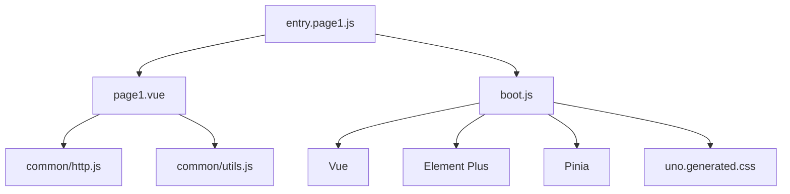
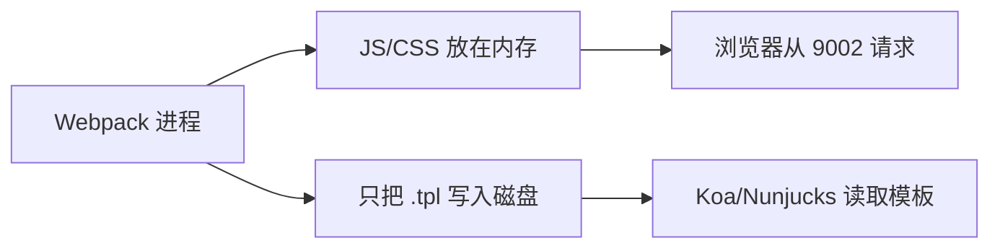

# Webpack 工程化：先问清这 6 个问题

> 一份结合 Elpis 项目的入门说明。  
> 不要求先背 Webpack 配置，先弄明白每项配置到底在解决什么问题。

---

## 先用一句大白话说明 Webpack

我们平时写的源码，浏览器不一定能直接使用：

- 浏览器不认识 `.vue` 文件。
- Less 需要先变成 CSS。
- 新版 JavaScript 可能要兼容旧浏览器。
- 项目里可能有几百个模块，不能让浏览器自己逐个寻找。
- 开发时希望保存代码后马上看到结果。
- 上线时希望文件更小、缓存更稳定。

Webpack 做的事情，可以理解成一条前端资源生产线：


所以，Webpack 工程化不是“装很多 loader 和 plugin”。

> **Webpack 工程化，是把源码到上线资源之间的过程，变成一套稳定、自动、可验证的规则。**

---

## 六个问题总览

| 问题                  | 大白话解释                                   | 主要对应配置                             |
| --------------------- | -------------------------------------------- | ---------------------------------------- |
| 1. 我要构建什么项目？ | 这是单页、多页，还是后端模板项目？           | `entry`、HtmlWebpackPlugin、构建目标     |
| 2. 源码从哪里进入？   | Webpack 从哪个文件开始找代码？               | `entry`、动态入口、依赖图、`splitChunks` |
| 3. 源码怎样转换？     | `.vue`、Less、图片怎样变成浏览器能用的内容？ | `module.rules`、loader、资源模块         |
| 4. 产物交给谁？       | 打包文件放在哪里，浏览器又从哪里请求？       | `output.path`、`filename`、`publicPath`  |
| 5. 开发时怎样更舒服？ | 保存后怎样快速更新，报错怎样方便定位？       | development、source map、HMR、开发服务器 |
| 6. 上线时怎样更可靠？ | 怎样压缩、缓存、发现构建失败和排查线上问题？ | production、hash、压缩、构建检查         |

下面逐个展开。

---

## 问题一：我要构建什么项目？

### 先说人话

配置 Webpack 之前，必须先弄明白项目最后是怎么运行的。

就像出发前要先确定目的地，否则导航软件也不知道该往哪里走。

常见项目大致分为下面几类：

| 项目类型     | 页面怎么打开                          | Webpack 通常怎么做              |
| ------------ | ------------------------------------- | ------------------------------- |
| 单页应用 SPA | 只有一个 HTML，页面切换由前端路由完成 | 一个入口、一个 HTML             |
| 多页应用 MPA | 每个页面相对独立                      | 多个入口、多个 HTML             |
| 后端模板项目 | 后端根据 URL 选择并渲染模板           | Webpack 生成模板和前端资源      |
| 组件库       | 被其他项目安装和引用                  | 输出 JS/CSS 库，通常不生成 HTML |
| SSR 项目     | 服务端也会执行 Vue 或 React           | 分别构建服务端和浏览器端代码    |

### Elpis 属于哪一种？

Elpis 属于“后端模板驱动的多页 Vue 项目”。


这里有一个很重要的边界：

- Koa 负责决定打开哪个页面。
- Nunjucks 负责生成 HTML 外壳。
- Webpack 负责生成模板需要引用的 JS 和 CSS。
- Vue 负责浏览器里的交互。

因此 Elpis 不能完全照搬普通 Vue SPA 的配置。它需要：

1. 找到多个页面入口。
2. 为每个入口生成一个 `.tpl` 模板。
3. 让生成的模板可以被 Koa 读取。
4. 让浏览器只加载当前页面需要的资源。

### 配置前要问自己

- 页面由前端路由决定，还是后端路由决定？
- 项目有一个入口还是多个入口？
- Webpack 要生成 HTML、模板，还是只生成 JS 库？
- 最终产物由浏览器、Node 服务还是其他项目使用？

> **结论：项目怎样运行，决定 Webpack 应该怎样配置。不要先复制配置，再猜它有什么用。**

---

## 问题二：源码从哪里进入，依赖关系是什么？

### 先说人话

Webpack 不会一上来就扫描整个项目。它需要一个起点，这个起点就是 `entry`。

比如从 `entry.page1.js` 开始，Webpack 会顺着 `import` 一层层往下找：



这张关系网就是“依赖图”。Webpack 后面的转换、分包和输出，都是根据这张图完成的。

### 普通单页项目怎么做？

通常只有一个入口：

```js
module.exports = {
  entry: './src/main.js',
}
```

### Elpis 为什么不是这样？

Elpis 有多个独立页面：

```text
entry.page1.js
entry.page2.js
entry.page3.js
```

如果每增加一个页面都要手工修改 Webpack：

```js
entry: {
  page1: "...",
  page2: "...",
  page3: "...",
}
```

页面越来越多以后，很容易漏配或写错。

所以 Elpis 使用 `glob` 自动扫描：

```js
glob.sync('./app/pages/**/entry.*.js')
```

只要文件名符合 `entry.页面名.js`，Webpack 就会自动把它作为入口。

这叫“约定优于配置”：

```text
不用每次修改配置
        ↓
但必须遵守统一命名
```

### 为什么还要分包？

假设 page1 和 page2 都使用 Vue、Element Plus、Axios。

如果不分包：

```text
page1.js = page1 业务代码 + Vue + Element Plus + Axios
page2.js = page2 业务代码 + Vue + Element Plus + Axios
```

相同依赖会被重复打包和下载。

因此项目使用 `splitChunks` 拆分：

| 产物      | 放什么                        | 为什么拆开                   |
| --------- | ----------------------------- | ---------------------------- |
| `entry`   | 当前页面自己的代码            | 不让不同页面业务混在一起     |
| `vendor`  | `node_modules` 里的第三方库   | 第三方库变化少，适合长期缓存 |
| `common`  | 多个页面共用的业务模块        | 避免重复打包                 |
| `runtime` | Webpack 加载其他 chunk 的代码 | 让业务代码和加载逻辑分离     |

### 配置前要问自己

- 项目有几个入口？
- 新增入口是手工配置还是自动发现？
- 哪些模块被多个页面使用？
- 有没有动态 `import()` 和懒加载？
- 分包后是不是产生了太多很小的文件？

> **结论：entry 决定 Webpack 从哪里出发，依赖图决定最后怎样打包。**

---

## 问题三：源码要怎样变成浏览器能用的内容？

### 先说人话

浏览器真正认识的是 HTML、CSS 和 JavaScript。

但是项目里写的是：

```text
.vue
.less
新版 JavaScript
UnoCSS 类名
图片和字体
```

所以需要把这些内容“翻译”成浏览器能理解的格式。

### Loader 是什么？

Loader 可以理解成文件翻译器。

| 源文件  | 使用的工具     | 转换结果                       |
| ------- | -------------- | ------------------------------ |
| `.vue`  | `vue-loader`   | 拆出 template、script 和 style |
| `.js`   | `babel-loader` | 转换浏览器不支持的新语法       |
| `.less` | `less-loader`  | 转换为普通 CSS                 |
| `.css`  | `css-loader`   | 解析 CSS 里的依赖关系          |
| 图片    | `url-loader`   | 内联小图片或输出资源文件       |
| 字体    | `file-loader`  | 输出文件并返回访问地址         |

一句话记忆：

> **Loader 主要负责处理某一种文件。**

### Loader 为什么有顺序？

例如 Less 需要经历：

```text
Less 源码
  ↓ less-loader
普通 CSS
  ↓ css-loader
Webpack 能识别的模块
  ↓ style-loader
开发时插入页面
```

配置写成：

```js
use: ['style-loader', 'css-loader', 'less-loader']
```

Webpack 会从右往左执行。

### Plugin 又是什么？

Plugin 不只是处理某一种文件，它会参与整个构建过程。

| Plugin                 | 在项目里做什么                                 |
| ---------------------- | ---------------------------------------------- |
| `VueLoaderPlugin`      | 让 Vue 单文件组件里的不同代码块使用对应 loader |
| `HtmlWebpackPlugin`    | 生成页面模板并注入 JS/CSS                      |
| `MiniCssExtractPlugin` | 生产环境输出独立 CSS 文件                      |
| `TerserWebpackPlugin`  | 压缩 JavaScript                                |
| `CleanWebpackPlugin`   | 构建前清理旧产物                               |

一句话区分：

> **Loader 处理文件，Plugin 管理整个构建过程。**

### UnoCSS 为什么单独处理？

Elpis 当前让 UnoCSS CLI 先扫描 Vue/JS：

```text
Vue/JS 中的工具类
        ↓ UnoCSS CLI
uno.generated.css
        ↓ boot.js 导入
Webpack 继续处理 CSS
```

这说明工程化配置不一定要把所有功能都硬塞进 Webpack plugin。只要边界清楚、命令稳定、结果能够验证，独立 CLI 也是合理方案。

### 配置前要问自己

- 项目里有哪些源码类型？
- 需要兼容哪些浏览器？
- Babel 应该转换业务代码还是整个 `node_modules`？
- CSS 开发时注入还是生产时提取？
- 图片和字体怎样处理？
- 每个 loader 的输入是不是上一个 loader 的输出？

> **结论：不是看见 loader 就安装，而是项目出现某种浏览器不能直接使用的源码时，才增加对应的转换步骤。**

---

## 问题四：构建产物放在哪里，由谁来使用？

### 先说人话

Webpack 把文件打包出来以后，还要回答两个问题：

1. 文件实际放在哪里？
2. 浏览器通过什么 URL 找到它？

这两个位置不一定相同。

### 三个最容易混淆的配置

```js
output: {
  path,
  filename,
  publicPath,
}
```

| 配置         | 大白话解释                        |
| ------------ | --------------------------------- |
| `path`       | 文件在磁盘或 Webpack 内存里的位置 |
| `filename`   | 文件叫什么名字                    |
| `publicPath` | 浏览器通过什么 URL 请求文件       |

例如：

```text
磁盘位置：
D:/Project/Elpis/app/public/dist/prod/js/page1_xxx.js

浏览器地址：
/dist/prod/js/page1_xxx.js
```

### Elpis 为什么更特殊？

开发环境里有两个进程：



关键配置是：

```js
writeToDisk: (filePath) => filePath.endsWith('.tpl')
```

原因不是 Webpack 强制要求，而是：

- JS/CSS 只给浏览器使用，可以留在 Webpack 内存里。
- `.tpl` 要给另一个 Koa 进程读取，所以必须写到磁盘。

### 这一步通常要考虑什么？

- 资源由 Webpack、Koa、Nginx 还是 CDN 提供？
- 浏览器请求资源时是否跨域？
- `publicPath` 是否和真实部署路径一致？
- 异步 chunk 能不能找到正确地址？
- 模板里注入的资源 URL 是否正确？
- 旧的 hash 文件是否需要清理？

### 怎样验证？

不要只看“打包命令没有报错”。还要打开浏览器 Network：

- JS 是否返回 200？
- CSS 是否返回 200？
- 图片和字体是否返回 200？
- 模板里是否注入了正确页面的资源？
- 动态加载的 chunk 是否出现 404？

> **结论：`path` 是文件放在哪里，`publicPath` 是浏览器去哪里找。**

---

## 问题五：开发时怎样让反馈更快？

### 先说人话

开发环境最重要的不是文件有多小，而是：

- 项目启动不要太慢。
- 保存代码后尽快看到结果。
- 报错能定位到源码。
- 修复错误后不用重新启动。
- 调接口方便。

因此开发配置通常会考虑：

| 能力                  | 解决的问题                           |
| --------------------- | ------------------------------------ |
| `mode: "development"` | 使用适合开发的默认配置               |
| source map            | 报错时定位到源码，而不是打包后的文件 |
| watch                 | 文件变化后自动重新编译               |
| HMR                   | 尽量只更新改变的模块                 |
| proxy 或 CORS         | 解决本地接口跨域                     |
| 清晰的错误输出        | 快速找到编译失败原因                 |

### Elpis 的开发过程

```text
npm run dev
└─ 启动 Koa：负责页面、模板和 API

npm run build:dev
├─ UnoCSS watch：重新生成工具类 CSS
└─ Webpack/HMR：重新编译并推送前端更新
```

HMR 的大致过程是：


### 怎样判断开发配置好不好？

可以亲自做五个实验：

1. 修改页面文字，多久能看到结果？
2. 修改组件时，页面状态能不能保留？
3. 故意写一个语法错误，报错是否清楚？
4. 修复错误后，是否不用重启服务？
5. 新增 UnoCSS 类名后，样式是否自动出现？

> **结论：开发配置服务的是开发人员，核心指标是反馈速度和排错体验。**

---

## 问题六：生产环境怎样做到更小、更稳、更好排查？

### 先说人话

生产环境和开发环境的目标不同。

```text
开发环境：快、方便调试
生产环境：正确、体积小、缓存好、出错能追踪
```

生产工程化可以分成四部分。

### 1. 首先要保证构建真的成功

Webpack callback 里的 `err` 只代表某些严重错误。模块编译失败时，还需要检查：

```js
stats.hasErrors()
```

否则可能出现：

```text
控制台打印了编译错误
        ↓
Node 进程却返回成功状态
        ↓
CI 误以为构建成功
```

所以生产脚本应该做到：

- callback `err` 时失败。
- `stats.hasErrors()` 时也失败。
- CI 根据非零退出码阻止发布。

### 2. 控制资源体积

常见做法包括：

- Terser 压缩 JavaScript。
- CSSMinimizer 压缩 CSS。
- MiniCssExtractPlugin 输出独立 CSS。
- `splitChunks` 拆分公共依赖。
- 动态 `import()` 延迟加载非首屏功能。

但是不要看到“多线程”“缓存插件”就直接添加。

> 优化前先测量，优化后再比较。没有数据的性能优化很容易只是增加配置复杂度。

### 3. 让浏览器正确使用缓存

通常使用内容 hash：

```text
entry.page1.a1b2c3d4.js
vendor.e5f6g7h8.js
common.1234abcd.css
```

文件内容不变，hash 就尽量保持不变，浏览器可以继续使用缓存。

文件内容改变，hash 也改变，浏览器就会请求新文件。

这也是为什么要把 vendor、common、runtime 和页面业务拆开：它们变化频率不同。

### 4. 上线后要能够排查

还要考虑：

- 是否生成受控的生产 Source Map。
- 错误监控能否关联构建版本。
- 每次构建能否对应 Git commit。
- 是否保存构建制品。
- 是否可以回滚到上一个版本。
- 是否设置 JS/CSS 体积上限。

### 怎样验证生产构建？

一份基本检查清单：

- [ ] 构建命令返回成功。
- [ ] Webpack stats 中没有错误。
- [ ] 生成了所有页面模板。
- [ ] 模板引用的 JS/CSS 文件真实存在。
- [ ] 核心页面能正常打开。
- [ ] 没有资源 404。
- [ ] 文件体积没有异常增长。
- [ ] 构建失败时 CI 会停止发布。

> **结论：生产优化首先保证正确，其次才是速度和体积。**

---

## 从零配置一个项目时，推荐按这个顺序

### 第一步：画出运行链路

先不要写 Webpack 配置，先回答：

```text
用户访问什么 URL？
谁返回 HTML？
谁提供 JS/CSS？
前端代码在哪里启动？
```

### 第二步：完成最小构建

只完成：

```text
entry → loader → output
```

确认页面能运行以后，再继续增加功能。

### 第三步：完善开发环境

增加：

- source map。
- watch。
- HMR。
- proxy 或 CORS。
- 清晰的错误输出。

### 第四步：完善生产环境

增加：

- CSS 提取。
- JS/CSS 压缩。
- 内容 hash。
- 公共代码分包。
- 旧产物清理。
- 构建错误检查。

### 第五步：用数据做优化

最后才考虑：

- 多线程 loader。
- 更复杂的缓存策略。
- 更细的 `splitChunks.cacheGroups`。
- CDN 和资源预加载。
- 构建分析与性能预算。

---

## 用这套方法重新看 Elpis

| 六个问题         | Elpis 的答案                                   |
| ---------------- | ---------------------------------------------- |
| 构建什么项目？   | Koa 后端路由驱动的多页 Vue 项目                |
| 源码从哪里进入？ | 自动扫描 `app/pages/**/entry.*.js`             |
| 源码怎样转换？   | Vue Loader、Babel、CSS/Less loader、UnoCSS CLI |
| 产物交给谁？     | `.tpl` 给 Koa，JS/CSS 给浏览器                 |
| 开发时怎样更新？ | Webpack middleware + HMR + UnoCSS watch        |
| 生产时怎样处理？ | CSS 提取、压缩、分包、hash 和构建检查          |

现在再看到一项配置时，可以反过来问：

```text
HtmlWebpackPlugin 为什么存在？
→ 因为每个入口都要生成 Koa 能渲染的模板。

writeToDisk 为什么只处理 .tpl？
→ 因为 Koa 读不到另一个进程里的内存文件。

splitChunks 为什么存在？
→ 因为多个页面会重复使用 Vue、Element Plus 和公共业务代码。

webpack.dev.js 为什么单独存在？
→ 因为开发环境追求反馈速度和调试能力。

webpack.prod.js 为什么单独存在？
→ 因为生产环境追求正确性、体积和缓存。
```

这时你理解的就不再是“某个配置项是什么意思”，而是：

> **项目遇到了什么问题，所以 Webpack 才需要这项配置。**

---

## 最后记住这张小抄

```text
1. 项目模型
   谁负责路由、渲染和运行？

2. 入口依赖
   Webpack 从哪里开始，模块之间怎样关联？

3. 源码转换
   浏览器不认识的文件怎样翻译？

4. 产物交付
   生成什么、放在哪里、由谁加载？

5. 开发体验
   怎样让修改、调试和报错反馈更快？

6. 生产质量
   怎样保证正确、体积、缓存和可排查？
```

每添加一项配置，都再问四句话：

1. 它解决了什么问题？
2. 为什么选择这个方案？
3. 它带来了什么副作用？
4. 怎样证明它真的有效？

能回答这四句话，才算真正理解了一项工程化配置。
