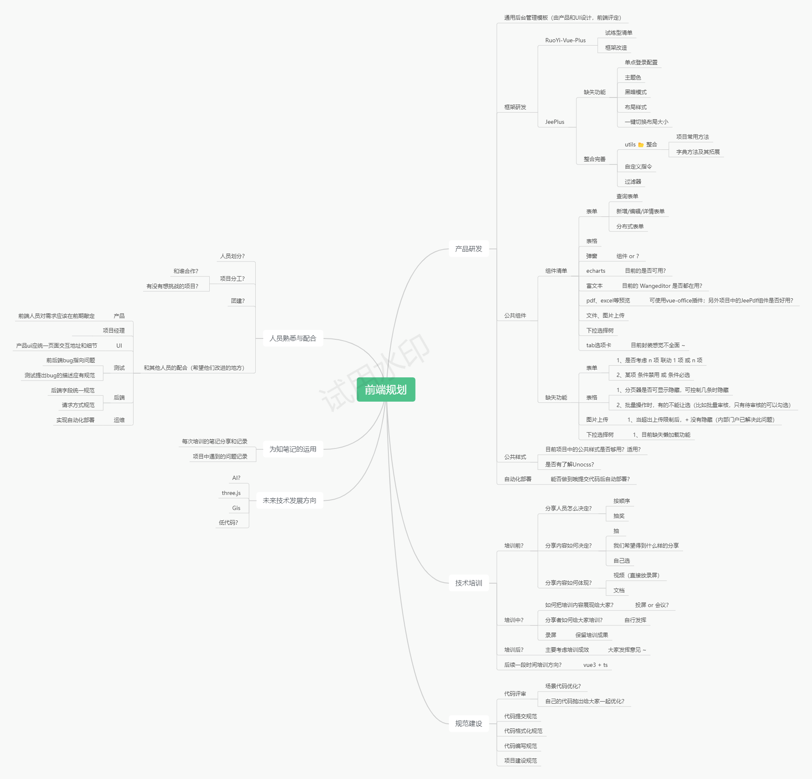
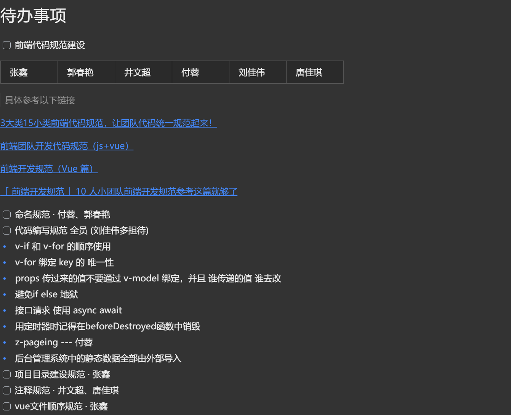
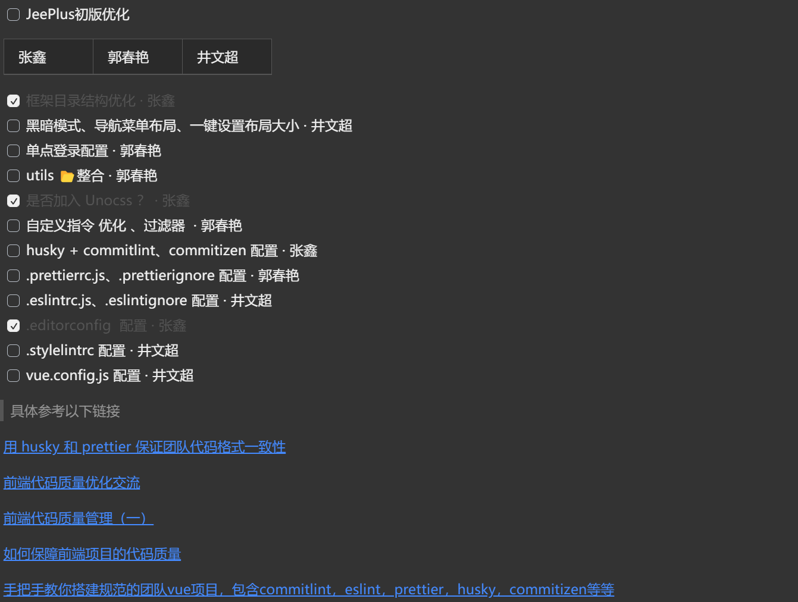
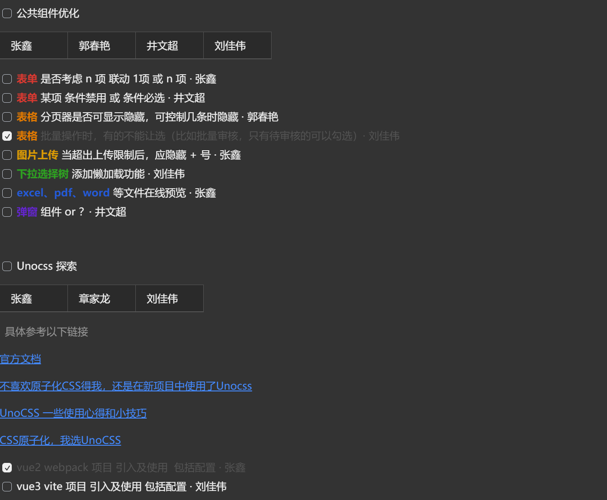
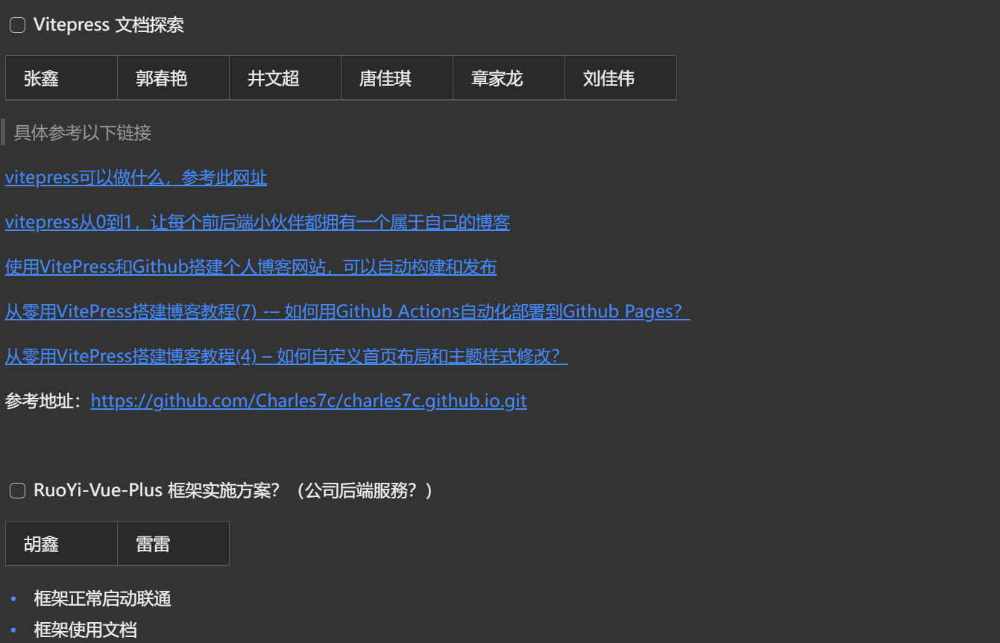
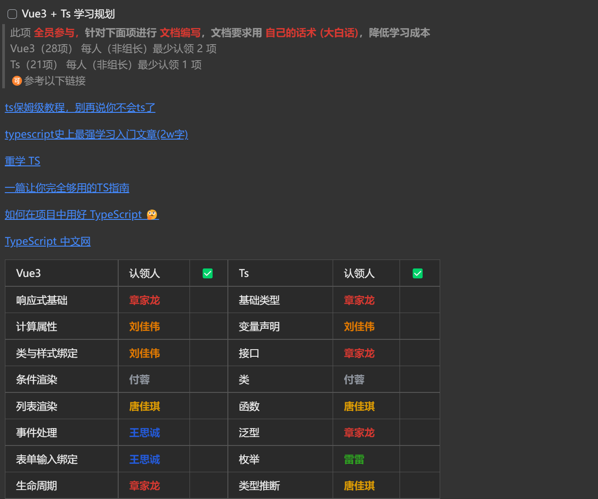
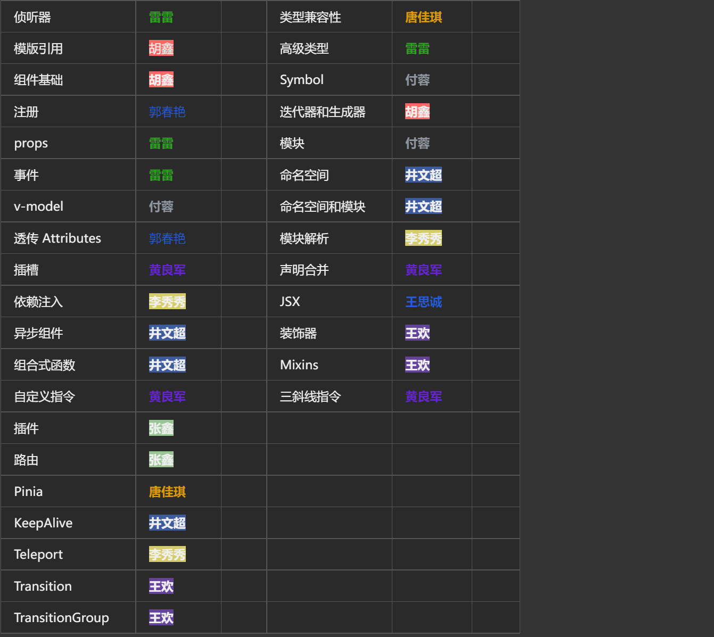

<BackTop />

# 涨薪申请 <small>(建议在 PC 端观看)</small>

## ⭐️ 职级变化（开发&nbsp;&nbsp;→&nbsp;&nbsp;主管）

### &nbsp; &nbsp; &nbsp; &nbsp; &nbsp;⏰ 任职时间：2024/03/12 ~ 至今

## ⭐️ 所作贡献

### &nbsp; &nbsp; &nbsp; &nbsp; &nbsp;🚀 组件库

  

    

      <b>·</b> 说明：为公司 Jeeplus 所搭建的 1 套前端组件库
    

    

      <b>·</b> 作用：能够极大效率提升前端同学的开发效率
    

    

      <b>·</b> 使用项目：《 公安厅 》、《 宣传部 》、《 社区矫正 》、《 农事服务 》
    

  

### &nbsp; &nbsp; &nbsp; &nbsp; &nbsp;🚀 前端规划

  

    <b>·</b> 说明：针对公司目前现状对前端同学所做的规划
  

  

    <b>·</b> 作用：让大家有 1 个明确的提升路线和更加规范、更加效率的开发体系
  

### &nbsp; &nbsp; &nbsp; &nbsp; &nbsp;🚀 前端所规划待办事项

  

    <b>·</b> 说明：针对前端团队未来发展所规划的一些前瞻工作
  

  

    <b>·</b> 作用：将规划落地，让团队更加有规范和素养
  

### &nbsp; &nbsp; &nbsp; &nbsp; &nbsp;🚀 培训

#### &nbsp; &nbsp; &nbsp; &nbsp; &nbsp; &nbsp; &nbsp; &nbsp; &nbsp; ⏰ 培训视频（**`优酷`** 在线观看）

#### &nbsp; &nbsp; &nbsp; &nbsp; &nbsp; &nbsp; &nbsp; &nbsp; &nbsp; ⏰ 培训文档（**`为知笔记`** 存放）<a href="https://qtmyx.netlify.app/other/vben/example">部分文档的在线地址</a>

  

    <b>·</b> 说明：每次培训的文档和视频都将记录在内
  

  

    <b>·</b> 作用：提升团队整体水平
  

 

<!-- ::: details 本地观看：20240726\_依赖之 codeInspector

<Video
  :second="3"
  src="/video/ruis/20240726_codeInspector.mp4"
  class="lazy-load"
  style="width: 100%; height: 100%;"
/>

::: -->

<Swiper />

<!-- ::: details 2024 🉐 3🈷️22☀️

[📺 1. 开发规范.mp4](https://v.youku.com/v_show/id_XNjQxODUyNjY4MA==.html)

[📺 2. 组件封装.mp4](https://v.youku.com/v_show/id_XNjQxODUyNTUxMg==.html)

:::

::: details 2024 🉐 3🈷️24☀️

[📺 3. 多选框联动.mp4](https://v.youku.com/v_show/id_XNjQyNTUwMDU5Mg==.html)

:::

::: details 2024 🉐 4🈷️27☀️

[📺 4. 社区矫正演示视频.mp4](https://v.youku.com/v_show/id_XNjQyNTUwMDY0NA==.html)

:::

::: details 2024 🉐 5🈷️28☀️

[📺 5. 产品研发相关规划上.mp4](https://v.youku.com/v_show/id_XNjQyNTUwNDg5Mg==.html)

[📺 6. 产品研发相关规划下.mp4](https://v.youku.com/v_show/id_XNjQxODUzOTQxMg==.html)

[📺 7. 规范建设.mp4](https://v.youku.com/v_show/id_XNjQyNTUwMjMwMA==.html)

[📺 8. 技术培训.mp4](https://v.youku.com/v_show/id_XNjQyNTUwMjM0MA==.html)

[📺 9. 人员熟悉与配合.mp4](https://v.youku.com/v_show/id_XNjQxODkyODU1Mg==.html)

[📺 10. 为知笔记运用与未来技术发展探讨.mp4](https://v.youku.com/v_show/id_XNjQxODkyODU5Ng==.html)

[📺 11. 效率翻倍.mp4](https://v.youku.com/v_show/id_XNjQyNTkwODEwOA==.html)

[📺 12. VSCode 设置 json.mp4](https://v.youku.com/v_show/id_XNjQyNTUwMDY1Ng==.html)

[📺 13. VSCode 小技巧.mp4](https://v.youku.com/v_show/id_XNjQxODUzMzQ2NA==.html)

:::

::: details 2024 🉐 7🈷️12☀️

[📺 14. vben 新框架初步使用.mp4](https://v.youku.com/v_show/id_XNjQxODkzNjA3Mg==.html)

:::

::: details 2024 🉐 7🈷️26☀️

[📺 15. VSCode 插件之 fnMap.mp4](https://v.youku.com/v_show/id_XNjQxODkzNjI5Ng==.html)

[📺 16. VSCode 插件之 SFTP.mp4](https://v.youku.com/v_show/id_XNjQyNTkwNzA1Ng==.html)

[📺 17. 依赖 ssh2-sftp-client.mp4](https://v.youku.com/v_show/id_XNjQyNTkwNzAxNg==.html)

[📺 18. vue3 组件注册.mp4](https://v.youku.com/v_show/id_XNjQxODkzNjM5Mg==.html)

[📺 19. vue3 透传.mp4](https://v.youku.com/v_show/id_XNjQyNTkwODU0MA==.html)

::: -->

