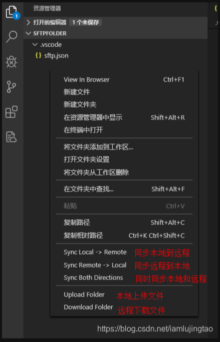

# VSCode-SFTP

## 写在前面

前端同学 **`打包部署`** 时可能需要依赖第 3 方工具，比如：`Final Shell`、`XShell` 等 ftp 工具。这些工具使用起来多多少少会有点麻烦，而且打开的应用程序过多，导致某些同学的电脑直接 **`红温`** 。现在 它 来了。

## 是什么？

> SFTP：是 vscode 的 1 款 插件。

## 有啥用？

> 在本地配置好对应的 json 文件，它可以直接在 vscode 中将你打好的包直接上传到服务器。

## 注意点

> 这一切的前提还是得配置好 nginx

## 咋个用？

1. 按下 ctrl + shift + p
2. 输入：SFTP: config，然后回车，会生成 1 个 json 文件 《 .vscode/sftp.json 》
3. 在生成的 json 文件中 配置好对应的 `服务器相关配置`
4. 打完包，按下 ctrl + shift + p
5. 输入：SFTP：Set Profile，然后回车，会让你选择对应的 `环境` (如果有多个环境的话)
6. 选好`环境`后，会在 vscode 底部 出现对应的 环境，如下图


7. 然后此时，在`打好的包`右键点击 `"同步本地到远程"`



8. 此时，底部状态栏会`显示上传过程`，当停止时，即`上传成功`
9. ⚠️**`.vscode`** 文件 **`有关服务器配置`**，一定要在 **`.gitignore`** 文件进行 **`忽略`**

## 更加简单

1. `先选好环境`
2. 在 json 配置文件中 添加 `watcher`，监听 `dist` 文件
3. 这样一打包，就会`直接进行部署`

## 常用配置

```json
{
  "name": "本地文件夹名称（可自定义）",
  "host": "ip或域名",
  "protocol": "协议：[sftp/ftp]默认ftp",
  "port": 22,
  "username": "username",
  "password": "password",
  "remotePath": "远程文件夹地址，默认/",
  "context": "本地文件夹地址，默认为vscode工作区根目录",
  "uploadOnSave": true,
  "downloadOnOpen": false,
  "ignore": ["**/.vscode/**", "**/.git/**", "**/.DS_Store"],
  "watcher": {
    "files": "dist/",
    "autoUpload": false,
    "autoDelete": false
  }
}
```

配置文件不能写注释，所以这里说明一下其中几个属性：

- `uploadOnSave`：本地更新文件保存会自动同步到远程文件（不会同步重命名文件和删除文件）
- `downloadOnOpen`：从远程服务器下载打开的文件
- `ignore`：忽略的文件（匹配的文件不会同步）
- `watcher`：监听器（可以重命名文件和删除文件）
- `autoUpload`：文件变更会自动同步（修改和重命名）
- `autoDelete`：文件删除会自动同步

## 我的配置

```json
{
  "name": "宣传部",
  "protocol": "sftp",
  "port": 22,
  "profiles": {
    "rc": {
      "name": "人才-测试环境",
      "host": "192.168.1.12",
      "username": "root",
      "password": "NXruisRJyxgs@2024",
      "remotePath": "/usr/local/dwxcb/rc/"
    },
    "rc_new_server": {
      "name": "人才-正式环境",
      "host": "45.253.62.7",
      "username": "root",
      "password": "!QAZX2wsdc",
      "remotePath": "/usr/local/dwxcb/rc/"
    }
  }
}
```
