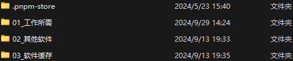
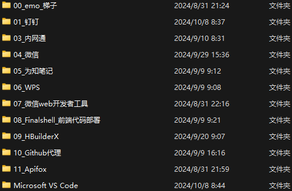
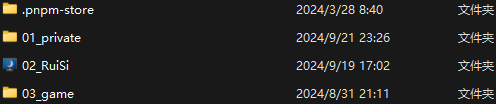

<BackTop />

# 前端同学 - 装机流程

## 💿 分盘

> 分盘主要是将电脑上的东西进行`分类`，每个盘负责存储其对应的内容

个人建议：除 C 盘之外，分出 D、E、F 盘。

- D：`软件`
- E：`工作`
- F：`娱乐`

## 📂 分文件夹

> 分文件夹同分盘，主要是为了能够 **`迅速定位`**。

下面展示了我的一些 文件夹 📂 命名和分类，希望可以对你有所帮助 😁

- `D盘` 📂: 放置了软件相关的东西

- `01_工作所需` 📂：特意标注了序号，看起来能够舒服一点 😌

- `E盘` 📂：放置了工作中的项目

> 当然我这里将娱乐和工作的东西放在了一起 😄

## 📚 装软件

> 这里我将列举`前端同学`可能常用的一些软件，如果有更好的也欢迎补充 👏

- 通过百度网盘全量下载
  <a class="has-card" href="https://pan.baidu.com/s/1YmaGSA6VsOyyLWA_BhdcWg?pwd=1024" target="_blank" rel="nofollow" title="部分软件的安装包">
  
  安装包
   
  🔗 `https://pan.baidu.com/s/1YmaGSA6VsOyyLWA_BhdcWg?pwd=1024`
  
  </a>
  <a class="has-card" href="https://pan.baidu.com/s/1GJR2pqCQN6i18PA5Pf7OFw?pwd=1024" target="_blank" rel="nofollow" title="部分软件的文件夹">
  
  软件包
   
  🔗 `https://pan.baidu.com/s/1GJR2pqCQN6i18PA5Pf7OFw?pwd=1024`
  
  </a>

- 工作所需（按需下载）

<MNavLinks v-for="{title, items} in WORK_SOFT" :title="title" :items="items"/>

- 其他软件（按需下载）

<MNavLinks v-for="{title, items} in OTHER_SOFT" :title="title" :items="items"/>

## 💻 环境配置

> 前端一般所要装的环境：`node`、`git`、`vue-cli`、`nvm?`、`nrm`、`npm`、`volta?`等等

`个人建议`：本人装的 volta，不用每个项目去切换 node 版本

<a class="has-card" href="https://qtmyx.netlify.app/other/pcInstall/nodeInstall" rel="nofollow" title="环境配置">
  
    环境配置
     
    🔗 https://qtmyx.netlify.app/other/pcInstall/nodeInstall
  
</a>

## 
浏览器配置

> 浏览器配置：一般指的是浏览器及其拓展、插件的使用

- 默认浏览器：<a href="https://www.google.com/intl/zh-CN/chrome/">Google </a>
- 浏览器拓展/插件

<MNavLinks v-for="{title, items} in GOOGLE_EXTENSION" :title="title" :items="items"/>

## 
vscode 配置

> vscode 配置：一般指的是 vscode 的`setting.json`文件及`插件`配置

- `setting.json` 配置(2 个配置区别在于插件的多与少)
  - 可以参考此配置：[某大佬配置](https://qtmyx.netlify.app/efficiency/software/vscode#推荐配置)
  - 也可以参考我的配置：[我的配置](./vscode-setting-json.md)
- `插件`
  - 通过百度网盘全量下载 (解压后放在：C: \ Users \ 用户 \ .vscode)
    <a class="has-card" href="https://pan.baidu.com/s/1CpfXQfh0PMf-EVbJa2bBNw?pwd=1024" target="_blank" rel="nofollow" title="vscode插件">
    
    vscode 插件
     
    🔗 `https://pan.baidu.com/s/1CpfXQfh0PMf-EVbJa2bBNw?pwd=1024`
    
    </a>
  - 按需下载
    <MNavLinks v-for="{title, items} in VSCODE_EXTENSION" :title="title" :items="items"/>
