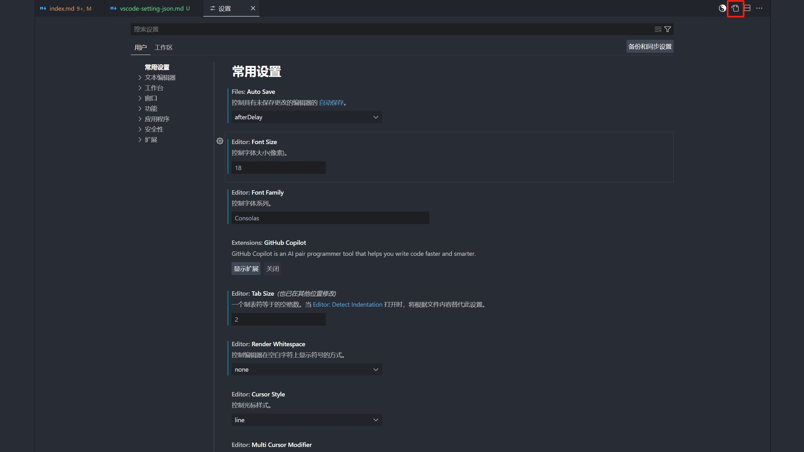

# 自用 vscode-setting.json

> 配置步骤如下

- 打开 vscode
- 按住 ctrl + ,（逗号）
- 点击右上角 如图所示按钮



- 然后 ctrl + a，ctrl + v，或者 按需复制

```json
{
  /* fnMap 注册码 */
  "fnMap.registrationCode": "ofalcA11+WPWATWSrjlYXB3phnqD6jf99Y1fV5/5ZPfDFsWdRNUEsMiogxnebH0oYUEyGkWcCMVM051vkIAc0wX/qvOEZVkt/yj6K+N/o4QhnEuDUgXdLdMm8yP+DsYrJQ4hz2mkuMQhlqneawnMqk6GsGGdS8YSKR2HTXK85mrns7ODQqLOm8kUIaT+n4GxFuKDosY2c8MpkEjhuccF60TCcS4ntd+WS2yVR6A5QXoKL6nFDpsJtp6aMFizM0T2dDuJMlHvSMJEfEr4HOG4Nk/FwsoKlzbpKhxs77dllfbLTo1OjdZE6ybHywwV38x+GjoJ7WO5lvoay1v+qzVJKA==",

  /* 控制编辑器是否已启用链接编辑。相关符号(如 HTML 标记)将在编辑时进行更新，具体取决于语言 */
  "editor.linkedEditing": true,

  /* Vue 自动补全 .value 和缺失属性提醒 */
  "vue.inlayHints.missingProps": true,
  "vue.autoInsert.dotValue": true,

  "files.autoSave": "afterDelay",
  "editor.formatOnPaste": true, // 粘贴后的内容, 是否自动格式化
  "editor.formatOnSave": true, // 在保存时格式化文件。格式化程序必须可用，延迟后文件不能保存，并且编辑器不能关闭
  "files.trimTrailingWhitespace": true, // 保存文件时，删除行尾空格
  "[markdown]": {
    "files.trimTrailingWhitespace": false,
    "editor.defaultFormatter": "esbenp.prettier-vscode"
  },

  /* 文件保存时使用什么进行格式化 */
  "[vue]": {
    "editor.defaultFormatter": "esbenp.prettier-vscode"
  },
  "[scss]": {
    "editor.defaultFormatter": "esbenp.prettier-vscode"
  },
  "[jsonc]": {
    "editor.defaultFormatter": "esbenp.prettier-vscode"
  },
  "[javascript]": {
    "editor.defaultFormatter": "esbenp.prettier-vscode"
  },

  /* 保存时为编辑器运行代码操作。必须指定代码操作，并且编辑器不能关闭 */
  "editor.codeActionsOnSave": {
    "source.organizeImport": "always", // 在保存文件时，自动组织导入语句的顺序
    "source.addMissingImports": "always", // 在保存文件时，自动添加缺失的导入语句
    "source.fixAll.eslint": "always", // 在保存文件时，自动执行 ESLint 的修复操作
    "eslint.autoFixOnSave": "always", // 在保存文件时，自动执行 ESLint 的修复操作
    "source.fixAll.stylelint": "always" // 在保存文件时，自动执行 Stylelint 的修复操作
  },

  /* eslint规则对以下几种类型文件生效 */
  "eslint.validate": [
    "javascript",
    "javascriptreact",
    "html",
    "typescript",
    "typescriptreact",
    "vue"
  ],

  /* 1. 丝滑打字配置 */
  "editor.cursorBlinking": "expand", // 控制光标的动画样式  smooth: 平滑闪烁 expand: 膨胀动画
  "editor.smoothScrolling": true, // 控制编辑器是否使用动画滚动
  "workbench.list.smoothScrolling": true, // 控制列表和树是否具有平滑滚动效果
  "editor.cursorSmoothCaretAnimation": "on", // 控制是否启用平滑插入动画 on: 始终启用平滑脱字号动画

  /* 2. 代码提示显示位置
        控制自定义代码片段所处位置
        许多插件都有snippet代码提示功能
        top: 表示自定义片段会优先显示在最上方
    */
  "editor.snippetSuggestions": "top",

  /* 3. 吸附置顶 */
  "editor.stickyScroll.enabled": true, // 父级自动吸附置顶
  "terminal.integrated.stickyScroll.enabled": true, // 终端命令吸附置顶

  /* 4. 别名路径跳转 */
  "alias-skip.allowedsuffix": ["js", "vue", "jsx", "ts"], // 可缺省后缀名的文件列表
  "alias-skip.mappings": {
    // 路径映射，例如{'@':'/src','components':'/src/components'}，/表示项目根目录
    "@": "/src"
  },

  "javascript.updateImportsOnFileMove.enabled": "always", // 始终自动更新路径
  "breadcrumbs.enabled": true, // 启用顶部面包屑导航（可直接跳转文件）

  /* 控制折行的方式:
        "off"：禁用文本换行，文本将水平滚动显示
        "on"：启用文本换行，文本将根据视窗宽度自动换行
        "wordWrapColumn"：将文本根据 editor.wordWrapColumn 的值进行换行。该值可以通过设置 editor.wordWrapColumn 属性来指定换行列的位置
        "bounded"：将文本根据视窗宽度自动换行，但不会超过 editor.wordWrapColumn 的值
    */
  "editor.wordWrap": "bounded",
  "editor.wordWrapColumn": 500, // 设置视图宽度自动折行的列数为 500

  /* =================== 《 搜索 》 =================== */

  "search.searchEditor.singleClickBehaviour": "peekDefinition", // 搜索吸附目录

  "search.followSymlinks": false, // 关闭搜索中跟踪符号链接，提高搜索性能

  /* VScode进行文件搜索时，不搜索这些区域 */
  "search.exclude": {
    "**/node_modules": true,
    "**/bower_components": true,
    "**/*.code-search": true,
    "**/.DS_Store": true,
    "**/.git": true,
    "**/.gitignore": true,
    "**/.idea": true,
    "**/.svn": true,
    "**/.vscode": true,
    "**/build": true,
    "**/dist": true,
    "**/tmp": true,
    "**/yarn.lock": true,
    // "**/assets": true,
    "**/.history": true
  },

  /* =================== 《 插件 》 =================== */

  "workbench.iconTheme": "material-icon-theme", // 设置图标主题为 material-icon-theme

  "workbench.colorTheme": "One Dark Pro", // 指定用在工作台中的颜色主题

  "console-ninja.featureSet": "Community",

  /* css2rem插件:
        书写css时，px单位自动提示是否转换为rem单位
        此处根字体大小设置为100（默认为16）, 注意与你项目中rem数值保持一致
    */
  "cssrem.rootFontSize": 100,
  "cssrem.vw": true, // 是否启用vw支持

  /* Live Sass Compiler 插件 */
  "liveSassCompile.settings.formats": [
    {
      "format": "expanded", // "format"：指定编译后的 CSS 格式，可以是 "expanded"（展开格式）、"compressed"（压缩格式）、"compact"（紧凑格式）等
      "extensionName": ".css", // 指定生成的 CSS 文件的扩展名
      "savePath": null, // 指定生成的 CSS 文件的保存路径。如果设置为 null，则会在 SCSS 文件所在的同级目录下生成对应的 CSS 文件
      "savePathReplacementPairs": null // 指定保存路径中需要替换的部分。这是一个对象数组，每个对象包含 "replace" 和 "with" 两个属性，用于指定需要替换的部分以及替换后的值
    }
  ],

  /* css导航跳转 */
  "CSSNavigation.activeCSSFileExtensions": ["css", "scss", "sass", "less", "html", "vue"],

  /* 排除的路径 */
  "CSSNavigation.excludeGlobPatterns": [
    "**/node_modules/**",
    "**/bower_components/**",
    "**/vendor/**",
    "**/coverage/**",
    "**/dist/**"
  ],

  "better-comments.highlightPlainText": true,

  /* =================== 《 代码提示 》 =================== */

  /*
      ! 代码提示默认选中项
        coding时，VScode会给出很多提示，在所有的提示选项中会默认选中一个，这一配置就是表示默认选中哪一项
            * "first": VScode将总是选中第一项
            ~ "recentlyUsed":（默认值）vscode将从代码提示中，预先选中最近使用过的项
            @ "recentlyUsedByPrefix":（推荐）vscode将从所有可用代码提示片段中，预先选中最近使用过的项，支持联想功能
    */
  "editor.suggestSelection": "recentlyUsedByPrefix",
  "editor.suggest.snippetsPreventQuickSuggestions": false, // 控制活动代码段是否阻止快速建议
  "editor.acceptSuggestionOnEnter": "smart", // 除了 `Tab` 键以外， `Enter` 键是否同样可以接受建议, 这能减少“插入新行”和“接受建议”命令之间的歧义
  /* 有一种场景，比如你在输入代码，输到一般，你突然想要代码补全
        于是你调出建议，但是补全的代码会直接插入，不会覆盖你的输入
        这时代码就会多一点内容出来，那么就报错了
      */
  "editor.suggest.insertMode": "replace",
  /* 是否显示可能用到的示例代码.安装插件过多，建议选项也会非常多 */
  "editor.quickSuggestions": {
    "other": true, // 在字符串和注释外启用快速建议
    "comments": true, // 在注释内启用快速建议
    "strings": false // 在字符串内启用快速建议
  },

  /* =================== 《 颜色 》 =================== */

  /* 1. 自定义编辑器的颜色样式 */
  "workbench.colorCustomizations": {
    // "editor.background": "#1b1b19", // 编辑器背景色
    "editorLineNumber.foreground": "#215f53", // 设置编辑器行号的颜色
    // "editorCursor.foreground": "#13a329", // 设置编辑器光标的颜色
    // "activityBar.background": "#111111", // 设置活动栏的背景颜色
    // "activityBar.foreground": "#ffe600", // 设置活动栏的前景（文字）颜色
    // "editor.selectionBackground": "#13a329", // 用户选中代码段的颜色
    // "editor.findMatchBackground": "#17e7ac", // 当前搜索匹配的颜色
    // "sideBar.background": "", // 设置侧边栏的背景颜色
    // "sideBar.foreground": "", // 设置侧边栏的前景（文字）颜色
    // "editor.findMatchHighlightBackground": "rgba(0, 0, 0, 0.0)", // 其他搜索匹配项的颜色
    // "editor.findRangeHighlightBackground": "#ffe600", // 限制搜索范围的颜色
    // "editor.lineHighlightBackground": "#3a2f2f", // 光标所在行高亮内容的背景颜色
    // "editor.lineHighlightBorder": "#f33f3f", // 光标所在行四周边框的背景颜色
    // "editorIndentGuide.activeBackground1": "#ff0000", // 设置guide线高亮颜色,可以改为自己喜欢的颜色
    /* 终端颜色配置 */
    "terminal.background": "#151718",
    "terminal.foreground": "#D6D6D6",
    "terminalCursor.background": "#D6D6D6",
    "terminalCursor.foreground": "#D6D6D6",
    "terminal.ansiBlack": "#151718",
    "terminal.ansiBlue": "#55B5DB",
    "terminal.ansiBrightBlack": "#41535B",
    "terminal.ansiBrightBlue": "#55B5DB",
    "terminal.ansiBrightCyan": "#55DBBE",
    "terminal.ansiBrightGreen": "#9FCA56",
    "terminal.ansiBrightMagenta": "#A074C4",
    "terminal.ansiBrightRed": "#CD3F45",
    "terminal.ansiBrightWhite": "#FFFFFF",
    "terminal.ansiBrightYellow": "#E6CD69",
    "terminal.ansiCyan": "#55DBBE",
    "terminal.ansiGreen": "#9FCA56",
    "terminal.ansiMagenta": "#A074C4",
    "terminal.ansiRed": "#CD3F45",
    "terminal.ansiWhite": "#D6D6D6",
    "terminal.ansiYellow": "#E6CD69"
  },

  /* 2. 替代当前所选颜色主题中的编辑器语法颜色和字形 */
  "editor.tokenColorCustomizations": {
    "comments": "#a2a7a4", // 注释
    "keywords": "#cff10a", // 关键字
    "variables": "#06ee19", // 变量名
    "strings": "#07ffd6", // 字符串
    "functions": "#f5b607", // 函数名
    "numbers": "#7f3cfa" // 数字
  },

  /* 3. 让注释颜色更加多彩 */
  "better-comments.tags": [
    {
      "tag": "!",
      "color": "#FF2D00",
      "strikethrough": false,
      "underline": false,
      "backgroundColor": "transparent",
      "bold": false,
      "italic": false
    },
    {
      "tag": "@",
      "color": "#3498DB",
      "strikethrough": false,
      "underline": false,
      "backgroundColor": "transparent",
      "bold": false,
      "italic": false
    },
    {
      "tag": "$",
      "color": "#474747",
      "strikethrough": true,
      "underline": false,
      "backgroundColor": "transparent",
      "bold": false,
      "italic": false
    },
    {
      "tag": "todo",
      "color": "#FF8C00",
      "strikethrough": false,
      "underline": false,
      "backgroundColor": "transparent",
      "bold": false,
      "italic": false
    },
    {
      "tag": "#",
      "color": "#98C379",
      "strikethrough": false,
      "underline": false,
      "backgroundColor": "transparent",
      "bold": false,
      "italic": false
    }
  ],

  /* =================== 《 Git相关配置 》 =================== */

  "git.autofetch": true, // 在push代码时，是否先自动从远端拉取代码
  "git.enableSmartCommit": true, // 在没有暂存的更改时提交所有更改
  /* 配置gitlens中git提交历史记录的信息显示情况 */
  "gitlens.advanced.messages": {
    "suppressCommitHasNoPreviousCommitWarning": false,
    "suppressCommitNotFoundWarning": false,
    "suppressFileNotUnderSourceControlWarning": false,
    "suppressGitVersionWarning": false,
    "suppressLineUncommittedWarning": false,
    "suppressNoRepositoryWarning": false
  },

  /* =================== 《 todo相关配置 》 =================== */

  "todo-tree.regex.regexCaseSensitive": false, // 使用区分大小写的正则表达式
  "todo-tree.regex.regex": "((%|#|//|<!--|^\\s*\\*)\\s*($TAGS)|^\\s*- \\[ \\])", // todo-tree 标签配置  标签兼容大小写字母(很好的功能!!!)

  "todo-tree.filtering.excludeGlobs": ["**/node_modules", "*.xml", "*.XML"],
  "todo-tree.filtering.ignoreGitSubmodules": true,
  "todo-tree.tree.showCountsInTree": true,
  "todo-tree.highlights.customHighlight": {
    "BUG": {
      "icon": "bug",
      "foreground": "#F56C6C",
      "type": "line"
    },
    "FIXME": {
      "icon": "flame",
      "foreground": "#FF9800",
      "type": "line"
    },
    "TODO": {
      "foreground": "#FFEB38",
      "type": "line"
    },
    "NOTE": {
      "icon": "note",
      "foreground": "#67C23A",
      "type": "line"
    },
    "INFO": {
      "icon": "info",
      "foreground": "#909399",
      "type": "line"
    },
    "TAG": {
      "icon": "tag",
      "foreground": "#409EFF",
      "type": "line"
    },
    "HACK": {
      "icon": "versions",
      "foreground": "#E040FB",
      "type": "line"
    },
    "XXX": {
      "icon": "unverified",
      "foreground": "#E91E63",
      "type": "line"
    }
  },
  "todo-tree.general.tags": ["BUG", "HACK", "FIXME", "TODO", "INFO", "NOTE", "TAG", "XXX"],
  "todo-tree.general.statusBar": "total",

  "todo-tree.tree.expanded": true, // 当打开新的工作区时，默认展开树状图

  "todo-tree.tree.buttons.export": true, // 在侧边栏顶部显示一个导出树状图的按钮

  "todohighlight.keywords": [
    "resetFrame:",
    {
      "text": "resetFrame:",
      "color": "#fff",
      "backgroundColor": "#FF77FF"
    }
  ],

  /* =================== 《 常规配置 (一般都需要且不会轻易改变) 》 =================== */

  "window.dialogStyle": "custom", // 使用 VSCode 自己的窗口

  "editor.mouseWheelZoom": true, // 按住 Ctrl 键并滚动鼠标滚轮时对编辑器字体大小进行缩放

  /* 外观 */
  "editor.fontSize": 18, // 字号为18
  "editor.tabSize": 2, // tab缩进 为 2 个空格
  "editor.lineHeight": 24, // 编辑器的行高为 24 像素
  "editor.renderLineHighlight": "none", // 设置行高亮的样式为无
  "editor.fontFamily": "Consolas", // 编辑器的字体为 Consolas

  /* 自动补全括号、引号 */
  "editor.autoClosingBrackets": "beforeWhitespace",
  "editor.autoClosingDelete": "always",
  "editor.autoClosingOvertype": "always",
  "editor.autoClosingQuotes": "beforeWhitespace",
  "editor.guides.bracketPairs": true,
  "editor.renderWhitespace": "none", // 设置空格符号的显示为无

  /* 编辑器窗口打开的数量 */
  "workbench.editor.limit.enabled": true, // 是否限制每一个VSCODE窗体内显示的编辑器窗体数量
  "workbench.editor.limit.perEditorGroup": true, // 是对打开的所有VSCODE窗体进行限制还是只对当前VSCODE窗体限制
  "workbench.editor.limit.value": 8, // 打开的编辑器的最大数量（默认为 10，超出数量会自动关闭）
  /* “打开编辑器”窗格中预分配的编辑器槽数下限 */
  "explorer.openEditors.minVisible": 10,
  /* “打开编辑器”窗格中显示的初始编辑器数上限。超过此限制将显示滚动条，并允许调整窗格大小以显示更多项目 */
  "explorer.openEditors.visible": 1,
  /* 将命令启动器与窗口标题一起显示。仅当 #window.customTitleBarVisibility# 设置为 never 时，此设置才会生效 */
  "window.customTitleBarVisibility": "never",
  "window.commandCenter": true,

  /* index 替换成 目录名, 在打开很多文件时，能区分出是谁 */
  "workbench.editor.customLabels.patterns": {
    "**/index.vue": "${dirname}.vue",
    "**/index.js": "${dirname}.js",
    "**/index.ts": "${dirname}.ts",
    "**/index.jsx": "${dirname}.jsx",
    "**/index.tsx": "${dirname}.tsx"
  },

  /* 配置是否在左侧目录列表中显示该文件/文件夹 */
  "files.exclude": {
    "**/.DS_Store": true,
    "**/.git": true,
    "**/.hg": true,
    "**/.svn": true,
    "**/*.g.dart": true,
    "**/CVS": true
  },

  /* 配置文件关联 比如小程序中的 .wxss 这种文件，会把它作为css文件来处理，以便相关插件提供对应的css的语法提示，css的格式化等 */
  "files.associations": {
    "*.wxss": "css",
    "*.cjson": "jsonc",
    "*.wxs": "javascript",
    "*.ts": "typescript",
    "*.vue": "vue",
    "*.dart": "dart",
    "*.json": "jsonc",
    ".prettierrc": "jsonc"
  },

  /* emmet 相关配置 */
  "emmet.triggerExpansionOnTab": true, // 配置emmet是否启用tab展开缩写
  "emmet.showSuggestionsAsSnippets": true, // 是否将自定义的代码片段作为提示建议显示
  /* 配置emmet支持哪些类型的文件 */
  "emmet.syntaxProfiles": {
    "vue-html": "html",
    "vue": "html",
    "javascript": "javascriptreact",
    "xml": {
      "attr_quotes": "double"
    }
  },
  /* 在默认不受支持的语言中启用 Emmet 缩写。在此语言和 Emmet 支持的语言之间添加映射 */
  "emmet.includeLanguages": {
    "wxml": "html",
    "vue-html": "html",
    "javascript": "javascriptreact",
    "jsx-sublime-babel-tags": "javascriptreact" // 在 react 的jsx中添加对emmet的支持
  },

  "debug.openDebug": "openOnDebugBreak", // 断点调试时，遇到断点，自动显示调试视图。（全局，不可为每种语言单独配置）

  "commentTranslate.multiLineMerge": true, // 多行注释合并

  "security.workspace.trust.untrustedFiles": "open", // 控制如何处理在受信任的工作区中打开不受信任的文件

  "liveServer.settings.port": 0,
  "liveServer.settings.donotShowInfoMsg": true,

  "editor.accessibilitySupport": "off", // 控制 UI 是否应在已针对屏幕阅读器进行优化的模式下运行

  "workbench.editorAssociations": {
    "*.docx": "docxreader.docxEditor",
    "*.doc": "default",
    "*.pptx": "default"
  },

  "interview.updateNotification": 1717484989750, // 是否显示提醒⏰, 根据时间戳是否差 3 天定

  "explorer.confirmDelete": false, // 控制资源管理器是否应在通过回收站删除文件时要求确认

  "explorer.confirmDragAndDrop": false, // 控制资源管理器是否应在通过拖放移动文件或文件夹时要求确认

  "explorer.compactFolders": false, // 文件夹紧凑模式显示

  "editor.bracketPairColorization.enabled": true, // 控制是否启用括号对着色

  /*
        控制当超出可用空间时，选项卡是否应在多行之间换行，或者是否应显示滚动条。
        如果未将 #workbench.editor.showTabs# 设置为 multiple，则会忽略此值
    */
  "workbench.editor.wrapTabs": true,
  "tabnine.experimentalAutoImports": true,

  /* 控制内联建议如何与建议小组件交互。如果启用，当内联建议可用时，不会自动显示建议小组件 */
  "editor.inlineSuggest.suppressSuggestions": true,

  /*
      如下是被vscode认为是分隔符的字符
      我们在设置中搜索editor.wordSeparators
      然后根据自己的需要删除不想要的分隔符即可
      比如删除@，这样我们就可以直接选中less变量和装饰器如@xxx
    */
  "editor.wordSeparators": "`~!@%^&*()=+[{]}\\|;:'\",.<>/?（），。；：",

  "editor.dragAndDrop": false, // 改为false即可禁止拖动代码

  /* 路径自动感知，在配置文件中配置@后我们就可以很方便快捷的引用各种文件了 */
  "path-intellisense.mappings": {
    "@": "${workspaceRoot}/src"
  },

  "explorer.copyRelativePathSeparator": "/", // 复制相对文件路径时使用的路径分隔字符

  "open-in-browser.default": "chrome", // 配置打开html文件的默认浏览器

  "workbench.startupEditor": "none", // 控制启动时显示的编辑器

  "files.autoGuessEncoding": true, // 自动猜测文本编码

  "diffEditor.ignoreTrimWhitespace": false, // 启用后，差异编辑器将忽略前导空格或尾随空格中的更改

  "typescript.locale": "zh-CN", // Typescript 语言设置中文

  "typescript.inlayHints.enumMemberValues.enabled": true, // 枚举类型数值提示

  "terminal.integrated.env.windows": {},

  /* 这些单词在拼写检查时将被视为正确拼写，不会触发拼写错误的警告 */
  "cSpell.userWords": [
    "allowedsuffix",
    "apifox",
    "Attributify",
    "autofetch",
    "Backtop",
    "Behaviour",
    "Btns",
    "Bussines",
    "cascader",
    "childs",
    "cjson",
    "classlist",
    "cnpm",
    "Colour",
    "composables",
    "compositionend",
    "compositionstart",
    "compostitonend",
    "Consolas",
    "cropperjs",
    "csscomb",
    "cssrem",
    "datav",
    "daterange",
    "datetime",
    "datetimerange",
    "developent",
    "docxreader",
    "donot",
    "echarts",
    "esbenp",
    "exceljs",
    "filemanager",
    "fillcontain",
    "flowable",
    "formbuilder",
    "gencode",
    "Gitee",
    "glassit",
    "hasslot",
    "javac",
    "jeeplus",
    "Jheng",
    "jiaminghi",
    "lazyload",
    "Locaking",
    "longpress",
    "mockjs",
    "msgbox",
    "nprogress",
    "opsz",
    "optimizelegibility",
    "Overtype",
    "pagefind",
    "Parens",
    "pinia",
    "popconfirm",
    "Pulm",
    "qiniu",
    "rulesets",
    "Schems",
    "sibiraj",
    "sortablejs",
    "stylelint",
    "Swiper",
    "tabnine",
    "thumbdrive",
    "todohighlight",
    "uglifyjs",
    "uniapp",
    "unocss",
    "unplugin",
    "validatenull",
    "vant",
    "vben",
    "vetur",
    "viewerjs",
    "vitepress",
    "vnode",
    "vsintellicode",
    "vuedraggable",
    "vuejs",
    "vuepress",
    "vuex",
    "wangeditor",
    "Webstorm",
    "winopacity",
    "Wscats",
    "wtext",
    "wxml",
    "wxss",
    "zlevel"
  ],
  "vue.server.hybridMode": false,
  "git.confirmSync": false,
  "winopacity.opacity": 255,
  "typescript.updateImportsOnFileMove.enabled": "always",
  "[typescript]": {
    "editor.defaultFormatter": "esbenp.prettier-vscode"
  }
}
```
