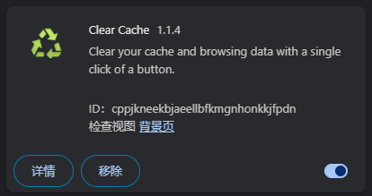
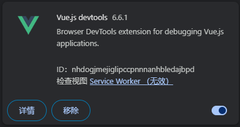
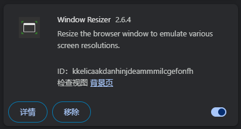
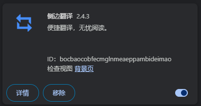
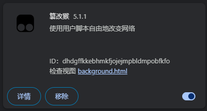
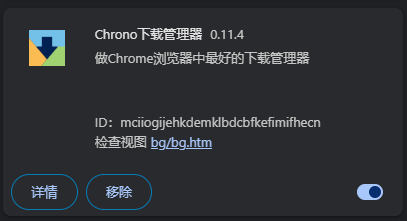
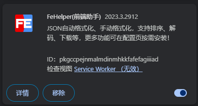
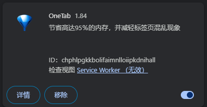
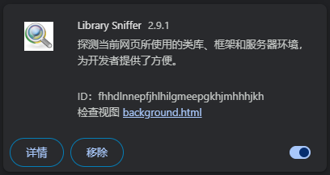

# Google 书签使用及插件分享

## **书签 🔖**

> 谷歌浏览器的 书签 就好像我们项目中一个个的 文件夹 📂，可以收藏我们常用的网站，方便 使用时快速打开

## **插件**

### 《 Clear Cache 》

描述：一键清除缓存并刷新当前页面

### 《 Vue.js devtools 》

描述：vue 框架 的 浏览器调试工具

### 《 Window Resizer 》

描述：一键调整浏览器大小

### 《 侧边翻译 》

描述：一键翻译网页（有时候可能稍微有点慢）

### 《 篡改猴 》

描述：俗称 “油猴”，可以安装各种脚本

### 《 Chrono 下载管理器 》

描述：谷歌浏览器的下载管理器，比原版的美化了点

### 《 FeHelper(前端助手) 》

描述：各种适用于前端的快捷功能

### 《 OneTab 》

描述：把多个 tab 收集到一块，节省高达 95％的内存，并减轻标签页混乱现象

### 《 Library Sniffer 》

描述：探测当前网页所使用的类库、框架和服务器环境

