<BackTop />

# 函数地图（fnMap）

## 前言

不知道大家有没有发现，有时候在写代码的时候，需要频繁地编辑多个地方的代码。而当代码体积比较大的时候，我们找起来某个关键字很麻烦，只能通过来回滚动鼠标，或者是查看左边的小地图来，浪费时间不说，也让编程体验大打折扣。后面，VSCode 推出了大纲（outline），但是功能非常简单，并没有很好地解决问题。

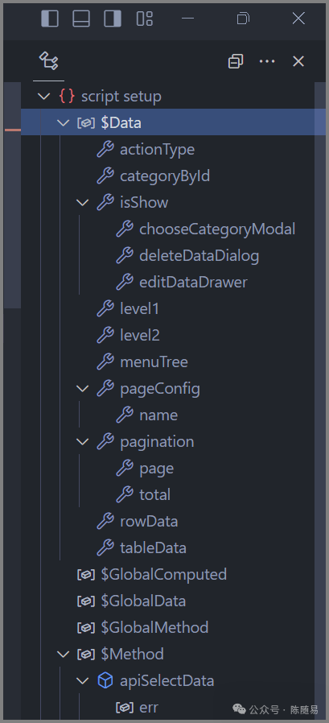

VSCode 自带大纲

比如不支持关键字搜索，不支持一键折叠展开，不支持符号置顶，标记等等。

为了改善这个问题，我找到了一个 vscode 插件，来更好的解决这个问题

## FnMap（函数地图）

这个插件很好的解决了以上问题，

## 如何下载

首先，打开 vscode 插件市场，搜索 **FnMap（**该扩展需要 `vscode 1.74` 或更高版本才能使用。**）**

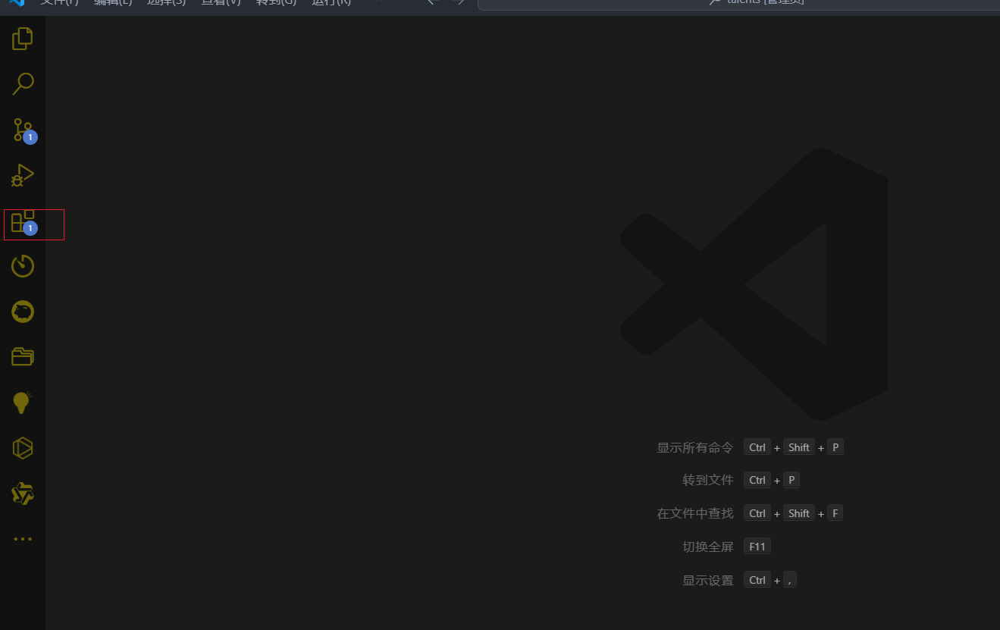

下载完成后，为了跟快捷的使用它，我们将他放入右侧拓展栏

- 点击右侧辅助侧栏

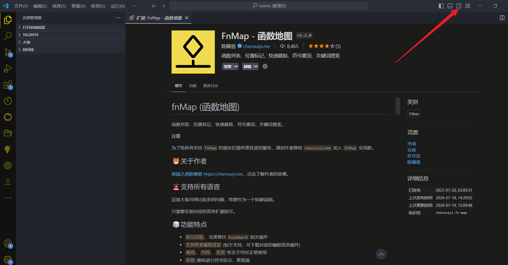

- 再将**FnMap**插件图标拖到右侧辅助侧栏（这边可以设置快捷键，来快捷打开右侧辅助栏）

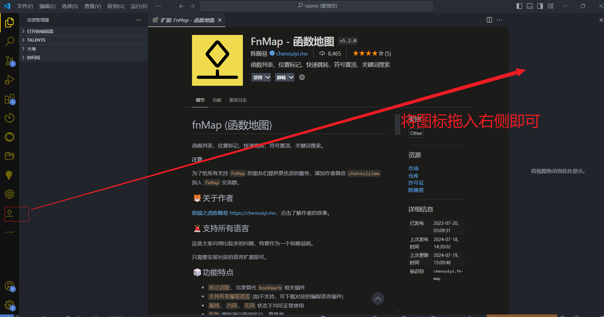

以上就是安装教程

## ⚠️ 注意事项

该插件是需要收费的，但是插件作者免费赠送一个 `永久注册码`，可以绑定一台电脑永久使用（无需付费）。

- 注册码与计算机的机器码绑定，每个注册码只能在绑定的计算机上使用。
- 不同的电脑有不同的序列号，需要单独绑定。
- CPU 等核心硬件更换后，机器码也可能发生变化。
- 每个用户可以无限制地购买多个注册码，给同事，朋友绑定使用皆可。
- 永久注册码一经生成，平台也无法解绑，所以购买后不支持退款，请知悉

## 如何获取注册码

- 点击小人图标，关注作者公众号即可登录成功

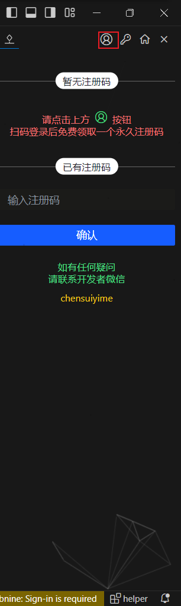

- 进去以后点击领取，自动领取注册码后，在点击本机一键启用，即注册成功

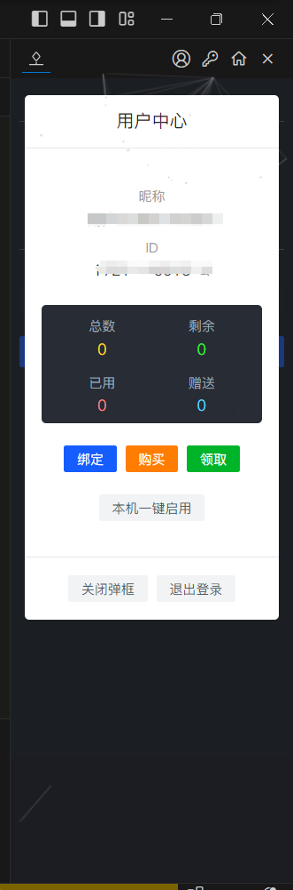

-

# 插件特点

##                                  🎲 功能特点

- `标记功能`，完美替代  `bookmark`  相关插件
- `支持所有编程语言` (如不支持，可下载对应的编程语言插件)
- `离线`、`内网`、`无网`  状态下均可正常使用
- `彩色`  图标进行符号区分，更直观
- 切换文件，记住函数列表的  `展开/关闭`  状态
- `左右箭头`  方便切换当前文档的所有符号显示级别
- `单击`  可快速定位到符号位置
- `左右箭头`  切换当前文档的折叠级别，方便查看长文件
- 支持  `位置升序`、`名称升序`、`名称降序`  等排序操作
- `置顶`  功能，方便在多处修改之间反复横跳
- `关键字`  搜索功能，快速找到需要的函数
- 可直接在编辑器进行  `注册`、`登录`、`购买`、`绑定`  等操作
- 可配置  `不同文件`  的  `默认展示层级`
- 可自定义  `某层级`  的符号  `是否显示`

# 插件快捷键

##                                 📐 快捷键

- `alt+m`  切换标记行。
- `alt+n`  命名标记行。
- `alt+左箭头`  折叠符号树。
- `alt+右箭头`  展开符号树。

# 功能演示

##                                🎨 效果演示

### ✅ 编辑区折叠和展开

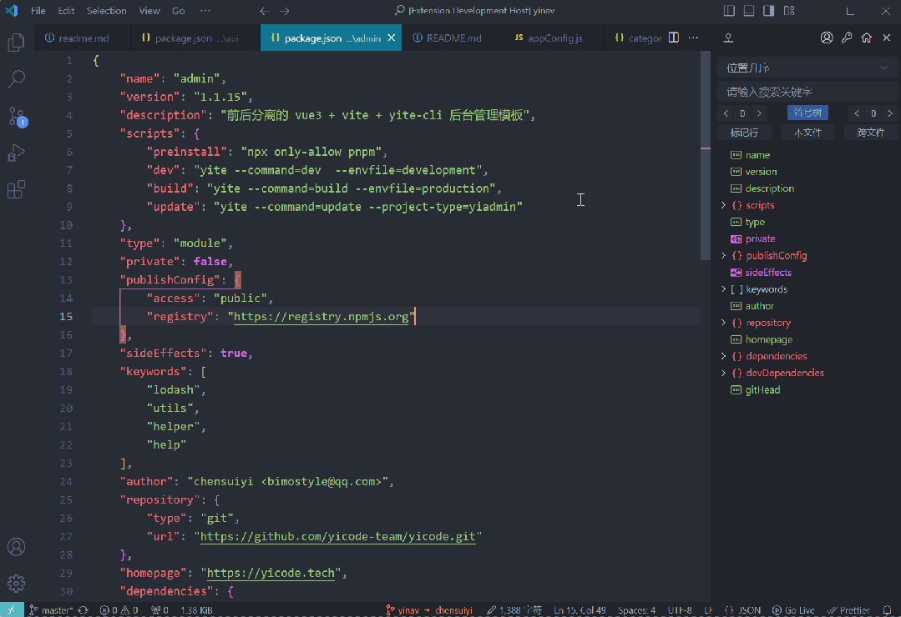

编辑区折叠和展开

### ✅ 符号区折叠和展开

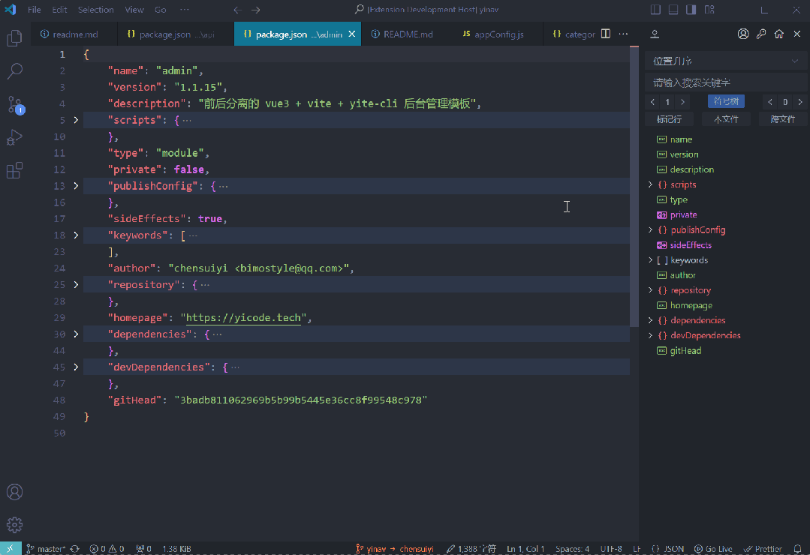

符号区折叠和展开

### ✅ 符号快捷跳转

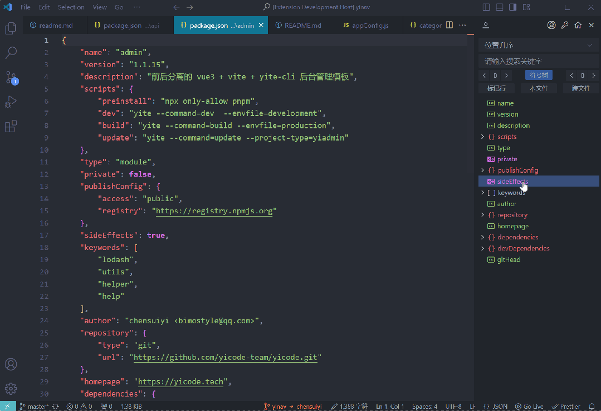

符号快捷跳转

### ✅ 当前文件符号置顶

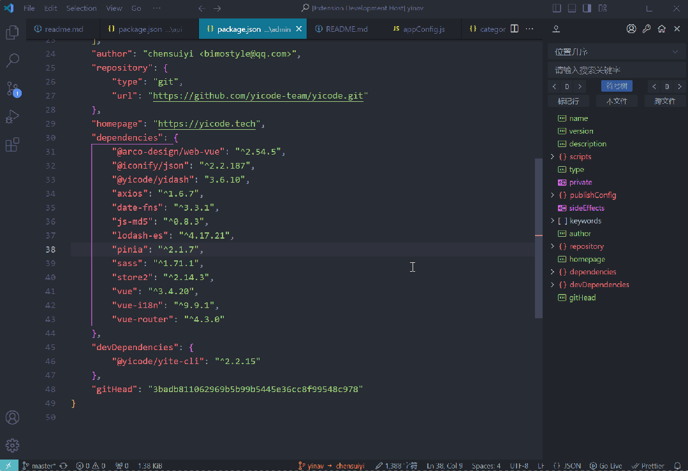

当前文件符号置顶

### ✅ 跨文件文件符号置顶

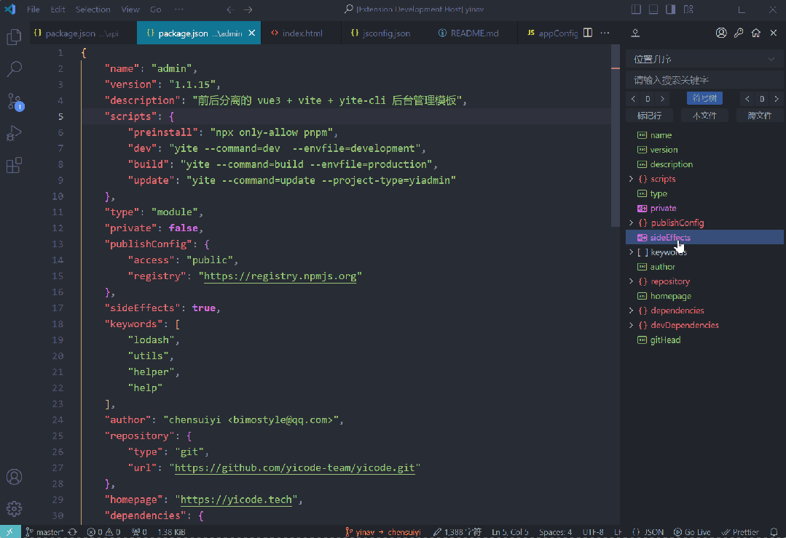

跨文件文件符号置顶

### ✅ 标记当前行

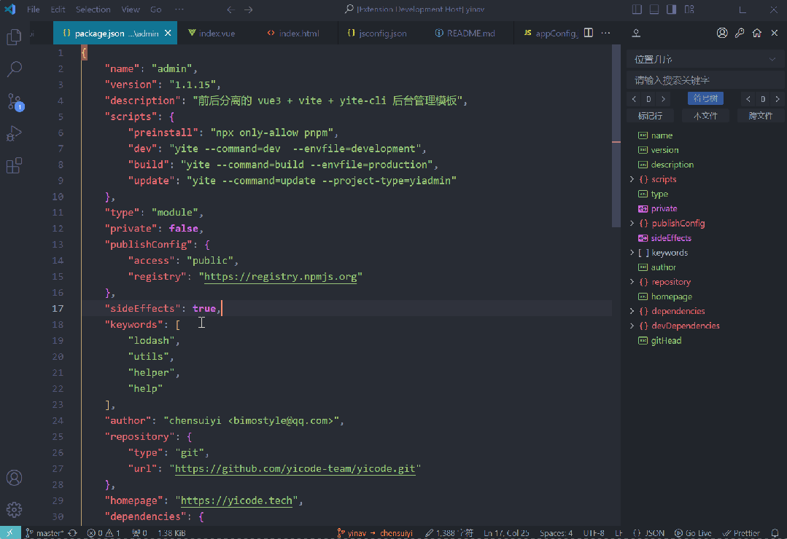

标记当前行

### ✅ 标记当前行（带标签）

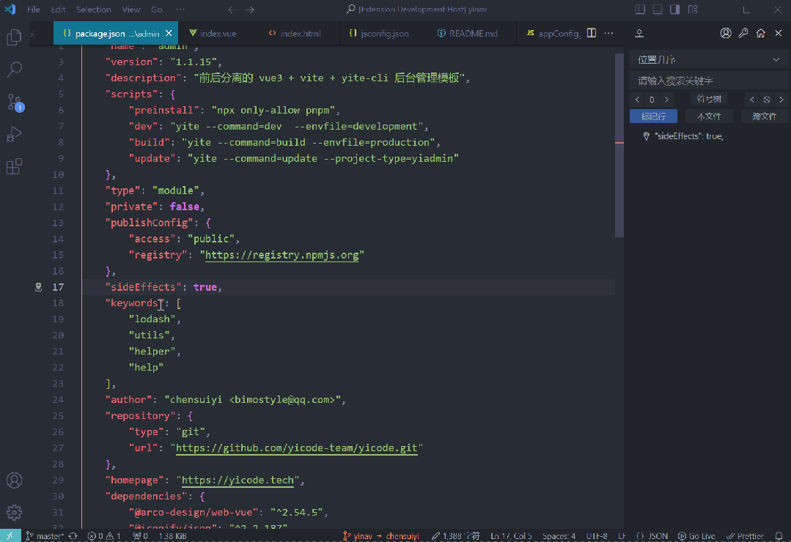

标记当前行（带标签）

### ✅ 符号排序

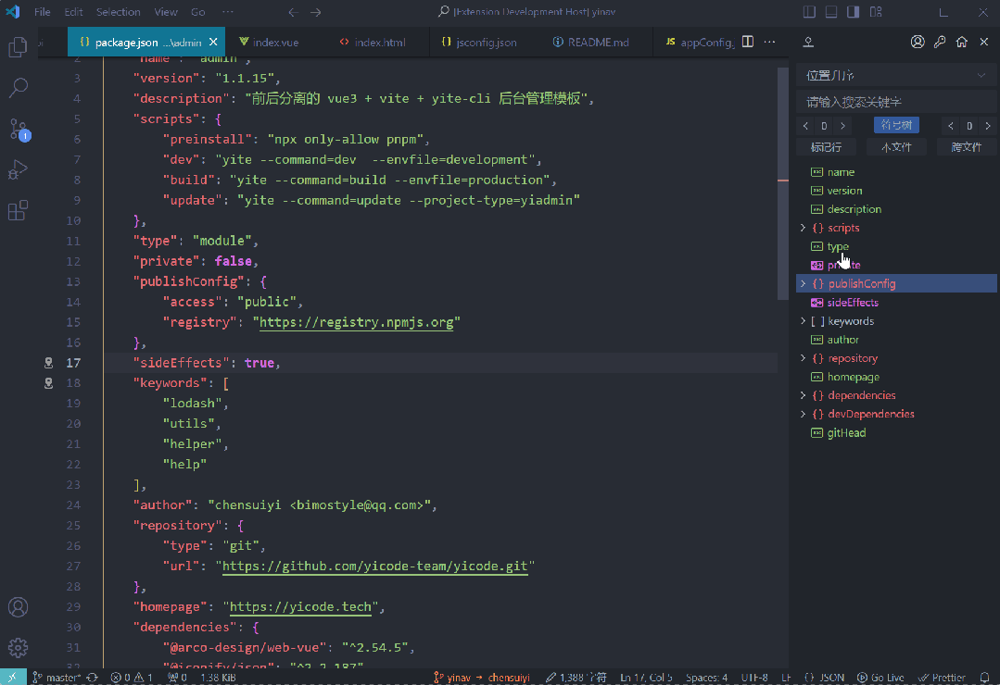

符号排序

### ✅ 搜索符号关键字

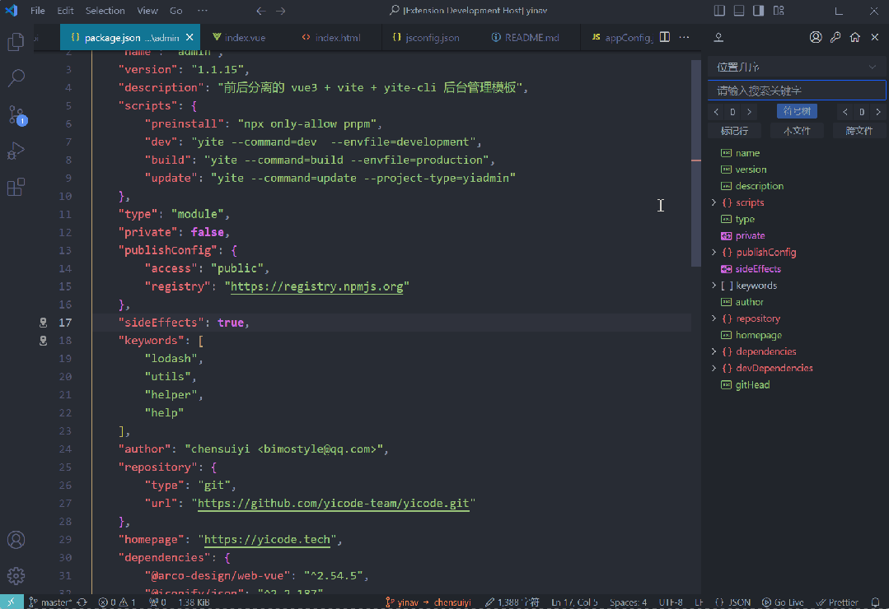
