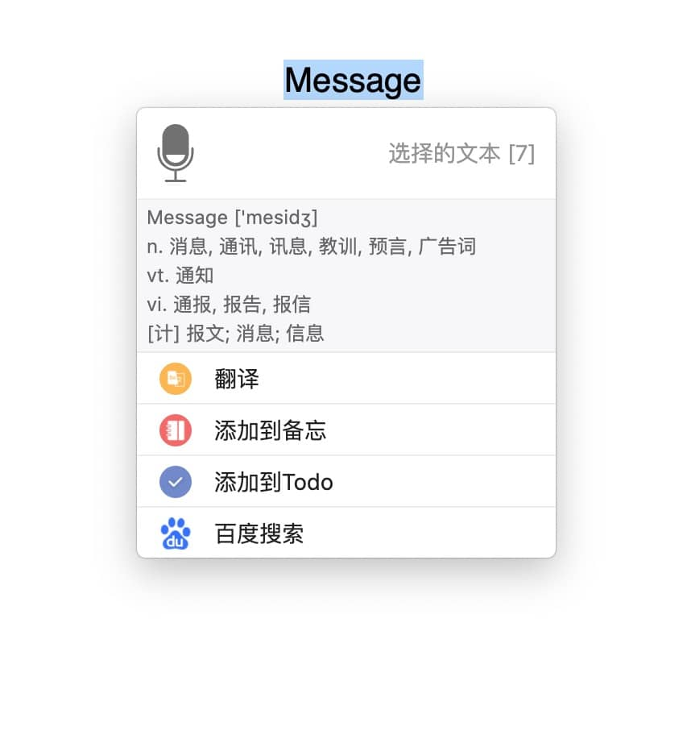
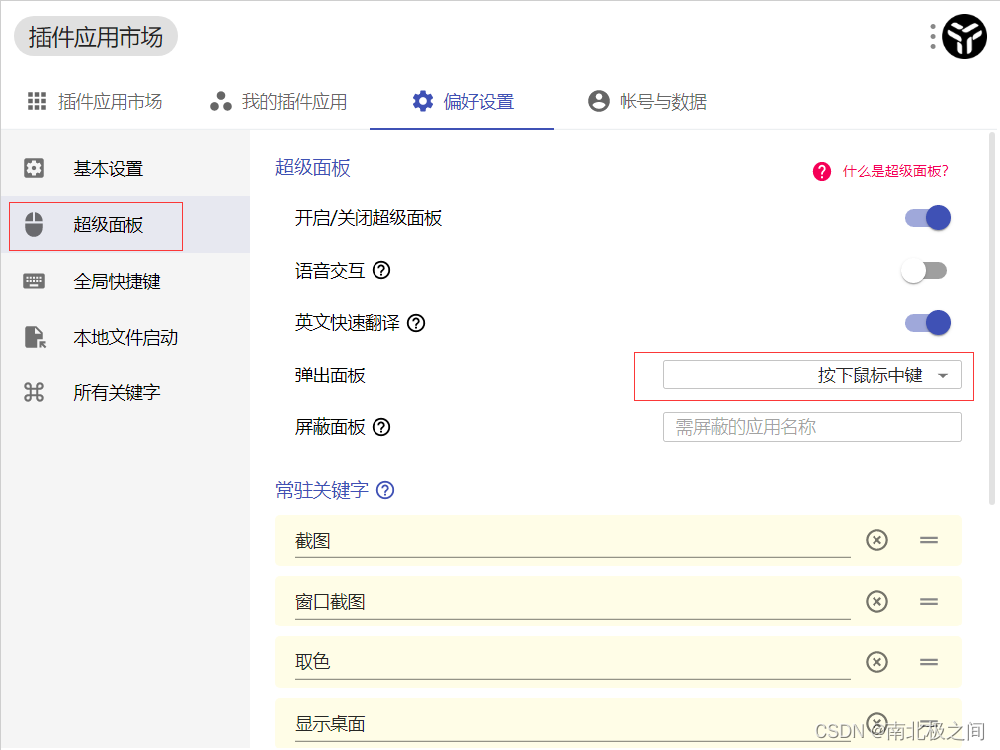
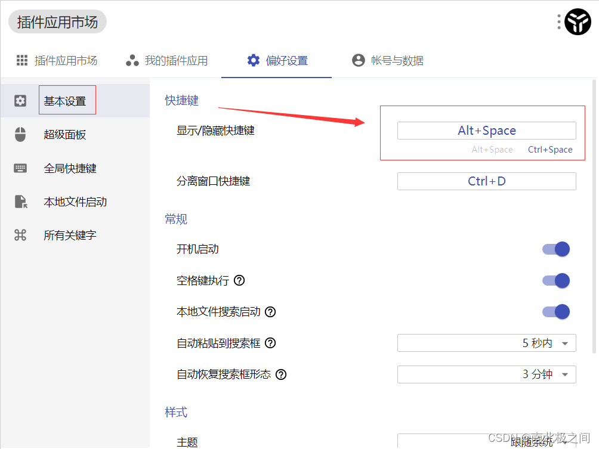
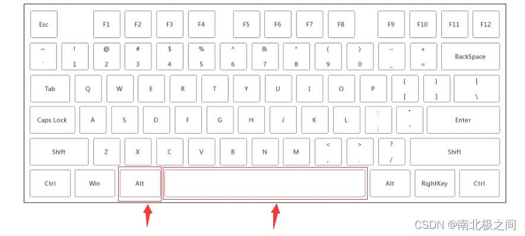
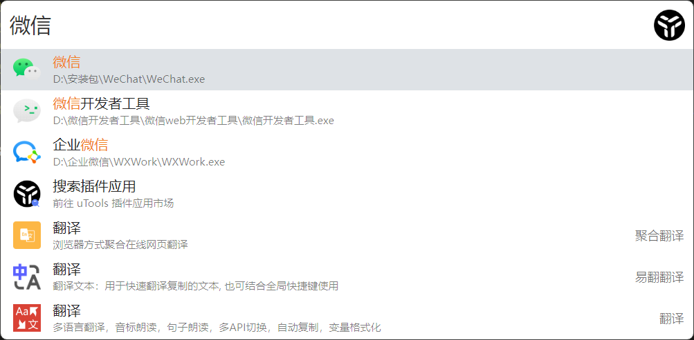
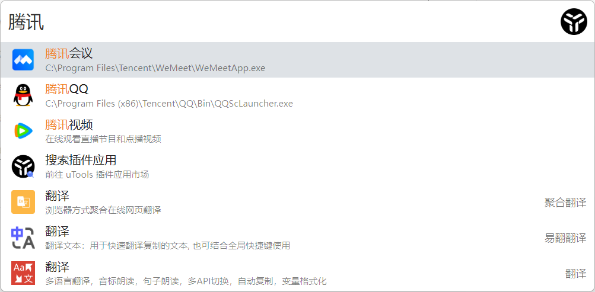
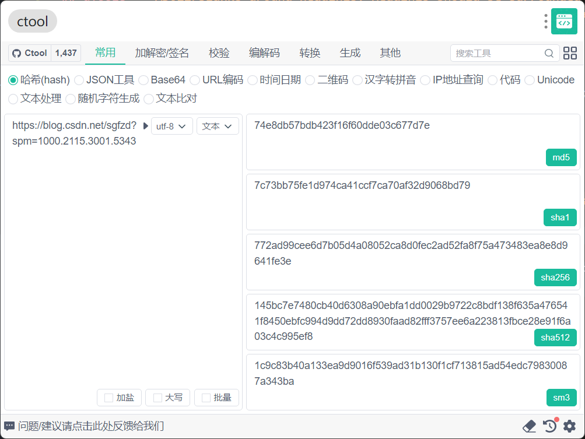
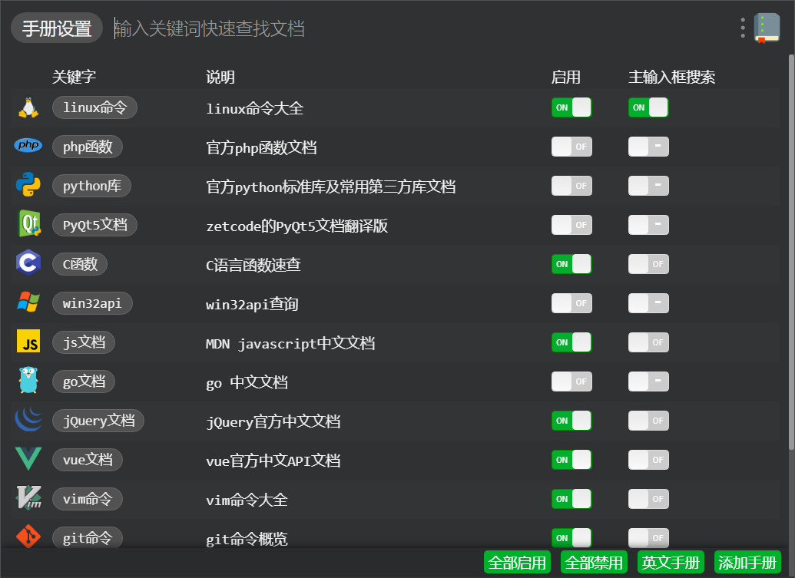
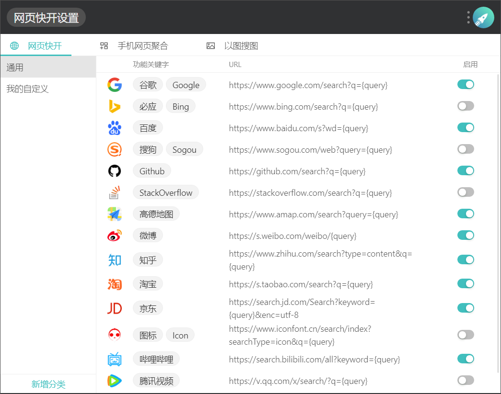

<BackTop />

# utools

## 前言

这是一款本人用的时间最久，体验感最佳的电脑工具箱，它可以实现一键运行，通过底座平台加插件应用的形式，可以添加几乎所有你常用的插件或者小工具，例如常用的开发工具，快速截图、网页快开、文件处理、图片处理等等，即用即走交互以及超轻量化减少电脑负担，不论你是学生党还是上班族，使用之后你就不再想卸载！

- 话不多说，先上地址 ⬇⬇⬇

下载地址：[uTools 官网 - 新一代效率工具平台](https://www.u.tools/)

## uTools

uTools 能做什么？
最简单的，uTools 可以作为一个程序快速启动器，支持英文、英文驼峰、中文拼音、拼音首字母来打开你的本地程序。除程序外， win10+ 和 macOS 用户还可以快速搜索并打开「控制面板」内的细项。总之，你只要还记得一个大概的名字，直接输入基本都能找到。

### 一切皆插件！

启动已安装的程序仅仅是最基础的功能，uTools 最大的特点就是拥有强大的插件系统。现在已有 400+ 的插件供你选择，每个插件解决一个具体场景的问题，简洁美观、即用即走。输入 插件市场 进入插件管理，你就可以根据自己的需求挑选安装，组合成自己最称手的工具集合，为各种日常操作提供便利，不断产生的新插件，也将为你带来无限可能


### 超级面板

可以通过鼠标右键/中键（可配置），快速打开 uTools 超级面板，uTools 会根据当前选择的内容（文本、截图、文件、文件夹）自动匹配已安装的插件供你选择。与平时使用右键类似的习惯，uTools 超级面板却能为你带来完全不一样的内容及体验

```
针对英文，还提供单词词典和整句翻译功能。
```







快捷键打开 uTools：alt+space 空格键



3、搜素功能：
不管是搜素本地的文件、软件。还是 uTools 插件。只要输入关键词。就能搜素出来一堆相关信息。优先是显示本地内容、还会推荐相关的网站、排行榜等。




## 插件市场:

### ctool

ctool 插件是一款程序开发常用工具，支持哈希/加解密/编码转换/时间戳/二维码/拼音/IP 查询/代码优化/Unicode/正则等功能。这是一个通用的工具插件。



### 程序员手册

程序员手直接集成了各种市面上各种语言的文档

- php 手册
- linux 手册
- python 手册
- PyQt5 文档
- C 函数
- go
- vim 命令
- git 命令
- sql 手册
- uTools API
- java
- javascript
- vue
- payload
- devdocs



### 网页快开


