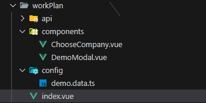
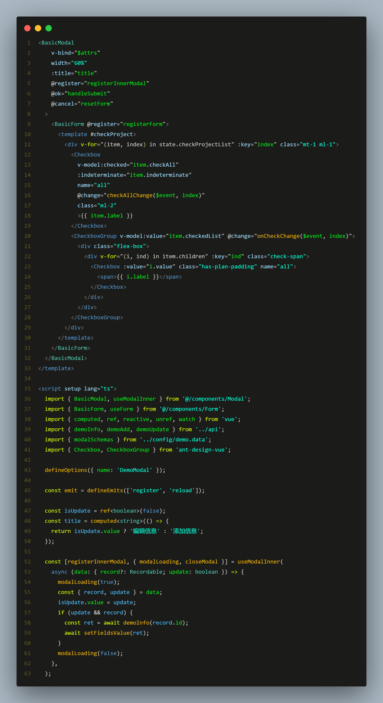

# vben 框架中引入 Modal 组件

## 前言

最近的项目中也是使用到了 vben-admin 这个框架 使用的技术栈是 v3+ts 里面的组件封装程度很高，一般来说上手比较

难，所以想在开发的过程中记录自己在使用框架时的疑惑和过程。

## 新增 编辑 详情 弹框的引入

这里很多小伙伴就说了，引入个弹框不是很简单吗？ 额 也确实很简单哈 ！ 这个框架里呢有点不一样咱们下面就来说说哪里不一样。



这是我项目中某一个页面的文件规范，可以看到这个页面引入了两个弹框组件



这是组件中 HTML 部分可以看到已经是封装过了的它里面封装了一些内置方法我们拿过来直接用这个页面也是把它直接引进来

这里是引入组件和封装的方法。

**！！注意 \*\***v-bind="\$attrs"\***\*记得写，用于将弹窗组件的 \*\***attribute\***\* 传入 \*\***BasicModal\***\* 组件。**

```javascript
import { BasicModal, useModalInner } from '@/components/Modal'
import { BasicForm, useForm } from '@/components/Form'
```

```javascript
//这里定义个亿变量用于控制title的展示
const isUpdate = ref < boolean > false
const title =
  computed <
  string >
  (() => {
    return isUpdate.value ? '编辑信息' : '添加信息'
  })

//这个地方必须要写 不写的话 弹框的显隐就会失效
const [registerInnerModal, { modalLoading, closeModal }] = useModalInner(
  //这里是拿回调的值
  async (data: { record?: Recordable, update: boolean }) => {
    modalLoading(true)
    const { record, update } = data
    isUpdate.value = update
    if (update && record) {
      const ret = await demoInfo(record.id)
      await setFieldsValue(ret)
    }
    modalLoading(false)
  },
)
```

useModalInner 用于操作独立组件

```Plain Text
const [register, { closeModal, setModalProps }] = useModalInner(callback);
callback
type: (data:any)=>void


回调函数用于接收 openModal 第二个参数传递的值
useModal((data: any) => {
  console.log(data);
});


//关闭弹框
closeModal();

//用于修改确认按钮的 loading 状态
changeOkLoading(true);

//用于修改 modal 的 loading 状态
changeLoading(true);
```

一般根据情况去修改弹框里的内容更改弹框的状态等等

\\~\~\~\~\~\~\~\~\~\~\~\~\~\~\~\~\~\~\~\~\~\~\~\~\~\~\~\~\~\~\~\~\~\~\~\~\~\~下面再说一下再页面中引入

```javascript
//在v3中直接引入使用 不用注册
  <!-- 弹窗 -->
    <DemoModal @register="registerModal" @reload="reload" />
    <ChooseCompany @register="registerChooseCompany" />


  /* 引入 自定义弹窗 组件 */
  import DemoModal from './components/DemoModal.vue';
  import ChooseCompany from './components/ChooseCompany.vue';

```

引入进来之后我们就要使用这个弹框 框架里也是直接把控制弹框的显隐 传参 加载都封装好了 我们只用调用方法
**！！在这里我就遇到了一个问题 引入两个弹框组件的时候分别调用成了一个问题 研究了一下也是找到了如何解决**

```javascript
/* 使用 useModal hooks */
//useModal 用于操作组件
//registerModal   registerChooseCompany 这个是定义组件的名字 以便于区分 然后分别定义 以便于在调用的时候区分
const [registerModal, { openModal }] = useModal()
const [registerChooseCompany, { openModal: openChooseCompany }] = useModal()

// 修改任务
function handleEdit(record: Recordable) {
  openModal(true, { record, update: true })
}
//  添加任务
function handleAdd() {
  openModal(true, { update: false })
}

// 选择企业
function handleChooseCompany() {
  openChooseCompany(true, { update: false })
}

//用于打开/关闭弹窗
// true/false: 打开关闭弹窗
// data: 传递到子组件的数据
//openModal(true, data);

用于关闭弹窗
closeModal()

//用于更改 modal 的 props 参数因为 modal 内容独立成组件，如果在外部页面需要更改 props 可能比较麻烦，所以提供 setModalProps 方便更改内部 modal 的 props
//Props 内容可以见下方
setModalProps(props)
```

**register 用于注册 \*\***useModal\***\*，如果需要使用 \*\***useModal\***\* 提供的 api，必须将 \*\***register\***\* 传入组件的 \*\***onRegister\***\*。**

**原理其实很简单，就是 vue 的组件子传父通信，内部通过 \*\***emit("register"，instance)\***\* 实现。**

**同时独立出去的组件需要将 \*\***attrs\***\* 绑定到 \*\***BasicModal\***\* 上面。**

## prpos 内容

| 属性                | 类型                     | 默认值   | 可选值     | 说明                                                                                         |
| ------------------- | ------------------------ | -------- | ---------- | -------------------------------------------------------------------------------------------- |
| title               | string                   | -        | -          | modal 标题                                                                                   |
| height              | number                   | -        | -          | 固定 modal 的高度                                                                            |
| minHeight           | number                   | -        | -          | 设置 modal 的最小高度                                                                        |
| draggable           | boolean                  | true     | true/false | 是否开启拖拽                                                                                 |
| useWrapper          | boolean                  | true     | true/false | 是否开启自适应高度，开启后会跟随屏幕变化自适应内容，并出现滚动条                             |
| wrapperFooterOffset | number                   | 0        | -          | 开启是适应高度后，如果超过屏幕高度，底部和顶部会保持一样的间距，该参数可以用来缩小底部的间距 |
| canFullscreen       | boolean                  | true     | true/false | 是否可以进行全屏                                                                             |
| defaultFullscreen   | boolean                  | false    | true/false | 默认全屏                                                                                     |
| loading             | boolean                  | false    | true/false | loading 状态                                                                                 |
| loadingTip          | string                   | -        | -          | loading 文本                                                                                 |
| showCancelBtn       | boolean                  | true     | true/false | 显示关闭按钮                                                                                 |
| showOkBtn           | boolean                  | true     | true/false | 显示确认按钮                                                                                 |
| helpMessage         | string , string[]        | -        | -          | 标题右侧提示文本                                                                             |
| centered            | boolean                  | false    | true/false | 是否居中弹窗                                                                                 |
| cancelText          | string                   | '关闭'   | -          | 关闭按钮文本                                                                                 |
| okText              | string                   | '保存'   | -          | 确认按钮文本                                                                                 |
| closeFunc           | () => `Promise<boolean>` | 关闭函数 | -          | 关闭前执行，返回 true 则关闭，否则不关闭                                                     |

## [](https://jeesite.com/front/vben-admin/docs/components/modal.html#events)Events

| 事件           | 回调参数              | 说明             |
| -------------- | --------------------- | ---------------- |
| ok             | function(e)           | 点击确定回调     |
| cancel         | function(e)           | 点击取消回调     |
| visible-change | (visible:boolean)=>{} | 打开或者关闭触发 |

## [](https://jeesite.com/front/vben-admin/docs/components/modal.html#slots)Slots

| 名称         | 说明                                               |
| ------------ | -------------------------------------------------- |
| default      | 默认区域                                           |
| footer       | 底部区域(会替换掉默认的按钮)                       |
| insertFooter | 关闭按钮的左边(不使用 footer 插槽时有效)           |
| centerFooter | 关闭按钮和确认按钮的中间(不使用 footer 插槽时有效) |
| appendFooter | 确认按钮的右边(不使用 footer 插槽时有效)           |
