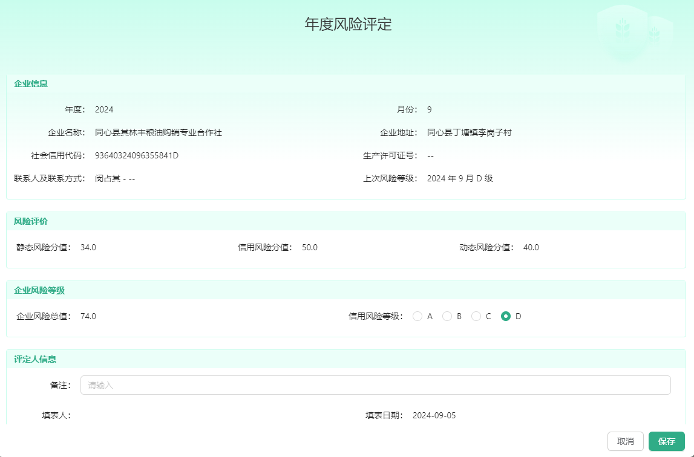

# vben 框架的多表单展示

####        **这片文档呢，我来分享一下使用 vben 框架在某种场景中需要使用多个表单来渲染数据或者提交数据。下面的截图就是我在本项目中遇到的一个场景，当然项目中还有其他地方也有类似的场景。**



#### 我是从以下几个点去分析的：

- 看到这个图怎么去做
- 为什么用多表单做
- 具体实现的过程
- 最后实现的效果

  ## ⭐️ 看到这个图怎么做

  <br/>
  在看到这个图的时候我有两个方案

  方案一：自己手动布局，然后调接口渲染。

  但是自己布局虽然可操控性强但是繁琐，只做渲染可以，但是这里面还要提交一些数据所以不采用
  <br/>
  <br/>
  <br/>

  方案二：使用框架封装好的表单组件，虽然方便但是不够自如，是用一整个表单还是多个表单去分开？

  使用一整个的话，后端返回的数据不好掌控，且布局样式不好做，所以在与后端去交流后，决定使用多表单的形式去做。
  <br/>
  <br/>
  <br/>

  ## ⭐️ 为什么用多表单实现

        使用多表单的话布局样式好调控，在与后端交流后，返回的数据也是多对象的形式传过来的。

所以这里使用多表单去实现。
<br/>
<br/>
<br/>

## ⭐️ 具体实现的过程

确定思路之后就开始动工，这块是从主页面点击按钮弹出来的弹框

```javascript
//html 工具栏部分
<template v-if="column.key === 'action'">
            <TableAction
              stopButtonPropagation
              :actions="[
                {
                  label: record.isFirst == 1 ? '立即评定' : '再次评定',
                  icon: IconEnum.EDIT,
                  type: 'primary',
                  ghost: true,
                  onClick: handleAssessment.bind(null, record),
                },
                {
                  label: '历史查看',
                  icon: IconEnum.DETAIL,
                  type: 'primary',
                  ghost: true,
                  ifShow: record.isFirst != 1,
                  onClick: handleHistoryView.bind(null, record),
                },
              ]"
            />
          </template>


     //引入组件部分
      <!-- 立即评定/再次评定 弹窗 -->
      <AssessmentModal @register="registerInnerAssessment" @reload="reload" />

      /* 引入 立即评定/再次评定 弹窗 组件 */
      import AssessmentModal from './components/assessmentModal.vue';

      //这里使用框架封装的调用弹框方法
      const [registerInnerAssessment, { openModal: openAssessmentModal }] = useModal();
       /* 立即评定/再次评定 */
      function handleAssessment(record: Recordable) {
          openAssessmentModal(true, { record });
       }
```

表单组件部分

```javascript
<BasicModal
    v-bind="$attrs"
    width="60%"
    title="年度风险评定"
    @register="registerAssessmentModal"
    @ok="handleSubmit"
    @cancel="handleCancel"
  >
    <!-- 企业信息 -->
    <div class="greenHeadAndWhiteBody">
      <div class="title">企业信息</div>
      <BasicForm
        :labelWidth="134"
        :schemas="enterpriseInfoFormSchemas"
        :baseColProps="{ span: 12 }"
        :showActionButtonGroup="false"
        ref="enterpriseInfoFormRef"
        class="form"
      />
    </div>
    <!-- 风险评价 -->
    <div class="greenHeadAndWhiteBody">
      <div class="title">风险评价</div>
      <BasicForm
        :labelWidth="110"
        :schemas="riskAssessmentFormSchemas"
        :baseColProps="{ span: 8 }"
        :showActionButtonGroup="false"
        ref="riskAssessmentFormRef"
        class="form"
      />
    </div>
    ..........
</BasicModal>


//表单的配置项
/* 立即评定/再次评定 - 企业信息 表单配置 */
export const enterpriseInfoFormSchemas: FormSchema[] = [
  {
    label: '列表主键ID: 保存时需要',
    field: 'connectId',
    component: 'Input',
    show: false,
  },
  {
    label: '任务ID: 保存时需要',
    field: 'taskId',
    component: 'Input',
    show: false,
  },
  {
    label: '年度：',
    field: 'checkYear',
    component: 'Text',
  },
   ...........
}

```

布局完成之后我们就考虑如何渲染后端返回的值，以及如何提交需要提交的数据。

<b style="color: red">思路</b> ：打开弹窗后调取后端接口拿到数据，分别给每个表单进行塞值（塞值我们怎么去塞呢，这里是通过拿到当前组件实例 ctx：当前组件； global：全局）去逐个进行赋值。在框架中使用<b style="color: red">setFormData</b> 这个方法去填值 ，使用 <b style="color: red">setFieldsValue</b> 去设置表单字段 。 看一下具体代码！！！！

```javascript
//引入获取实例方法
/* 用来获取实例 */
import useCurrentInstance from '@/hooks/web/useCurrentInstance'
/* 拿到当前组件实例 ctx：当前组件； global：全局 */
const { ctx } = useCurrentInstance()

//在打开弹窗方法时调接口获取数据
const [registerAssessmentModal, { modalLoading, closeModal }] = useModalInner(
  async (data: { record?: Recordable }) => {
    modalLoading(true)

    /* 这里是从父组件的 handleAssessment 方法传过来的 record */
    const { record } = data

    if (record) {
      isFirst.value = record.isFirst
      /* 1. 调取接口，并将返回对象中的 null 和 undefined 置为 '--' */
      const res = resetObjSomeValueToEmptyStr(
        await getAssessmentData({ connectId: record.connectId }),
        '--',
      )
      let ret = await userProfile()
      /* 联系人及联系方式 */
      res.connectBy = `${res.connectBy} - ${res.phoneNumber}`
      /* 信用风险等级 - 展示时所需 */
      res.creditLevel = `${res.riskGrade}`
      /* 上次风险等级 - 展示时所需 */
      res.riskGrade = `${res.lastYear} 年 ${res.lastMonth} 月 ${res.riskGrade} 级`
      /* 2. 进行赋值 */
      await setFormData(ctx?.$refs, res, ret)
    }
    modalLoading(false)
  },
)

/**
 * 赋值函数
 * @param refs - 组件引用
 * @param res - 要赋值的数据
 */
async function setFormData(refs: any, res: any, ret: any) {
  if (refs) {
    const that = refs

    try {
      /* 企业风险等级、评定人信息 这 2 个表单初始化值和校验 */
      if (isFormRef(that.riskLevelFormRef) && isFormRef(that.assessorFormRef)) {
        /* 设定 信用风险等级 默认为 D */
        that.riskLevelFormRef.setFieldsValue({ creditLevel: res?.creditLevel || 'D' })
      }

      /* 企业信息 - 赋值 */
      if (isFormRef(that.enterpriseInfoFormRef)) {
        await that.enterpriseInfoFormRef.setFieldsValue(res)
      }

      /* 风险评价 - 赋值 */
      if (isFormRef(that.riskAssessmentFormRef)) {
        await that.riskAssessmentFormRef.setFieldsValue(res)
      }

      /* 企业风险等级 - 赋值 */
      if (isFormRef(that.riskLevelFormRef)) {
        await that.riskLevelFormRef.setFieldsValue({ totalScore: res.totalScore })
      }

      /* 评定人信息 - 赋值 */
      if (isFormRef(that.assessorFormRef)) {
        /* 填表人、填表日期 */
        await that.assessorFormRef.setFieldsValue({
          fillBy: res.fillBy,
          fillTime: res.fillTime,
          approveBy: ret.user.nickName,
          approveTime: ret.user.loginDate,
        })
      }
    } catch (error) {
      console.error('赋值过程中出现错误:', error)
    }
  }
}
```

由于表单中有个别字段是需要提交给后端的，所以在提交方法里要设置提交字段的值，框架内是封装好的方法 <b style="color: red">getFieldsValue</b>，看下面代码是如何实现的。

```javascript
async function handleSubmit() {
  const data = {
    ...assessorFormData,
    ...riskLevelFormData,
    companyId: enterpriseInfoFormRef.getFieldsValue().companyId,
    taskId: enterpriseInfoFormRef.getFieldsValue().taskId,
    connectId: enterpriseInfoFormRef.getFieldsValue().connectId,
    isFirst: isFirst.value,
  }
  /* 调取保存接口 */
  await addAssessmentData(data)
}
```

## ⭐️ 实现的效果

通过以上方法实现了多对象 ， 多表单的展示及提交，重点是通过获取每个表单实例再通过框架提供的方法去赋值。从而实

现了这个功能，代码也简便了不少，比起手动布局省事了很多。
