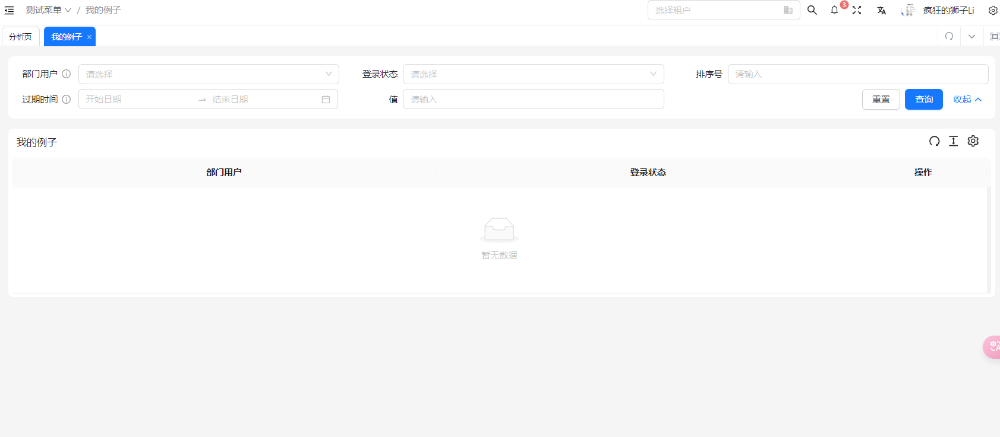
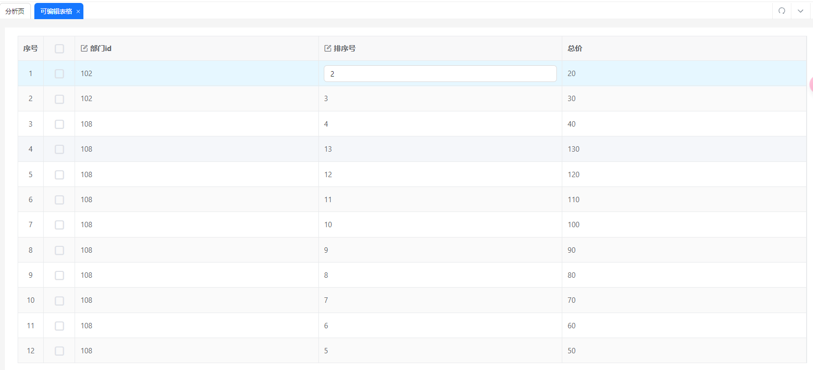

<BackTop />

# vben 框架的使用

## 创建一个基础表格

### 页面展示效果



### 代码实现

在 vben 框架中，创建表格主要使用使用组件 BasicTable,方法 useTable 实现。

```javascript
<template>
    <BasicTable @register="registerTable">
    </BasicTable>
</template>
<script setup lang="scss">
import { BasicTable, useTable } from '@/components/Table';
const [registerTable] = useTable({
    title: '我的例子',
    showIndexColumn: false,
    rowKey: 'id',
    // 控制是否展示搜索表单, false 就是不展示
    useSearchForm: true,
    // 搜索表单的配置，useSearchForm为false的时候即使配置了也不起作用
    formConfig: {
      schemas: formSchems,
      // 控制一行展示几个表单项，类似于el-row 中的span设置的值
      baseColProps: {
        span: 8,
      },
    },
    // 表格列的配置
    columns: columns,
    //  表格操作列
    actionColumn: {
      width: 200,
      title: '操作',
      key: 'action',
      fixed: 'right',
    },
  });
</script>


// columns 配置

```

### 表格的配置项

来源于 src\\components\\Table\\src\\types\\table.ts 中的接口 BasicTableProps

```javascript
export interface BasicTableProps<T = any> {
  // 点击行选中
  clickToRowSelect?: boolean;
  // 是否是树表格
  isTreeTable?: boolean;
  // 控制每次只能展开一行，详见vxe-table文档https://vxetable.cn/#/table/api说明
  accordion?: boolean; // isTreeTable 或 expandRowByClick 时支持
  // 自定义排序方法
  sortFn?: (sortInfo: SorterResult) => any;
  // 排序方法
  filterFn?: (data: Partial<Recordable<string[]>>) => any;
  // 取消表格的默认padding
  inset?: boolean;
  // 显示表格设置
  showTableSetting?: boolean;
  tableSetting?: TableSetting;
  // 斑马纹
  striped?: boolean;
  // 是否自动生成key
  autoCreateKey?: boolean;
  // 计算合计行的方法
  summaryFunc?: (...arg: any) => Recordable[];
  // 自定义合计表格内容
  summaryData?: Recordable[];
  // 是否显示合计行
  showSummary?: boolean;
  // 是否可拖拽列
  canColDrag?: boolean;
  // 接口请求对象
  api?: (...arg: any) => Promise<any>;
  // 请求之前处理参数
  beforeFetch?: Fn;
  // 自定义处理接口返回参数
  afterFetch?: Fn;
  // 查询条件请求之前处理
  handleSearchInfoFn?: Fn;
  // 请求接口配置
  // Partial 可以快速把某个接口类型中定义的属性变成可选的（Optional）
  fetchSetting?: Partial<FetchSetting>;
  // 立即请求接口
  immediate?: boolean;
  // 在开起搜索表单的时候，如果没有数据是否显示表格
  emptyDataIsShowTable?: boolean;
  // 额外的请求参数
  searchInfo?: Recordable;
  // 默认的排序参数
  defSort?: Recordable;
  // 使用搜索表单
  useSearchForm?: boolean;
  // 表单配置
  formConfig?: Partial<FormProps>;
  // 列配置
  columns: BasicColumn[];
  // 是否显示序号列
  showIndexColumn?: boolean;
  // 序号列配置
  indexColumnProps?: BasicColumn;
  actionColumn?: BasicColumn;
  // 文本超过宽度是否显示。。。
  ellipsis?: boolean;
  // 是否继承父级高度（父级高度-表单高度-padding高度）
  isCanResizeParent?: boolean;
  // 是否可以自适应高度
  canResize?: boolean;
  // 自适应高度偏移， 计算结果-偏移量
  resizeHeightOffset?: number;

  // 在分页改变的时候清空选项
  clearSelectOnPageChange?: boolean;
  // 表格行的key，主要在存在checkbox复选框的时候使用
  rowKey?: InstanceType<typeof AntDesignVueTable>['$props']['rowKey'];
  // 数据
  dataSource?: Recordable[];
  // 标题右侧提示
  titleHelpMessage?: string | string[];
  // 表格滚动最大高度
  maxHeight?: number;
  // 是否显示边框
  bordered?: boolean;
  // 分页配置
  pagination?: PaginationProps | boolean;
  // loading加载
  loading?: boolean;

  /**
    树形表格
   * The column contains children to display
   * @default 'children'
   * @type string | string[]
   */
  childrenColumnName?: string;

  /**
   * Override default table elements
   * @type object
   */
  components?: object;

  /**
    主要用于树形表格，控制是否默认展开所有行
   * Expand all rows initially
   * @default false
   * @type boolean
   */
  defaultExpandAllRows?: boolean;

  /**
    主要用于树形表格，控制默认展开的行的key值，key的值和rowkey中保持一致
   * Initial expanded row keys
   * @type string[]
   */
  defaultExpandedRowKeys?: string[];

  /**
   * Current expanded row keys
   * @type string[]
   */
  expandedRowKeys?: string[];

  /**
   * Expanded container render for each row
   * @type Function
   */
  expandedRowRender?: (record?: ExpandedRowRenderRecord<T>) => VNodeChild | JSX.Element;

  /**
   * Customize row expand Icon.
   * @type Function | VNodeChild
   */
  expandIcon?: Function | VNodeChild | JSX.Element;

  /**
   * Whether to expand row by clicking anywhere in the whole row
   * @default false
   * @type boolean
   */
  expandRowByClick?: boolean;

  /**
   * The index of `expandIcon` which column will be inserted when `expandIconAsCell` is false. default 0
   */
  expandIconColumnIndex?: number;

  /**
   * Table footer renderer
   * @type Function | VNodeChild
   */
  footer?: Function | VNodeChild | JSX.Element;

  /**
   * Indent size in pixels of tree data
   * @default 15
   * @type number
   */
  indentSize?: number;

  /**
    表格使用语言
   * i18n text including filter, sort, empty text, etc
   * @default { filterConfirm: 'Ok', filterReset: 'Reset', emptyText: 'No Data' }
   * @type object
   */
  locale?: object;

  /**
   * Row's className
   * @type Function
   */
  rowClassName?: (record: TableCustomRecord<T>, index: number) => string;

  /**
   * Row selection config
   * @type object
   */
  rowSelection?: TableRowSelection;

  /**
   * Show table selection bar（显示多选状态栏）
   * @type boolean
   */
  showSelectionBar?: boolean;

  /**
   * Set horizontal or vertical scrolling, can also be used to specify the width and height of the scroll area.
   * It is recommended to set a number for x, if you want to set it to true,
   * you need to add style .ant-table td { white-space: nowrap; }.
   * @type object
   */
  scroll?: InstanceType<typeof AntDesignVueTable>['$props']['scroll'];

  /**
   * Whether to show table header
   * @default true
   * @type boolean
   */
  showHeader?: boolean;

  /**
   * Size of table
   * @default 'default'
   * @type string
   */
  size?: SizeType;

  /**
   * Table title renderer
   * @type Function | ScopedSlot
   */
  title?: VNodeChild | JSX.Element | string | ((data: Recordable) => string);

  /**
   * Set props on per header row
   * @type Function
   */
  customHeaderRow?: (column: ColumnProps, index: number) => object;

  /**
   * Set props on per row
   * @type Function
   */
  customRow?: (record: T, index: number) => object;

  /**
   * `table-layout` attribute of table element
   * `fixed` when header/columns are fixed, or using `column.ellipsis`
   *
   * @see https://developer.mozilla.org/en-US/docs/Web/CSS/table-layout
   * @version 1.5.0
   */
  tableLayout?: 'auto' | 'fixed' | string;

  /**
   * the render container of dropdowns in table
   * @param triggerNode
   * @version 1.5.0
   */
  getPopupContainer?: (triggerNode?: HTMLElement) => HTMLElement;

  /**
   * Data can be changed again before rendering.
   * The default configuration of general user empty data.
   * You can configured globally through [ConfigProvider](https://antdv.com/components/config-provider-cn/)
   *
   * @version 1.5.4
   */
  transformCellText?: Function;

  /**
   * Callback executed before editable cell submit value, not for row-editor
   *
   * The cell will not submit data while callback return false
   */
  beforeEditSubmit?: (data: {
    record: Recordable,
    index: number,
    key: Key,
    value: any,
  }) => Promise<any>;

  /**
   * Callback executed when pagination, filters or sorter is changed
   * @param pagination
   * @param filters
   * @param sorter
   * @param currentDataSource
   */
  onChange?: (pagination: any, filters: any, sorter: any, extra: any) => void;

  /**
   * Callback executed when the row expand icon is clicked
   *
   * @param expanded
   * @param record
   */
  onExpand?: (expanded: boolean, record: T) => void;

  /**
   * Callback executed when the expanded rows change
   * @param expandedRows
   */
  onExpandedRowsChange?: (expandedRows: string[] | number[]) => void;

  onColumnsChange?: (data: ColumnChangeParam[]) => void;
}
```

### 表格的的方法

主要在 src\\components\\Table\\src\\types\\table.ts 定义

```javascript
export interface TableActionType {
  reload: (opt?: FetchParams) => Promise<Recordable<any>[] | undefined>;
  setSelectedRows: (rows: Recordable[]) => void;
  getSelectRows: <T = Recordable>() => T[];
  clearSelectedRowKeys: () => void;
  expandAll: () => void;
  collapseAll: () => void;
  expandRows: (keyValues: Key[]) => void;
  collapseRows: (keyValues: Key[]) => void;
  scrollTo: (pos: string) => void; // pos: id | "top" | "bottom"
  getSelectRowKeys: () => Key[];
  deleteSelectRowByKey: (keyValue: Key) => void;
  setPagination: (info: Partial<PaginationProps>) => void;
  setTableData: <T = Recordable>(values: T[]) => void;
  updateTableDataRecord: (keyValue: Key, record: Recordable) => Recordable | void;
  deleteTableDataRecord: (keyValues: Key | Key[]) => void;
  insertTableDataRecord: (record: Recordable | Recordable[], index?: number) => Recordable[] | void;
  findTableDataRecord: (keyValue: Key) => Recordable | void;
  getColumns: (opt?: GetColumnsParams) => BasicColumn[];
  setColumns: (columns: BasicColumn[] | string[]) => void;
  getDataSource: <T = Recordable>() => T[];
  getRawDataSource: <T = Recordable>() => T;
  getSearchInfo: <T = Recordable>() => T;
  setLoading: (loading: boolean) => void;
  setProps: (props: Partial<BasicTableProps>) => void;
  redoHeight: () => void;
  setSelectedRowKeys: (keyValues: Key[]) => void;
  getPaginationRef: () => PaginationProps | boolean;
  getSize: () => SizeType;
  getRowSelection: () => TableRowSelection<Recordable>;
  getCacheColumns: () => BasicColumn[];
  emit?: EmitType;
  updateTableData: (index: number, key: string, value: any) => Recordable;
  setShowPagination: (show: boolean) => Promise<void>;
  getShowPagination: () => boolean;
  setCacheColumnsByField?: (dataIndex: string | undefined, value: BasicColumn) => void;
  setCacheColumns?: (columns: BasicColumn[]) => void;
}
```

## 搜索表单项的配置

### 展示效果


### 代码实现

表单项的配置主要依赖于 components/Form 中的 FormSchema

```Plain Text
// 用于获取字典值
import { DictEnum } from '@/enums/dictEnum';
import { getDictOptions } from '@/utils/dict';


/* 定义表单 */
export const formSchems: FormSchema[] = [
  {
    label: '部门用户',
    field: 'deptId',
    helpMessage: '请选择用户',
    component: 'Select',
    componentProps: {
      options: [
        {
          label: '张三',
          value: 1,
        },
        {
          label: '李四',
          value: 2,
        },
      ],
    },
  },
  {
    label: '登录状态',
    field: 'status',
    component: 'Select',
    componentProps: {
      options: getDictOptions(DictEnum.COMMON_STATUS),
    },
  },
  {
    label: '排序号',
    field: 'orderNum',
    component: 'Input',
  },
  {
    label: '过期时间',
    field: 'expireTime',
    helpMessage: ['过期时间不能小于当前时间'],
    component: 'RangePicker',
    componentProps: {
      // format: 'YYYY-MM-DD HH:mm:ss',
      // valueFormat: 'YYYY-MM-DD HH:mm:ss',
      showTime: true,
    },
    // colProps: {
    //   xs: 24,
    //   sm: 24,
    //   md: 12,
    //   lg: 12,
    //   xl: 12,
    // },
  },
  {
    label: '值',
    field: 'value',
    component: 'Input',
  },
];
```

### 表格中搜索表单使用的详细配置

```javascript
export interface FormProps {
  name?: string;
  layout?: 'vertical' | 'inline' | 'horizontal';
  // Form value
  model?: Recordable;
  // 表单文本标签的宽度
  labelWidth?: number | string;
  // 表单文本标签的位置
  labelAlign?: 'left' | 'right';
  // 详细配置见ant-design-vue框架中栅格布局的Row的配置
  rowProps?: RowProps;
  // Submit form on reset
  submitOnReset?: boolean;
  // Submit form on form changing
  submitOnChange?: boolean;
  // Col configuration for the entire form
  labelCol?: Partial<ColEx>;
  // 控制搜索表单项的一列中表单项的宽度
  wrapperCol?: Partial<ColEx>;

  // General row style
  baseRowStyle?: CSSProperties;

  // General col configuration
  baseColProps?: Partial<ColEx>;

  // 表单项配置
  schemas?: FormSchema[];
  // Function values used to merge into dynamic control form items
  mergeDynamicData?: Recordable;
  // Compact mode for search forms
  compact?: boolean;
  // Blank line span
  emptySpan?: number | Partial<ColEx>;
  // Internal component size of the form
  size?: 'default' | 'small' | 'large';
  // Whether to disable
  disabled?: boolean;
  // 是否只读
  readonly?: boolean;
  // Time interval fields are mapped into multiple
  fieldMapToTime?: FieldMapToTime;
  // Placeholder is set automatically
  autoSetPlaceHolder?: boolean;
  // Auto submit on press enter on input
  autoSubmitOnEnter?: boolean;
  // Check whether the information is added to the label
  rulesMessageJoinLabel?: boolean;
  // Whether to show collapse and expand buttons
  showAdvancedButton?: boolean;
  // Whether to focus on the first input box, only works when the first form item is input
  autoFocusFirstItem?: boolean;
  // Automatically collapse over the specified number of rows
  autoAdvancedLine?: number;
  // Always show lines
  alwaysShowLines?: number;
  // Whether to show the operation button
  showActionButtonGroup?: boolean;

  // Reset button configuration
  resetButtonOptions?: Partial<ButtonProps>;

  // Confirm button configuration
  submitButtonOptions?: Partial<ButtonProps>;

  // Operation column configuration
  actionColOptions?: Partial<ColEx>;

  // Show reset button
  showResetButton?: boolean;
  // Show confirmation button
  showSubmitButton?: boolean;
  // 重置方法
  resetFunc?: () => Promise<void>;
  // 提交方法
  submitFunc?: () => Promise<void>;
  transformDateFunc?: (date: any) => string;
  colon?: boolean;
}
```

### formSchema 中的详细配置

src\\components\\Form\\src\\types\\form.ts

### 表单项组件详见

src\\components\\Form\\src\\types\\index.ts —— ComponentProps 接口配置

```javascript
interface BaseFormSchema<T extends ComponentType = any> {
  // Field name
  field: string;
  // Extra Fields name[]
  fields?: string[];
  // Event name triggered by internal value change, default change
  changeEvent?: string;
  // Variable name bound to v-model Default value
  valueField?: string;
  // Label name
  label?: string | VNode | ((renderCallbackParams: RenderCallbackParams) => string | VNode);
  // Auxiliary text
  subLabel?: string;
  // Help text on the right side of the text
  helpMessage?:
    | string
    | string[]
    | ((renderCallbackParams: RenderCallbackParams) => string | string[]);
  // BaseHelp component props
  helpComponentProps?: Partial<HelpComponentProps>;
  // Label width, if it is passed, the labelCol and WrapperCol configured by itemProps will be invalid
  labelWidth?: string | number;
  // Disable the adjustment of labelWidth with global settings of formModel, and manually set labelCol and wrapperCol by yourself
  disabledLabelWidth?: boolean;
  // Component parameters
  componentProps?:
    | ((opt: {
        schema: FormSchema;
        tableAction: TableActionType;
        formActionType: FormActionType;
        formModel: Recordable;
      }) => ComponentProps[T])
    | ComponentProps[T];
  // Required
  required?: boolean | ((renderCallbackParams: RenderCallbackParams) => boolean);

  suffix?:
    | string
    | number
    | VNode
    | ((renderCallbackParams: RenderCallbackParams) => string | VNode | number);
  prefix?:
    | string
    | number
    | VNode
    | ((renderCallbackParams: RenderCallbackParams) => string | VNode | number);
  // Validation rules
  rules?: Rule[];
  // Check whether the information is added to the label
  rulesMessageJoinLabel?: boolean;

  // Reference formModelItem
  itemProps?: Partial<FormItem>;

  // col configuration outside formModelItem
  colProps?: Partial<ColEx>;

  // 默认值
  defaultValue?: any;

  // 额外默认值数组对象
  defaultValueObj?: { [key: string]: any };

  // 是否自动处理与时间相关组件的默认值
  isHandleDateDefaultValue?: boolean;

  isAdvanced?: boolean;

  // Matching details components
  span?: number;

  ifShow?: boolean | ((renderCallbackParams: RenderCallbackParams) => boolean);

  show?: boolean | ((renderCallbackParams: RenderCallbackParams) => boolean);

  // Render the content in the form-item tag
  render?: (
    renderCallbackParams: RenderCallbackParams,
    opts: RenderOpts,
  ) => VNode | VNode[] | string;

  // Rendering col content requires outer wrapper form-item
  renderColContent?: (
    renderCallbackParams: RenderCallbackParams,
    opts: RenderOpts,
  ) => VNode | VNode[] | string;

  renderComponentContent?:
    | ((renderCallbackParams: RenderCallbackParams, opts: RenderOpts) => any)
    | VNode
    | VNode[]
    | string;

  // Custom slot, similar to renderColContent
  colSlot?: string;

  dynamicDisabled?: boolean | ((renderCallbackParams: RenderCallbackParams) => boolean);

  dynamicReadonly?: boolean | ((renderCallbackParams: RenderCallbackParams) => boolean);

  dynamicRules?: (renderCallbackParams: RenderCallbackParams) => Rule[];
}
```

## 创建一个可编辑的表格

### 展示效果



### 代码实现

```javascript
<template>
  <PageWrapper dense contentClass="p-16px">
    <VxeBasicTable ref="tableRef" v-bind="gridOptions" />
  </PageWrapper>
</template>
<script setup lang="ts">
  // src\views\demo\subform\SubFormTest.vue
  import { PageWrapper } from '@/components/Page';
  import { BasicTableProps, VxeBasicTable } from '@/components/VxeTable';
  import { vxeTableColumns, validRules } from './vxeGrid.data';
  import { reactive, ref, onMounted } from 'vue';
  import { VxeGridInstance } from 'vxe-table';
  import { demoList } from './api';

  const gridOptions = reactive<BasicTableProps>({
    keepSource: true,
    border: true,
    editConfig: {
      trigger: 'click',
      mode: 'cell',
      showStatus: true,
    },
    columns: vxeTableColumns,
    toolbarConfig: {
      enabled: false,
    },
    columnConfig: {
      resizable: true,
    },
    data: [],
    proxyConfig: {
      //  必须设置？
      enabled: false,
    },
    editRules: validRules,
  });
  const loading = ref(false);
  const tableRef = ref<VxeGridInstance>();
  /* 获取表格数据 */
  const getTableData = async () => {
    loading.value = true;
    const res = await demoList();
    /* vxeTable赋值*/
    tableRef.value?.loadData(res?.rows);
  };
  onMounted(async () => {
    getTableData();
  });
</script>
<style lang="less" scoped></style>

```
