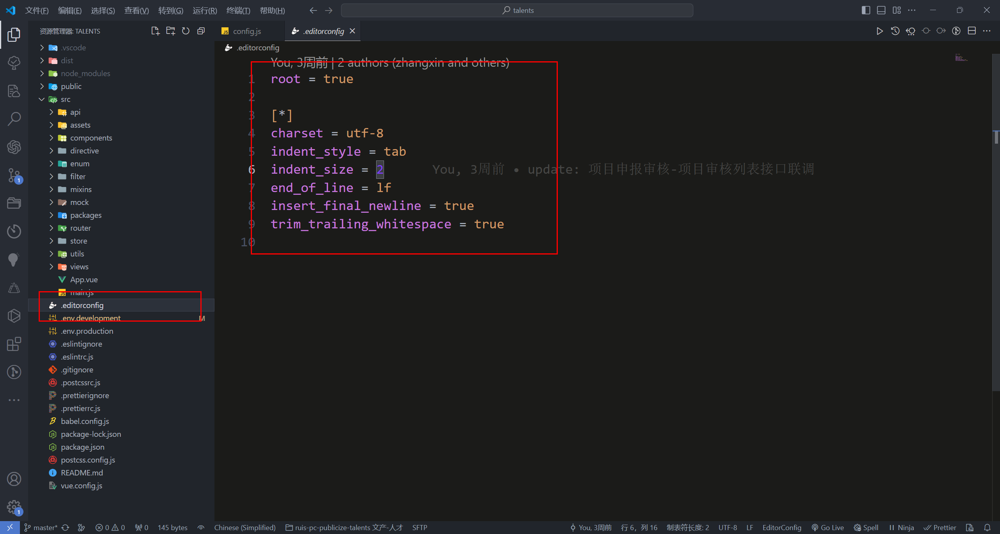
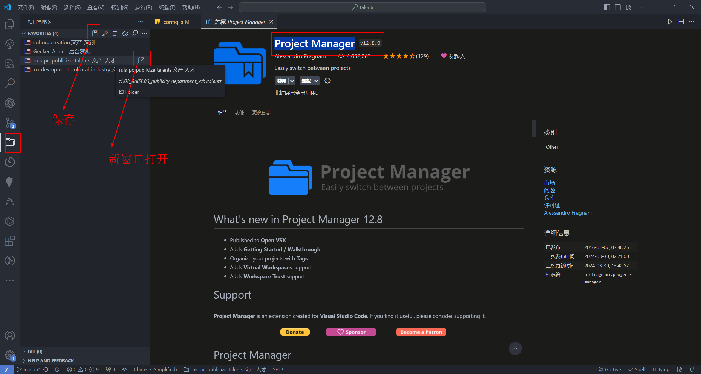

# VSCode 插件分享

## 《 Turbo Console Log 》

\---------- 描述 ----------

快速添加 console.log 信息，js debug 必备
\---------- 插件样子 ----------

\---------- 快捷键 ----------

1. ctrl + alt + l 选中变量之后，使用这个快捷键生成 console.log
2. alt + shift + c 注释所有 console.log
3. alt + shift + u 启用所有 console.log
4. alt + shift + d 删除所有 console.log

## 《 英文驼峰命名 》

\---------- 描述 ----------

很多人不会起英文名而被同行 diss，今天他来了，解决你起名的苦恼

\----------  使用方法见插件动图（非常简单） ----------

## 《 Better Comments 》

\---------- 描述 ----------

该插件对不同类型的注释会附加了不同的颜色，更加方便区分，帮助我们在代码中创建更人性化的注释。

\---------- 插件样子 ----------

\----------- 如何使用 ----------

1. 在 Vscode 左下角齿轮图标打开设置，输入 setting 打开  [在 settings.json 中编辑](http://xn--uba/)
2. 将 { } 中的内容（详情见 common 文件夹中 json 文件）全部复制到 Vscode 设置中的 settings.json 中
3. !  此行前面加   !，会让该行注释颜色变为红色
4. ?  此行前面加   ?，会让该行注释颜色变为蓝色
5. //  此行前面加   //，会让该行注释颜色变为灰色，并加删除线样式
6. todo 此行前面加   todo，会让该行注释颜色变为橘色
7. \*  此行前面加   \*，会让该行注释颜色变为绿色

\---------- 使用效果如下图(多行注释会有不同的颜色) ----------

## 《 Code Spell Checker 》

\---------- 描述 ----------

检查代码是否拼写错误

\----------  插件样子 ----------

## 《 Error Gutters 》

\---------- 描述 ----------

代码报错会有大红波浪号提示

\---------- 插件样子 ----------

\---------- 使用效果如下图 ----------

## 《 indent-rainbow 》

\---------- 描述 ----------

把代码不同的缩进展示不同的颜色

\---------- 插件样子和使用效果如下图 ----------

## 《 Browse Lite（vscode 中的浏览器） 》

\---------- 描述 ----------

在 Vscode 中打开浏览器，并且能够调试

\---------- 插件样子和使用效果如下图 ----------

## 《 Postcode 》

\---------- 描述 ----------

Postman  都听说过吧，这个插件就基本上可以理解为，在  vscode  里面使用  postman

\---------- 插件样子和使用效果如下图 ----------

## 《 Time Master 》

\---------- 描述 ----------

从编程活动中自动生成的指标、见解和时间跟踪。它是一个开源项目，独立于网络环境，安全轻量

\---------- 插件样子和使用效果如下图 ----------

## 《 any-rule 》

\---------- 描述 ----------

可以鼠标右键在代码里插入正则表达式 (准确度自己判断)

\---------- 插件样子和使用效果如下图 ----------

## 《 background-cover 》

\---------- 描述 ----------

可以更换 vscode 的背景图

\---------- 插件样子和使用效果如下图 ----------

## 《 Component Template 》

\---------- 描述 ----------

鼠标右键新建组件，可以快速生成指定的文件(夹)模板

\---------- 插件样子和使用效果如下图 ----------

## 《 Console Ninja 》

\---------- 描述 ----------

可以在 vscode 中直接看到打印结果

\---------- 插件样子和使用效果如下图 ----------

## 《 Docx Renderer、Docs To Pdf、Docx/ODT Viewer、Xmind Viewer 》

\---------- 描述 ----------

可以直接在 vscode 中预览 docx、xmind

\---------- 插件样子和使用效果如下图 ----------

## 《 EditorConfig for VS Code 》

\---------- 描述 ----------

可以在项目中生成 .editorconfig 文件，统一项目的编写规范，比如：tab 缩进、结尾是否分号等

\---------- 插件样子和使用效果如下图 ----------

## 《 ESLint 》

\---------- 描述 ----------

可以对项目代码进行校验，前提需要配置

\---------- 插件样子和使用效果如下图 ----------

## 《 filesize 》

\---------- 描述 ----------

可以查看任意文件的大小

\---------- 插件样子和使用效果如下图 ----------

## 《 Git History 》

\---------- 描述 ----------

可以查看 git 的历史，比如代码是谁提交的，好找出凶手

\---------- 插件样子和使用效果如下图 ----------

## 《 Image preview、Svg Preview 》

\---------- 描述 ----------

当图片路径输写正确后，会在左侧出现小图片预览；可以对 svg 图片进行预览

\---------- 插件样子和使用效果如下图 ----------

## 《 Live Server 》

\---------- 描述 ----------

对于 html 文件，可以鼠标右键打开浏览器，代码和页面实时响应

\---------- 插件样子和使用效果如下图 ----------

## 《 Markdown All in One、Markdown Preview Enhanced、markdownlint 》

\---------- 描述 ----------

可以帮助你更改的编写和预览 md 文档

\---------- 插件样子和使用效果如下图 ----------

## 《 Material Icon Theme 》

\---------- 描述 ----------

可以让 vscode 的图标变得更好看，容易识别

\---------- 插件样子和使用效果如下图 ----------

## 《 Prettier - Code formatter、Prettier ESLint 》

\---------- 描述 ----------

对代码进行格式化，需要相应配置

\---------- 插件样子和使用效果如下图 ----------

## 《 Project Manager 》

\---------- 描述 ----------

项目管理器：可以从 vscode 方便快捷打开已保存的项目 (自己可以选择直接替换还是打开新的窗口)

\---------- 插件样子和使用效果如下图 ----------

## 《 px to rem & rpx & vw (cssrem) 》

\---------- 描述 ----------

做移动端可能有用，将 px 转为 rem，具体配置参照  [该网址](https://www.cnblogs.com/mzq156416/p/13565644.html)

\---------- 插件样子和使用效果如下图 ----------

## 《 Stylelint、stylus 》

\---------- 描述 ----------

可以对 css 文件进行校验

\---------- 插件样子和使用效果如下图 ----------

## 《 Tabnine 》

\---------- 描述 ----------

可以辅助或者说预判你的代码，按 tab 键可直接生成

\---------- 插件样子和使用效果如下图 ----------

## 《 TODO Highlight、 Todo Tree 》

\---------- 描述 ----------

可以让 todo 等关键字高亮 (可配置高亮颜色)；可以在项目里生成 1 个 todo 树，方便看未完成的事项

\---------- 插件样子和使用效果如下图 ----------

## 《 Vetur 》

\---------- 描述 ----------

vue2 必装，使用时注意 禁用 Vue - Official

\---------- 插件样子和使用效果如下图 ----------

## 《 Vue - Official 》

\---------- 描述 ----------

vue3 必装，使用时注意 禁用 Vetur

\---------- 插件样子和使用效果如下图 ----------

## 《UnoCSS》

\---------- 描述 ----------

原子 CSS 引擎，提供类名，能够更方便的在项目中使用

\---------- 插件样子和使用效果如下图 ----------

## 《 别名路径跳转 》

\---------- 描述 ----------

别名路径跳转插件，支持任何项目，可以自由配置映射规则，自由配置可缺省后缀名列表

\---------- 插件样子和使用效果如下图 ----------

