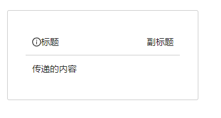

<BackTop />

# 组件注册

所谓注册在 vue 中实际上指的是组件注册，v3 中的组件注册和 v2 中的组件注册并无较大差别，都分为全局注册、局部注册。

## 1.全局注册组件

##### 1.1 基本使用

- 使用场景：若这个组件需要在多个业务场景中用到，我们可以考虑将其注册为全局组件，这样在使用的时候就不需要单独引入。
- 注册方法： 使用 Vue 应用实例，也就是我们经常使用的 createApp()的.component()方法进行注册。
- 代码例子
  我们注册一个全局的 BasicCard 组件。

```javascript
<!-- 封装一个Card组件，在页面中的任何地方都去使用 -->
<template>
  <div class="card">
    <div class="card-header">
      <div>标题</div>
      <div>副标题</div>
    </div>
    <div v-if="content" class="card-content">
      {{ content }}
    </div>
  </div>
</template>
<script setup lang="ts">
type Props = {
  content: string
}

defineProps<Props>()
</script>
<style lang="less" scoped>
@border: #ccc;
.card {
  width: 300px;
  border: 1px solid @border;
  border-radius: 3px;
  &:hover {
    box-shadow: 0 0 10px @border;
  }

  &-content {
    padding: 10px;
  }
  &-header {
    display: flex;
    justify-content: space-between;
    padding: 10px;
    border-bottom: 1px solid @border;
  }
}
</style>

```

在 main.ts 中进行全局注册

```javascript
import { createApp } from 'vue'
import './style.css'
import App from './App.vue'
import router from './router'

/* 全局引入basicCard组件 */
import BasicCard from '@/components/common/BasicCard.vue'
createApp(App)
  .component('BasicCard', BasicCard) // 全局注册BasicCard
  .use(router)
  .mount('#app')
```

在其他 vue 页面中使用 BasicCard，无需引入即可使用

```javascript
<template>
  <BasicCard content="传递的内容">
  </BasicCard>
</template>
<script setup lang="ts">
</script>
```

##### 1.2 扩展- 批量注册全局组件

之所以能够批量注册全局组件的原因是.component()的方法是可以被链式调用的。

```javascript
// 官方例子
app
  .component('ComponentA', ComponentA)
  .component('ComponentB', ComponentB)
  .component('ComponentC', ComponentC)
```

例如全局注册 ant-design 的图标

```javascript
// main.ts
/* 全局注册ant-design的图标 */
import * as AntDesignIconsVue from '@ant-design/icons-vue'

const app = createApp(App)
for (const [key, component] of Object.entries(AntDesignIconsVue)) {
  app.component(key, component)
}
app.component('BasicCard', BasicCard).use(router).mount('#app')

// BasicCard使用图标
<template>
  <div class="card">
    <div class="card-header">
      <div><InfoCircleOutlined />标题</div>
      <div>副标题</div>
    </div>
    <div v-if="content" class="card-content">
      {{ content }}
    </div>
  </div>
</template>
<script setup lang="ts">
type Props = {
  content: string
}

defineProps<Props>()
</script>
```

展示效果



## 2.局部注册组件

局部注册组件存在的原因主要是为了解决全局组件带来的弊端，全局组件主要存在以下弊端：

- 全局组件会造成打包后的代码体积变大，全局注册的组件即使不使用，打包后还是会存在 JS 文件中，无法在生产打包的时候被自动移除。
- 代码长期维护较复杂，如果是一个大型复杂的项目，vue 的文件很多，使用全局注册的组件会使得项目的依赖关系不明确。主要表现是在父组件使用子组件时，不太容易定位子组件。就和使用过多的全局变量一样，较难长期维护。
  局部组件的出现解决以上全局组件带来的弊端，局部组件是谁使用谁引用，依赖关系较为明确，并且不容易造成打包后导致的包体积变大。

1. 局部组件的注册
   简单的说就是在一个组件中通过 import 引用另一个组件，并且引用后组件 B 只能在组件 A 中引用。如果组件 C 也想引用组件 B，也需要通过 import 去手动引入组件 B。
2. 具体引入方式

- Vue3 中存在语法糖 setup 直接引入即注册，不需要再另外注册组件。

```javascript
<script setup>
import ComponentA from './ComponentA.vue'
</script>

<template>
  <ComponentA />
</template>
```

- 如果没有使用`<script setup></script>`,则需要使用 components 选项来注册，类似于 vue2 中的局部组件引入

```javascript
import ComponentA from './ComponentA.js'

export default {
  components: {
    ComponentA,
  },
  setup() {
    // ...
  },
}
```

## 3.组件名注册格式

官方推荐我们使用大驼峰的组件命名格式，Vue 支持将模板中使用 kebab-case 的标签解析为使用 PascalCase 注册的组件。

```javascript
// 组件名 BasicCard
// 在模板中使用的时候
<BasicCard/> 或者 <basic-card></basic-card>
```
