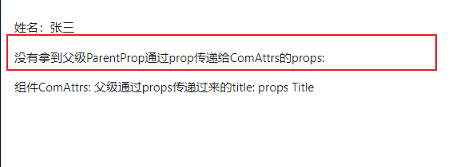

<BackTop />

# 透传 Attributes

直接说透传 Attributes 我们可能是有点陌生，但在组件封装的时候我们常见到的\$attrs 肯定是熟悉的，所谓透传就是我们使用\$attrs 将父组件的未声明的 Props 直接传递给子组件内部的 HTML 标签或自定义组件。

使用透传简化了属性传递的流程，我们不需要通过 props 将父组件的属性逐层传递下去，并且可以直接在子组件中访问到父组件的属性。

透传传递的属性包括变量、方法、class、style 和 id。

## 1.透传 class、style 和 id

1.1 样式可直接透传给子组件

```
// 父组件中加载子组件，并在父组件中定义类名
// 父组件
<template>
  <ComAttrs class="parent-style"></ComAttrs>
</template>
<script setup lang="ts">
import ComAttrs from './ComAttrs.vue'
</script>
<style lang="less" scoped>
.parent-style {
  background: red;
  color: #fff;
}
</style>


// 子组件
<template>
  <h3>你好，我是子组件</h3>
</template>
<script setup lang="ts"></script>
<style lang="scss" scoped></style>
```

页面效果：


1.2 class、style 的合并

```
// 同时在引用组件及子组件上分别定义类名，会进行合并。
// 父组件
<template>
  <ComAttrs class="parent-style"></ComAttrs>
</template>
<script setup lang="ts">
import ComAttrs from './ComAttrs.vue'
</script>
<style lang="less" scoped>
.parent-style {
  background: red;
  color: #fff;
}
</style>
// 子组件
<template>
  <h3 class="children-style">你好，我是子组件</h3>
</template>
<script setup lang="ts"></script>
<style lang="less" scoped>
.children-style {
  color: blue;
}
</style>

```

页面效果：


## 2.父组件传递属性，子组件获取传递过来的属性

- 子组件只有一个根元素，父级透传的 attribute 会自动被添加到根元素上。

```
// 父节点
<template>
  <ComAttrs
    class="parent-style"
    name="张三"
    age="28"
  > </ComAttrs>
</template>
<script setup lang="ts">
import ComAttrs from './ComAttrs.vue'
</script>
<style lang="less" scoped>
.parent-style {
  background: red;
  color: #fff;
}
</style>

// 子组件通过useAttrs 接收
<template>
  <div>
    <h3>我是子组件</h3>
    <p>姓名：{{ attrs.name }}</p>
    <p>年龄：{{ attrs.age }}</p>
  </div>
</template>
<script setup lang="ts">
import { useAttrs } from 'vue'

const attrs = useAttrs()
</script>
<style lang="less" scoped>
.children-style {
  color: blue;
}
</style>
```

- 子组件存在多个根元素的时候，不会自动 attribute 透传行为，如果\$attrs 没有被显示绑定，将会抛出一个运行时警告。


```
<template>
// 显式绑定$attrs
  <div v-bind="$attrs">
    <h3>我是子组件</h3>
    <p>姓名：{{ $attrs.name }}</p>
    <p>年龄：{{ $attrs.age }}</p>
  </div>
  <div>我是另一个根元素</div>
</template>
<script setup lang="ts">

</script>
```

- 若不做显式绑定，也可以直接通过\$attrs 来访问到透传过来的属性，那么在有多个根节点时候进行显式绑定的意义是什么？

```
// 父组件
<template>
  <div>
    <ComAttrs id="parentId" class="parent-style" name="张三" age="28"> </ComAttrs>
  </div>
</template>
<script setup lang="ts">
import ComAttrs from './ComAttrs.vue'
</script>
<style lang="less" scoped>
.parent-style {
  background: red;
  color: #fff;
}
</style>
// 子组件没有做显式绑定
<template>
  <div class="children-style">
    <h3>我是子组件</h3>
    <p>姓名：{{ $attrs.name }}</p>
    <p>年龄：{{ $attrs.age }}</p>
  </div>
  <div>我是另一个根元素</div>
</template>
<script setup lang="ts">
</script>
<style lang="less" scoped>
.children-style {
  color: blue;
}
</style>
```

页面效果：


仔细观察上图的页面效果展示图，可以发现在父组件引用子组件的时候，我们定义了 id、class 都没有透传给子组件，当我们进行显式绑定后的页面效果如下图：（父级类名虽然透传过来了，但由于存在多个根元素，所以父级的样式还没有起作用）


## 3.深层组件继承

- 存在两级以上组件进行透传的时候，最底层组件能获取到最顶层透传过来的属性，但是最顶层通过 prop 或者 emits 声明的事件传递给中间层，最底层是没办法获取到的。 按照官方的说法： 声明过的 props 和侦听函数被中间层“消费”了
- 组件透传截图


- 页面效果



## 4.禁用 Attributes 继承

- 使用场景： 如果你不想要一个组件自动的继承 attribute(这句话的意思是单个根元素都是自动透传继承的，尤其是类名都会自动透传给子组件，如果你不想要子组件自动继承父组件的样式),就可以在组件选项中设置 inheritAttrs:false。但还是可以通过\$attrs 访问到透传过来的属性。
  页面效果：


- 组件选项中设置 inheritAttrs:false， 如果你使用了`<script setup></script>`,你需要一个额外的`<script></script>`块来书写这个选项声明。

```
<template>
  <div class="children-style">
    <p>姓名：{{ $attrs.name }}</p>
    <p>组件ComAttrs: 父级通过props传递过来的title: {{ title }}</p>
  </div>
</template>
<script lang="ts">
export default {
  inheritAttrs: false
}
</script>
<script setup lang="ts">
defineProps<{
  title: string
}>()
</script>

<style lang="less" scoped>
.children-style {
  color: blue;
}
</style>

```

- 从 vue3.3 开始，可以直接在`<script setup></script/>`中使用 defineOptions,

```
<script setup lang="ts">
defineOptions({
  inheritAttrs: false
})
</script>
```

## 5.注意

- 和 props 有所不同，透传 attributes 在 JavaScript 中保留了他们原始的大小写，所以像 foo-bar 这样一个 attribute 需要通过\$attrs\['foo-bar'\]来访问。
- 像@click 这样一个 v-on 事件监听器将在此对象下被暴露为一个函数\$attrs.onClick;
- 没有参数的 v-bind 会将一个对象的所有属性都作为 attribute 应用到目标元素上。
- attrs 对象虽然总是反映为最新的透传 attribute,但它并非响应式的（考虑到性能因素）。因此不能通过侦听器去监听他的变化。如果需要响应性，可以使用 prop。或者也可以使用 onUpdated()是的在每次更新时结合最新的 attrs 执行副作用。
