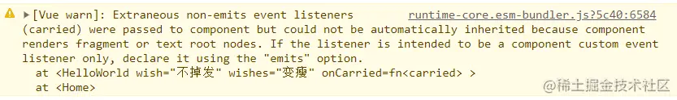
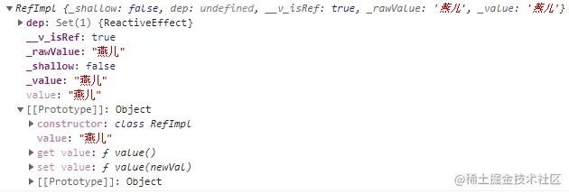
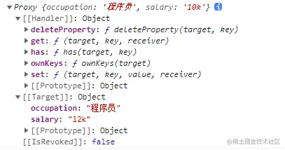
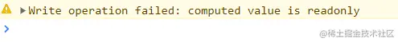
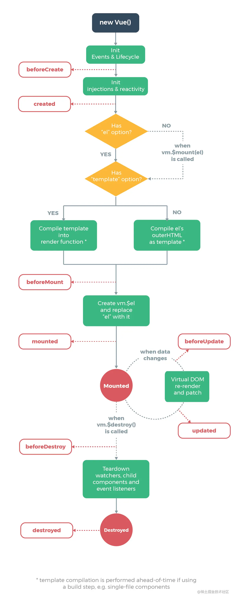
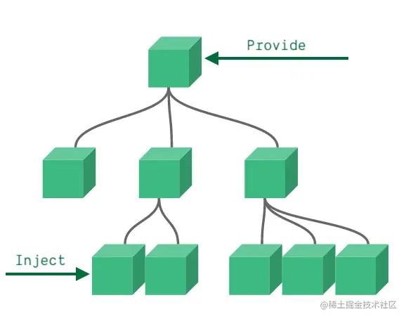

<BackTop />

# 初学 vue3

同志们，没有什么花里胡哨的开场白，今天我们来了解下 vue3.

## 了解 vue3 创建方式

首先我们先创建 vue3 文件，当然这一步和 vue2 一样，我就不一一描述了哈，懂的都懂。

都创建好了吧，创建好了我们就来讲一讲 [vite](https://link.juejin.cn?target=https%3A%2F%2Fvitejs.cn%2F 'https://vitejs.cn/')😝

第一我们要先了解 **vite** 是什么，vite 是尤雨溪团队开发的新一代的前端构建工具，意图取代 **webpack**，首先我们先来看一看 vite 有什么优点


- 无需打包，快速的冷服务器启动
- 即时热模块更换（HMR，热更新）
- 真正的按需编译 webpack 是一开始是入口文件，然后分析路由，然后模块，最后进行打包，然后告诉你，服务器准备好了（默认 8080）


然而 vite 是什么，它一开始是先告诉你服务器准备完成，然后等你发送 HTTP 请求，然后是入口文件，`Dynamic import`（动态导入）`code split point`（代码分割）


如何使用 vite 呢，大家可以去看[官网](https://link.juejin.cn?target=https%3A%2F%2Fvitejs.cn%2F 'https://vitejs.cn/')，也可以看我写的

```bash
// 要构建一个 Vite + Vue 项目，运行，使用 NPM:
npm init @vitejs/app 项目名

// 使用 Yarn:
yarn create @vitejs/app 项目名

你会觉得非常快速的创建了项目，然而它并没有给你下载依赖，你还有进入文件然后
npm install (or yarn)
```

然后它的打开方式不是 `serve` 变成了`dev`


`Edit components/HelloWorld.vue to test hot module replacement.`

编辑 components/HelloWorld.vue 以测试热模块更换。（也就是热更新更快）


然而我们只是简单了解下，我们现在的重点是 vue3，如果以后 vite 成为主流，我们也可以在回头看看。😜

现在还是以主流的方式创建并进行讲解

# 分析 vue3

## 基本了解

当我们创建完成 vue3 项目后，点击它的 main.js，你会发现写法发生了改变


引入的不是 vue 构造函数，而是`createApp`工厂函数然而，创建实例对象其实就相当于 vue2 中的`vm`，`mount（'#app'）`就相当于`$mount('#app')`，并且 vue2 的写法在 vue3 不能兼容

现在我们进入 App 组件，你会发现什么不一样的地方，他没有了根标签，在 vue2 的时候，我们都是在 div 根标签里面写东西，所以在 vue3 里面可以没有根标签


## 常用组合式 API（重点！！！）

### setup

**setup 函数是 Composition API（组合 API）的入口**

**在 setup 函数中定义的变量和方法最后都是需要 return 出去的 不然无法再模板中使用**

```vue
<script>
export default {
  name: 'App',
  setup() {
    let name = '流星'
    let age = 18
    // 方法
    function say() {
      console.log(`我叫${name},今年${age}岁`)
    }

    // 返回一个对象
    return {
      name,
      age,
      say,
    }
  },
}
</script>
```

当然这不是响应式的写法，然后你们可能会问，为什么没有用`this`，我们要想一想之前为什么要用`this`，还不是作用域的问题，然而这次我们都在`setup`里面，所以不会用到`this`，而且这里兼容 vue2 的写法如：`data，methods...`，并且在 vue2 中可以读取到 vue3 里的配置但是 vue3 里面不能读取到 vue2 的配置，所以，vue3 和 vue2 不要混用，如果有重名那么优先`setup`。

ps. 如果大家不喜欢`return`这样的写法的话，可以用 vue3 新语法糖`<script setup>`， `<script setup>`就相当于在编译运行是把代码放到了 setup 函数中运行，然后把导出的变量定义到上下文中，并包含在返回的对象中。具体操作可以看掘金其他大佬

[script setup 基本使用](https://juejin.cn/post/7002490039066165279 'https://juejin.cn/post/7002490039066165279')

[上手后才知道 ，Vue3 的 script setup 语法糖是真的爽](https://juejin.cn/post/6983626263327932429 'https://juejin.cn/post/6983626263327932429')

[vue3 新语法糖——setup script](https://juejin.cn/post/6944190150406570020 'https://juejin.cn/post/6944190150406570020')

......

**setup 还有几个注意点**

- 它比`beforeCreate`和`created`这两个生命周期还要**快**，就是说，setup 在`beforeCreate,created`前，它里面的 this 打印出来是`undefined`
- setup 可以接受两个参数，第一个参数是`props`, 也就是组件传值，第二个参数是`context`, 上下文对象，`context`里面还有三个很重要的东西`attrs`，`slots`,`emit`，它们就相当于 vue2 里面的`this.$attrs`,`this.$slots`,`this.$emit`。

通过打印，你可以看到传值，但是会有警告，那是因为我传了两个值，却只接收了一个，要是两个都接收就不会出现警告了


这个是因为 vue3 中要求我们用`emits`去接收，接收后就不会警告了，但是也可以不理警告直接用



使用插槽时，不能使用 `slot="XXX"`, 要使用`v-slot`，不然会报错

```vue
父
<template>
  <div class="home">
    <HelloWorld wish="不掉发" wishes="变瘦" @carried="carried">
      <h3>实现插槽1</h3>
      <template v-slot:dome>
        <h4>实现插槽2</h4>
      </template>
    </HelloWorld>
  </div>
</template>

<script>
import HelloWorld from './components/HelloWorld'
export default {
  name: 'Home',
  components: {
    HelloWorld,
  },
  setup() {
    function carried(value) {
      alert(`牛呀，都实现了！！！${value}`)
    }
    return {
      carried,
    }
  },
}
</script>
------- 子
<template>
  <h1>HelloWorld</h1>
  <h1>{{ wish }}</h1>
  <button @click="dream">点击实现</button>
  <slot></slot>
  <slot></slot>
</template>

<script>
export default {
  name: 'HelloWorld',
  props: ['wish', 'wishes'],
  emits: ['carried'],
  setup(props, context) {
    console.log(props)
    console.log(context.attrs)
    function dream() {
      context.emit('carried', 666)
    }
    return {
      dream,
    }
  },
}
</script>

<style scoped></style>
```

### ref 与 reactive

#### ref

上方我说到，我们写的不是响应式数据，我们写的只是字符串和数字，那怎么变成响应式数据呢，那就呀引入 **ref**，但是如果我们直接在代码里面修改是修改不了的, 不如打印一下 name 和 age，你会发现 ref 把它们变成了对象 并且还是`RefImpl`的实例对象

```vue
<template>
  <div class="home">
    <h1>姓名：{{ name }}</h1>
    <h1>年龄：{{ age }}</h1>
    <button @click="say">修改</button>
  </div>
</template>

<script>
import { ref } from 'vue'
export default {
  name: 'Home',
  setup() {
    let name = ref('燕儿')
    let age = ref(18)
    console.log(name)
    console.log(age)
    //方法
    function say() {
      name = '苒苒'
      age = 20
    }
    return {
      name,
      age,
      say,
    }
  },
}
</script>
```

所以，在修改的时候要. value 去修改，里面还是走的 get 与 set 去修改页面



其实按道理的话，我们在页面上用的话应该要 {<code>\{ name.value \}</code>} 显示的，但是因为 vue3 检测到你是 ref 对象，它就自动给你. value 了

```js
function say() {
  name.value = '苒苒'
  age.value = 20
}
```

那么要是我定义的 ref 是个对象呢，因为我们知道尽管 ref 后会变成`RefImpl`的实例对象，所以我们就用`XX.value.xx`进行修改

```vue
<template>
  <div class="home">
    <h1>姓名：{{ name }}</h1>
    <h1>年龄：{{ age }}</h1>
    <h2>职业：{{ job.occupation }}</h2>
    <h2>薪资：{{ job.salary }}</h2>
    <button @click="say">修改</button>
  </div>
</template>

<script>
import { ref } from 'vue'
export default {
  name: 'Home',
  setup() {
    let name = ref('燕儿')
    let age = ref(18)
    let job = ref({
      occupation: '程序员',
      salary: '10k',
    })
    console.log(name)
    console.log(age)
    // 方法
    function say() {
      job.value.salary = '12k'
    }
    return {
      name,
      age,
      job,
      say,
    }
  },
}
</script>
```

但是我们打印 job.value, 你会发现，它不再是`RefImpl`实例对象，变成了`Proxy`实例对象，他只是 vue3 底层，把对象都变成了`Proxy`实例对象，对于基本数据类型就是按照`Object.defineProperty`里面的`get`和`set`进行数据劫持然后进行响应式，但是如果是对象类型的话，是用到的`Proxy`，但是 vue3 把它封装在新函数 **reactive** 里，就相当于，ref 中是对象，自动会调用 **reactive**。



#### reactive

reactive 只能定义对象类型的响应式数据，前面说到的 ref 里是对象的话，会自动调用 **reactive**，把`Object`转换为`Proxy`，那我们来打印一下，你会发现就直接变成了`Proxy`，之前为什么会. value 呢，是因为要去获取值，然后通过 **reactive** 变成`Proxy`，但是现在是直接通过 **reactive** 变成`Proxy`，而且它是进行的一个深层次的响应式，也可以进行数组的响应式

```vue
<template>
  <div class="home">
    <h1>姓名：{{ name }}</h1>
    <h1>年龄：{{ age }}</h1>
    <h2>
      职业：{{ job.occupation }}
      <br />
      薪资：{{ job.salary }}
    </h2>
    <h3>爱好：{{ hobby[0] }},{{ hobby[1] }},{{ hobby[2] }}</h3>
    <button @click="say">修改</button>
  </div>
</template>

<script>
import { ref, reactive } from 'vue'
export default {
  name: 'Home',
  setup() {
    let name = ref('燕儿')
    let age = ref(18)
    let job = reactive({
      occupation: '程序员',
      salary: '10k',
    })
    let hobby = reactive(['刷剧', '吃鸡', '睡觉'])
    console.log(name)
    console.log(age)
    // 方法
    function say() {
      job.salary = '12k'
      hobby[0] = '学习'
    }
    return {
      name,
      age,
      job,
      say,
      hobby,
    }
  },
}
</script>
```

有些人可能觉得，哎呀，我记不住，我就用`ref`，每次就`.value`可以了，香香香。他喵的，你正常点，要是一个页面就几个数据的话那还好，要是一堆数据，不得把你`.value`点的冒烟吗？，其实你可以按照之前 vue2 中 data 的形式来写，这样你就会觉得`reactive`香的一批了 😁

```vue
<template>
  <div class="home">
    <h1>姓名：{{ data.name }}</h1>
    <h1>年龄：{{ data.age }}</h1>
    <h2>
      职业：{{ data.job.occupation }}
      <br />
      薪资：{{ data.job.salary }}
    </h2>
    <h3>爱好：{{ data.hobby[0] }},{{ data.hobby[1] }},{{ data.hobby[2] }}</h3>
    <button @click="say">修改</button>
  </div>
</template>

<script>
import { reactive } from 'vue'
export default {
  name: 'Home',
  setup() {
    let data = reactive({
      name: '燕儿',
      age: 18,
      job: {
        occupation: '程序员',
        salary: '10k',
      },
      hobby: ['刷剧', '吃鸡', '睡觉'],
    })
    // 方法
    function say() {
      data.job.salary = '12k'
      data.hobby[0] = '学习'
    }
    return {
      data,
      say,
    }
  },
}
</script>
```

怎么样，是不是直接暴露出去个 data 就好了，这样起码更能理解，不会让人摸不着头脑为什么要`.value`，是吧 😊

#### ref 与 reactive 的区别

- ref 用来定义：**基本类型数据**。
- ref 通过`Object.defineProperty()`的`get`与`set`来实现响应式（数据劫持）。
- ref 定义的数据：操作数据需要`.value`，读取数据时模板中直接读取不需要`.value`。
- reactive 用来定义：**对象或数组类型数据**。
- reactive 通过使用 **Proxy** 来实现响应式（数据劫持）, 并通过 **Reflect** 操作源代码内部的数据。
- reactive 定义的数据：操作数据与读取数据：均不需要`.value`。 当然，我之前就说过，ref 可以定义对象或数组的，它只是内部自动调用了 **reactive** 来转换。

### vue3 的响应式原理

说到 vue3 的响应式原理，那我们就不得不提一句 vue2 的响应式了，（狗都知道的一句）通过`Object.defineProperty`的`get`，`set`来进行数据劫持，修改，从而响应式, 但是它有什么缺点呢 😶

- 由于只有 get()、set() 方式，所以只能捕获到属性读取和修改操作，当 新增、删除属性时，捕获不到，导致界面也不会更新。
- 直接通过下标修改数组，界面也不会自动更新。 ok，vue2 就聊这么多，什么？你还想听 vue2 底层？那你就 Alt+←，拜拜了您嘞。

对于 vue3 中的响应式，我们用到的 **Proxy**，当然，我们在 vue2 里面知道，**Proxy** 是什么，是代理，当然，并不是只用到了它，还有个 Window 上的内置对象`Reflect（反射）`

- 通过 Proxy（代理）: 拦截对象中任意属性的变化, 包括：属性值的读写、属性的添加、属性的删除等。
- 通过 Reflect（反射）: 对源对象的属性进行操作。

```js
const p = new Proxy(data, {
  // 读取属性时调用
  get(target, propName) {
    return Reflect.get(target, propName)
  },
  // 修改属性或添加属性时调用
  set(target, propName, value) {
    return Reflect.set(target, propName, value)
  },
  // 删除属性时调用
  deleteProperty(target, propName) {
    return Reflect.deleteProperty(target, propName)
  },
})
```

### computed，watch 与 watchEffect

#### computed

在 vue3 中，把`computed`变成为组合式 API，那么就意味着你要去引入它，代码如下，一个简易的计算就完成了

```vue
<template>
  <div class="home">
    姓：
    <input type="text" v-model="names.familyName" />
    <br />
    名：
    <input type="text" v-model="names.lastName" />
    <br />
    姓名：{{ fullName }}
    <br />
  </div>
</template>

<script>
import { reactive, computed } from 'vue'
export default {
  name: 'Home',
  setup() {
    let names = reactive({
      familyName: '阿',
      lastName: '斌',
    })
    fullName = computed(() => {
      return names.familyName + '.' + names.lastName
    })
    return {
      names,
      fullName,
    }
  },
}
</script>
```

要是你去修改计算出来的东西，你知道会发生什么吗？警告的意思是计算出来的东西是一个只读属性。



那要是我们想要修改怎么办呢, 那么就要用到`computed`的终结写法了

```vue
<template>
  <div class="home">
    姓：
    <input type="text" v-model="names.familyName" />
    <br />
    名：
    <input type="text" v-model="names.lastName" />
    <br />
    姓名：
    <input type="text" v-model="names.fullName" />
    <br />
  </div>
</template>

<script>
import { reactive, computed } from 'vue'
export default {
  name: 'Home',
  setup() {
    let names = reactive({
      familyName: '阿',
      lastName: '斌',
    })
    names.fullName = computed({
      get() {
        return names.familyName + '.' + names.lastName
      },
      set(value) {
        let nameList = value.split('.')
        names.familyName = nameList[0]
        names.lastName = nameList[1]
      },
    })
    return {
      names,
    }
  },
}
</script>
```

但是，yysy（有一说一），他喵的，我寻思也没有人会去改计算属性吧？如果有，就当我没说 😷

#### watch

你可能会想到`computed`都是组合式 API，那么`watch`会不会也是组合式 API 呢？大胆点，它也是， 那么我们就来进行监视

```vue
<template>
  <div class="home">
    <h1>当前数字为:{{ num }}</h1>
    <button @click="num++">点击数字加一</button>
  </div>
</template>

<script>
import { ref, watch } from 'vue'
export default {
  name: 'Home',
  setup() {
    let num = ref('0')
    watch(num, (newValue, oldValue) => {
      console.log(`当前数字增加了,${newValue},${oldValue}`)
    })
    return {
      num,
    }
  },
}
</script>
```

当然这是监听`ref`定义出来的单个响应式数据，要是监听多个数据应该怎么办呢？其实可以用多个`watch`去进行监听，当然这不是最好的方法，最好的办法其实是监视数组

```js
watch([num, msg], (newValue, oldValue) => {
  console.log('当前改变了', newValue, oldValue)
})
```

既然我们监听的是数组，那么我们得到的`newValue`和`oldValue`也就是数组，那么数组中的第一个就是你监视的第一个参数。

ps. 当然之前在 vue2 中`watch`不是有什么其他参数吗，vue3 中也有, 是写在最后的。

```js
watch(
  [num, msg],
  (newValue, oldValue) => {
    console.log('当前改变了', newValue, oldValue)
  },
  { immediate: true, deep: true },
)
```

之前我说过，我们现在监听的是监听`ref`定义出来数据，那么要是我们监听的是`reactive`

```vue
<template>
  <div class="home">
    <h1>当前姓名:{{ names.familyName }}</h1>
    <h1>当前年龄:{{ names.age }}</h1>
    <h1>当前薪水:{{ names.job.salary }}K</h1>
    <button @click="names.familyName += '!'">点击加!</button>
    <button @click="names.age++">点击加一</button>
    <button @click="names.job.salary++">点击薪水加一</button>
  </div>
</template>

<script>
import { reactive, watch } from 'vue'
export default {
  name: 'Home',
  setup() {
    let names = reactive({
      familyName: '鳌',
      age: 23,
      job: {
        salary: 10,
      },
    })
    watch(
      names,
      (newValue, oldValue) => {
        console.log(`names改变了`, newValue, oldValue)
      },
      { deep: false },
    )
    return {
      names,
    }
  },
}
</script>
```

但是你会发现一个问题，为什么`newValue`与`oldValue`一样呢，就很尴尬，都是新的数据，就算你使用`ref`来定义，还是没有办法监听到`oldValue`（他喵的，都给你说了`ref`定义的对象会自动调用`reactive`）, 所以**在监视 reactive 定义的响应式数据时，oldValue 无法正确获取**, 并且你会发现，它是**强制开启深度监视（`deep:true`），并且无法关闭。**

然而现在我们监视的是`reactive`定义的响应式数据的全部属性，是只监听其中的一个属性，那怎么办呢，可能大家会

```js
watch(names.age, (newValue, oldValue) => {
  console.log(`names改变了`, newValue, oldValue)
})
```

来进行监视，但是，vue3 会警告只能监听`reactive`定义的或者`ref`定义的, 并且不能监听。


那么我们就必须这样写（不会还有人不知道`return`可以省略吧？不会吧？不会吧？不会那个人就是你吧？）

```js
watch(
  () => names.age,
  (newValue, oldValue) => {
    console.log('names改变了', newValue, oldValue)
  },
)
```

那么要是我们监听的是多个属性，那怎么办呢？emmmm，你正常点，我上面都写了监听多个`ref`定义的响应式数据，你就不会举一反三吗？敲代码很累的好吧！！！他喵的，为了防止你们问多个`reactive`定义的一个属性，我就只能说和这个是一样的！！！能不能聪明点！！！

```js
watch([() => names.age, () => names.familyName], (newValue, oldValue) => {
  console.log('names改变了', newValue, oldValue)
})
```

ok，要是我们监听的是深度的属性那要怎么办呢？你会发现我要是只监听第一层是监听不到的，那么我们有两种写法

```js
// 第一种
watch(
  () => names.job.salary,
  (newValue, oldValue) => {
    console.log('names改变了', newValue, oldValue)
  },
)

// 第二种
watch(
  () => names.job,
  (newValue, oldValue) => {
    console.log('names改变了', newValue, oldValue)
  },
  { deep: true },
)
```

那么我们就可以这样理解，**如果监视的是`reactive`定义的响应式数据的属性，并且这个属性是对象，那么我们可以开启深度监视**

（人都写傻了，写了四千多字了，还没写完...）

#### watchEffect

`watchEffect`是 vue3 的新函数，它是来和`watch`来抢饭碗的，它和`watch`是一样的功能，那它有什么优势呢？

- 自动默认开启了`immediate:true`
- 用到了谁就监视谁

```js
watchEffect(() => {
  const one = num.value
  const tow = person.age
  console.log('watchEffect执行了')
})
```

其实吧，`watchEffect`有点像`computed`，都是里面的值发生了改变就调用一次，但是呢`computed`要写返回值, 而`watchEffect`不用写返回值。

### 生命周期




我们先来简单分析下，在 vue2 中，我们是先`new Vue()`，然后执行`beforeCreate`与`created`接着问你有没有`vm.$mount(el)`，有，才继续执行，但是在 vue3 中，它是先全部准备好后然后再进行函数。

其实在 vue3 中生命周期没有多大的改变，只是改变了改变了销毁前，和销毁，让它更加语义化了 **`beforeDestroy`改名为`beforeUnmount`,`destroyed`改名为`unmounted`**

然后在 vue3 中，**`beforeCreate`与`created`并没有组合式 API 中,`setup`就相当于这两个生命周期函数**

**在 vue3 中也可以按照之前的生命周期函数那样写，只是要记得有些函数名称发生了改变**

在`setup`里面应该这样写

- `beforeCreate`===>`Not needed*`
- `created`=======>`Not needed*`
- `beforeMount` ===>`onBeforeMount`
- `mounted`=======>`onMounted`
- `beforeUpdate`===>`onBeforeUpdate`
- `updated` =======>`onUpdated`
- `beforeUnmount` ==>`onBeforeUnmount`
- `unmounted` =====>`onUnmounted`

### hooks 函数

- Vue3 的 hook 函数 相当于 vue2 的 mixin, 不同在与 hooks 是函数
- Vue3 的 hook 函数 可以帮助我们提高代码的复用性, 让我们能在不同的组件中都利用 hooks 函数

其实就是代码的复用，可以用到外部的数据，生命钩子函数...，具体怎么用直接看代码，

```js
// 一般都是建一个hooks文件夹，都写在里面

import { reactive, onMounted, onBeforeUnmount } from 'vue'

export default function () {
  // 鼠标点击坐标
  let point = reactive({ x: 0, y: 0 })

  // 实现鼠标点击获取坐标的方法
  function savePoint(event) {
    point.x = event.pageX
    point.y = event.pageY
    console.log(event.pageX, event.pageY)
  }

  // 实现鼠标点击获取坐标的方法的生命周期钩子
  onMounted(() => {
    window.addEventListener('click', savePoint)
  })

  onBeforeUnmount(() => {
    window.removeEventListener('click', savePoint)
  })

  return point
}

// 在其他地方调用
import useMousePosition from './hooks/useMousePosition'
let point = useMousePosition()
```

### toRef 与 toRefs

#### toRef

`toRef`翻译过来其实就是把什么变成`ref`类型的数据，可能大家会觉得没有什么用，毕竟我们之前定义时就已经定义成`ref`, 但是你们想一想，我们在之前是怎么写的

```vue
<template>
  <div class="home">
    <h1>当前姓名:{{ names.name }}</h1>
    <h1>当前年龄:{{ names.age }}</h1>
    <h1>当前薪水:{{ names.job.salary }}K</h1>
    <button @click="names.name += '!'">点击加!</button>
    <button @click="names.age++">点击加一</button>
    <button @click="names.job.salary++">点击薪水加一</button>
  </div>
</template>

<script>
import { reactive } from 'vue'
export default {
  name: 'Home',
  setup() {
    let names = reactive({
      name: '老谭',
      age: 23,
      job: {
        salary: 10,
      },
    })
    return {
      names,
    }
  },
}
</script>
```

是不是一直都是用到代码`name.xx`，可能你会说，那我就`return`的时候不这样写，改成这样

```js
return {
  name: names.name,
  age: names.age,
  salary: names.job.salary,
}
```

但是你要是在页面进行操作时就不是响应式了，为什么呢？那是因为你现在暴露出去的是简简单单的字符串，字符串会有响应式吗？肯定没有呀，但是你要是用到了`toRef`, 那就是把`name.xx`变为响应式，然后操作它时会自动的去修改`name`里面的数据

```js
return {
  name: toRef(names, 'name'),
  age: toRef(names, 'age'),
  salary: toRef(names.job, 'salary'),
}
```

但是有的人可能会说那我为什么不用`ref`去改变？可能大家会发现在页面里也是响应式的，但是我告诉你们，根本用到的不是`names`里面的数据，而是你单独定义出来的数据，所以要是这样写，无论怎么修改都不会修改到`names`里的数据

```js
return {
  name: ref(names.name),
  age: ref(names.age),
  salary: ref(names.job.salary),
}
```

#### toRefs

聪明一点，`toRefs`与`toRef`有什么不同，加了个`s`,`toRef`是单个转化为响应式，那`toRefs`就是多个转化为响应式咯，这样的话就减少代码，不然要是有成千上万个，那你不是要当憨憨闷写吗？（`...`是结构哈, 看不懂就麻溜的 alt+←)，当然它只会结构一层，深层里的代码还是要老实的写

```js
<h1>当前姓名:{{ name }}</h1>
<h1>当前薪水:{{ job.salary }}K</h1>
return { ...toRefs(names) }
```

## 其他组合式 API（了解，我寻思你基本上不会用）

### shallowReactive 与 shallowRef

`shallowReactive`浅层次的响应式, 它就是只把第一层的数据变为响应式，深层的数据不会变为响应式,`shallowRef`如果定义的是基本类型的数据，那么它和`ref`是一样的不会有什么改变，但是要是定义的是对象类型的数据，那么它就不会进行响应式，之前我们说过如果`ref`定义的是对象，那么它会自动调用`reactive`变为`Proxy`, 但是要是用到的是`shallowRef`那么就不会调用`reactive`去进行响应式。

**shallowReactive：只处理对象最外层属性的响应式（浅响应式）。** **shallowRef：只处理基本数据类型的响应式, 不进行对象的响应式处理。**

```js
let person = shallowReactive({
  name: '大理段氏',
  age: 10,
  job: { salary: 20 },
})

let x = shallowRef({ y: 0 })
```

### readonly 与 shallowReadonly

`readonly`是接收了一个响应式数据然后重新赋值，返回的数据就不允许修改（深层只读），`shallowReadonly`却只是浅层只读（第一层只读，其余层可以进行修改）

```js
names = readonly(names)
names = shallowReadonly(names)
```

### toRaw 与 markRaw

`toRaw`其实就是将一个由`reactive`生成的**响应式对象**转为**普通对象**。如果是`ref`定义的话，是没有效果的（包括`ref`定义的对象）**如果在后续操作中对数据进行了添加的话，添加的数据为响应式数据**，当然要是将数据进行`markRaw`操作后就不会变为响应式，可能大家会说，不就是和`readonly`一样吗？那肯定不一样咯，`readonly`是根本没办法改，但`markRaw`是不转化为响应式，但是数据还会发生改变。

```vue
<template>
  <div class="home">
    <h1>当前姓名:{{ names.name }}</h1>
    <h1>当前年龄:{{ names.age }}</h1>
    <h1>当前薪水:{{ names.job.salary }}K</h1>
    <h1 v-if="names.girlFriend">女朋友：{{ names.girlFriend }}</h1>
    <button @click="names.name += '!'">点击加!</button>
    <button @click="addAges">点击加一</button>
    <button @click="addSalary">点击薪水加一</button>
    <button @click="add">添加女朋友</button>
    <button @click="addAge">添加女朋友年龄</button>
  </div>
</template>

<script>
import { reactive, toRaw, markRaw } from 'vue'
export default {
  name: 'Home',
  setup() {
    let names = reactive({
      name: '老伍',
      age: 23,
      job: {
        salary: 10,
      },
    })
    function addAges() {
      names.age++
      console.log(names)
    }
    function addSalary() {
      let fullName = toRaw(names)
      fullName.job.salary++
      console.log(fullName)
    }
    function add() {
      let girlFriend = { sex: '女', age: 40 }
      names.girlFriend = markRaw(girlFriend)
    }
    function addAge() {
      names.girlFriend.age++
      console.log(names.girlFriend.age)
    }
    return {
      names,
      add,
      addAge,
      addAges,
      addSalary,
    }
  },
}
</script>
```

### customRef

**`customRef`创建一个自定义的 ref，并对其依赖项跟踪和更新触发进行显式控制。**

单纯觉得这个东西的作用只有防抖的作用（要是知道其他的用法可以告知一下我）

```vue
<template>
  <input type="text" v-model="keyWord" />
  <h3>{{ keyWord }}</h3>
</template>

<script>
import { customRef } from 'vue'
export default {
  name: 'App',
  setup() {
    //自定义一个ref——名为：myRef
    function myRef(value, times) {
      let time
      return customRef((track, trigger) => {
        return {
          get() {
            console.log(`有人从myRef中读取数据了，我把${value}给他了`)
            track() //通知Vue追踪value的变化（必须要有，并且必须要在return之前）
            return value
          },
          set(newValue) {
            console.log(`有人把myRef中数据改为了：${newValue}`)
            clearTimeout(time)
            time = setTimeout(() => {
              value = newValue
              trigger() //通知Vue去重新解析模板（必须要有）
            }, times)
          },
        }
      })
    }
    let keyWord = myRef('HelloWorld', 1000) //使用自定义的ref

    return { keyWord }
  },
}
</script>
```

给你们说个趣事吧，顺便你们讲一下防抖节流的区别，之前有人在我公司面试的时候哈，给我说对项目进行了防抖节流处理，但是我细问防抖与节流的区别时却支支吾吾的，就很尴尬，然后我们就心照不宣的跳过了这个话题 🤣🤣🤣

我是这样理解的

**防抖：在第一次触发事件时，不立即执行函数，而是给出一个时间段，如果短时间内大量触发同一事件，只会执行一次函数。**

**节流：函数执行一次后，在某个时间段内暂时失效，过了这段时间后再重新激活，如果短时间内大量触发同一事件，那么在函数执行一次之后，该函数在指定的时间期限内不再生效，直至过了这段时间才重新生效。**（可以理解为游戏技能冷却期）

如果还是不是很能理解的话去看大佬的 [一杯茶的时间 🍵，带你彻底学会手写防抖节流](https://juejin.cn/post/7016502001911463950#heading-5 'https://juejin.cn/post/7016502001911463950#heading-5')

### provide 与 inject

都知道组件传值吧，在 vue2 中，如果要在后代组件中使用父组件的数据，那么要一层一层的父子组件传值或者用到`vuex`，但是现在，无论组件层次结构有多深，父组件都可以作为其所有子组件的依赖提供者。这个特性有两个部分：父组件有一个  `provide`  选项来提供数据，子组件有一个  `inject`  选项来开始使用这些数据。



```js
// 父
import { provide } from 'vue'

setup(){
  let fullname = reactive({
    name: '阿月',
    salary: '15k'
  })
}

provide('fullname', fullname) //给自己的后代组件传递数据 return {...toRefs(fullname)} }

// 后代
import {inject} from 'vue'

setup(){
  let fullname = inject('fullname')
  return {fullname}
}
```

当然子组件也可以用，但是请记住，父子组件传参是有方法的！！！别瞎搞。

### 响应式判断

下面是 vue3 给的一些判断方法

**isRef: 检查值是否为一个 ref 对象。**

**isReactive：检查对象是否是由  [`reactive`](https://link.juejin.cn?target=https%3A%2F%2Fv3.cn.vuejs.org%2Fapi%2Fbasic-reactivity.html%23reactive 'https://v3.cn.vuejs.org/api/basic-reactivity.html#reactive')  创建的响应式代理。**

**isReadonly: 检查对象是否是由  [`readonly`](https://link.juejin.cn?target=https%3A%2F%2Fv3.cn.vuejs.org%2Fapi%2Fbasic-reactivity.html%23readonly 'https://v3.cn.vuejs.org/api/basic-reactivity.html#readonly')  创建的只读代理。**

**isProxy：检查对象是否是由  [`reactive`](https://link.juejin.cn?target=https%3A%2F%2Fv3.cn.vuejs.org%2Fapi%2Fbasic-reactivity.html%23reactive 'https://v3.cn.vuejs.org/api/basic-reactivity.html#reactive')  或  [`readonly`](https://link.juejin.cn?target=https%3A%2F%2Fv3.cn.vuejs.org%2Fapi%2Fbasic-reactivity.html%23readonly 'https://v3.cn.vuejs.org/api/basic-reactivity.html#readonly')  创建的 proxy。**

```js
import { ref, reactive, readonly, isRef, isReactive, isReadonly, isProxy } from 'vue'

export default {
  name: 'App',
  setup() {
    let fullName = reactive({ name: '小唐', price: '20k' })
    let num = ref(0)
    let fullNames = readonly(fullName)

    console.log(isRef(num))
    console.log(isReactive(fullName))
    console.log(isReadonly(fullNames))
    console.log(isProxy(fullName))
    console.log(isProxy(fullNames))
    console.log(isProxy(num))

    return {}
  },
}
```

## 有趣的组件

### Fragment

对我而言这个更像是一种概念，它的意思就相当于创建页面时，给了一个虚拟根标签`VNode`，因为我们知道在 vue2 里面，我们是有根标签这个概念的，但是到来 vue3，它是自动给你创建个虚拟根标签`VNode`（`Fragment`）, 所以可以不要根标签。好处就是 **减少标签层级, 减小内存占用**

### Teleport

`teleport` 提供了一种有趣的方法，允许我们控制在 DOM 中哪个父节点下渲染了 HTML，而不必求助于全局状态或将其拆分为两个组件。

其实就是可以不考虑你写在什么位置，你可以定义`teleport`在任意标签里进行定位等（常见操作为模态框），除了 body 外，还可以写 css 选择器（`id，class`）

```vue
// id定位
<teleport to="#app">
    <div class="four">
      <div class="five"></div>
    </div>
 </teleport>

// class定位
<teleport to=".one">
    <div class="four">
      <div class="five"></div>
    </div>
 </teleport>

// 示例
<template>
  <div class="one">
    <h1>第一层</h1>
    <div class="two">
      <h1>第二层</h1>
      <div class="three">
        <h1>第三层</h1>
        <teleport to="body">
          <div class="four">
            <div class="five"></div>
          </div>
        </teleport>
      </div>
    </div>
  </div>
</template>

<script>
export default {
  name: 'App',
  setup() {
    return {}
  },
}
</script>

<style lang="less">
.one {
  width: 100%;
  background-color: blue;
  .two {
    margin: 20px;
    background-color: aqua;
    .three {
      margin: 20px;
      background-color: aliceblue;
    }
  }
}
.four {
  position: absolute;
  top: 0;
  bottom: 0;
  left: 0;
  right: 0;
  background-color: rgba(0, 0, 0, 0.5);
  .five {
    position: absolute;
    top: 50%;
    left: 50%;
    transform: translate(-50%, -50%);
    width: 300px;
    height: 300px;
    left: 50%;
    background-color: #f60;
  }
}
</style>
```

打开控制台然后触发事件，观看效果

### Suspense

大家都知道在渲染组件之前进行一些异步请求是很常见的事，`suspense`  组件提供了一个方案，允许将等待过程提升到组件树中处理，而不是在单个组件中。但是！！！在 vue3 中特别说明了，**Suspense 是一个试验性的新特性，其 API 可能随时会发生变动。特此声明，以便社区能够为当前的实现提供反馈。**，我直接尬住，以后估计会发生改变，但是你们愿意卷的话可以去看文章 [vue3 的传送门 teleport 究竟有多神奇？suspense 发起异步请求有多简约？](https://juejin.cn/post/6977869719546101796#heading-12 'https://juejin.cn/post/6977869719546101796#heading-12')，嗯，记得写 800 字观后感

## vue3 其他改动

### router

可能大家会想到路由跳转的问题，可能大家会以为还是用`this.$router.push`来进行跳转，但是哦，在 vue3 中，这些东西是没有的，它是定义了一个`vue-router`然后引入的`useRoute`,`useRouter`  相当于 vue2 的  `this.$route`，`this.$router`, 然后其他之前 vue2 的操作都可以进行

```js
import {useRouter,useRoute} from "vue-router";
 setup(){
  const router = useRouter()
  const route = useRoute()

  function fn() {
    this.$router.push('/about')
  }

  onMounted(() => {
    console.log(route.query.code)
  })

  return{ fn }
}
```

### 全局 API 的转移

<table><thead><tr><th>2.x 全局 API（<code>Vue</code>）</th><th>3.x 实例 API (<code>app</code>)</th></tr></thead><tbody><tr><td>Vue.config.xxxx</td><td>app.config.xxxx</td></tr><tr><td>Vue.config.productionTip</td><td><strong>移除</strong></td></tr><tr><td>Vue.component</td><td>app.component</td></tr><tr><td>Vue.directive</td><td>app.directive</td></tr><tr><td>Vue.mixin</td><td>app.mixin</td></tr><tr><td>Vue.use</td><td>app.use</td></tr><tr><td>Vue.prototype</td><td>app.config.globalProperties</td></tr></tbody></table>

### 其他改变

**移除** keyCode 作为 v-on 的修饰符，同时也不再支持`config.keyCodes`

**移除**`v-on.native`修饰符

**移除**过滤器（`filter`）

...

对了有手痒的想实战项目的话可以去看一看大佬的[🎉🎉Vue 3 + Element Plus + Vite 2 的后台管理系统开源啦 🎉🎉](https://juejin.cn/post/6945072070132760590 'https://juejin.cn/post/6945072070132760590')

# 🎉🎉 完结撒花 🎉🎉
